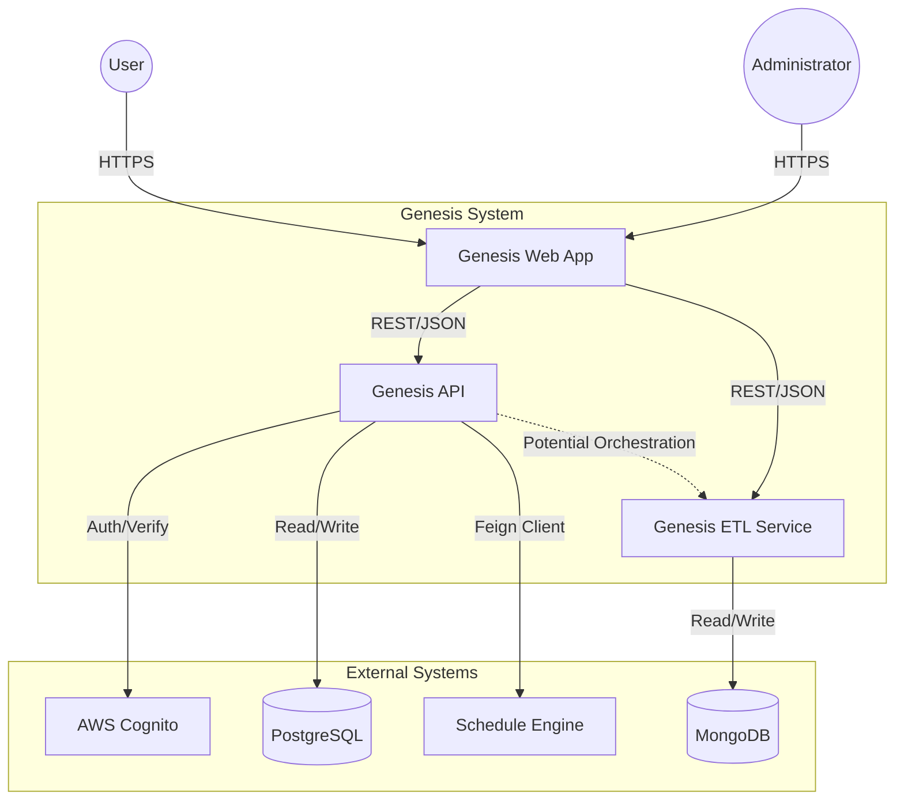
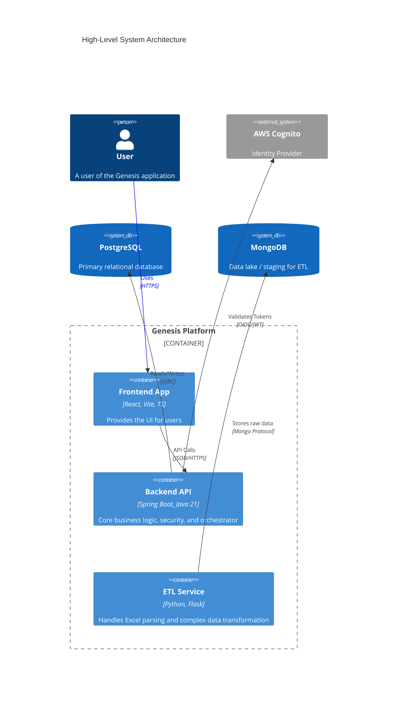

# 📘 SYSTEM TECHNICAL DESIGN & ENGINEERING SPECIFICATION

## 0. Document Governance & Intent

### 0.1 Purpose of This Document
The purpose of this document is to provide a comprehensive technical blueprint for the Genesis system. It serves as the single source of truth for engineering, architecture, and deviations from the original requirements. It bridges the gap between high-level business requirements and low-level code implementation.

### 0.2 Scope of System Covered
This specification covers the "Genesis" platform, including:
*   **Genesis API**: A Spring Boot-based backend Application Programming Interface.
*   **Genesis App**: A React-based Single Page Application (SPA) frontend.
*   **Genesis ETL Service**: A Python/Flask-based service for heavy data processing and ETL tasks.
*   **Infrastructure**: Dockerized container deployment and AWS integration (Cognito, S3).

### 0.3 Out-of-Scope Items
*   Third-party system internals (e.g., AWS Cognito internal architecture).
*   Detailed legal or compliance frameworks (GDPR/CCPA) logic outside of technical implementation.
*   Legacy systems not explicitly integrated with Genesis.

### 0.4 Intended Audience
*   **Software Engineers**: For implementation details, API contracts, and code structure.
*   **System Architects**: For understanding system boundaries, data flow, and trade-offs.
*   **DevOps/SRE**: For deployment, monitoring, and infrastructure management.

### 0.5 Assumptions & Constraints
*   **Authentication**: AWS Cognito is the primary Identity Provider (IdP).
*   **Database**: PostgreSQL is the primary transactional store; MongoDB is used for ETL/intermediate data.
*   **Deployment**: The system is designed to be container-native (Docker).
*   **Network**: Internal services communicate over HTTP/REST on a private network or via secure service-to-service calls.

### 0.6 Definitions, Acronyms & Terminology
*   **ETL**: Extract, Transform, Load - specifically referring to the Python service.
*   **DTO**: Data Transfer Object.
*   **IdP**: Identity Provider (AWS Cognito).
*   **SPA**: Single Page Application (React).

---

## 1. Executive Summary

### 1.1 System Overview
Genesis is a modern enterprise platform designed to manage employee data, schedule generation, and complex data workflows. It consists of a high-performance Java backend for business logic and data integrity, a reactive modern frontend for user interaction, and a specialized Python service for handling Excel-based data ingestion and transformation.

### 1.2 Problem Statement
Enterprises often struggle with managing complex employee scheduling and data synchronization spread across spreadsheets and legacy systems. Genesis aims to centralize this data, automate the ingestion of "messy" Excel files, and provide a secure, scalable interface for management.

### 1.3 Key Capabilities & Features
*   **Secure Authentication**: Role-based access control via AWS Cognito.
*   **Data Ingestion**: Robust Excel/CSV upload and parsing capabilities.
*   **Employee Management**: centralized CRUD operations for employee records.
*   **Schedule Generation**: Integration with an external scheduling engine.
*   **Auditability**: Complete tracking of data changes and upload history.

### 1.4 Target Users & Personas
*   **System Administrators**: Configure system settings, integrations, and user roles.
*   **Managers**: Upload schedules, manage employee lists, and view reports.
*   **Employees**: View personal schedules and update profile information (future scope).

### 1.5 Business & Operational Value
*   **Efficiency**: Reduces manual data entry time by automating Excel imports.
*   **Accuracy**: Enforces strict data validation rules to prevent corrupt data entry.
*   **Scalability**: Microservices-ready architecture allows independent scaling of the ETL layer and the API layer.

### 1.6 Success Criteria
*   Successful upload and processing of complex Excel sheets without manual intervention.
*   Sub-second API response times for standard CRUD operations.
*   Seamless synchronization of user accounts between the application and AWS Cognito.

---

## 2. System Context & Architecture

### 2.1 System Context Diagram (Actors & External Systems)

### 2.2 High-Level Architecture Diagram

### 2.3 Architecture Style & Rationale
The system follows a **Service-Oriented Architecture (SOA)** approach, nearing microservices. 
*   **Rationale for Split**: 
    *   **Java/Spring Boot** is chosen for the core transaction layer due to its strong typing, robust security (Spring Security), and mature ecosystem for enterprise APIs.
    *   **Python/Flask** is chosen for the ETL layer to leverage the rich data science ecosystem (Pandas, NumPy) which excels at parsing Excel files and performing vectorised operations, which is often more verbose in Java.
    *   **React** provides a responsive, decoupled frontend that can be deployed independently (e.g., to a CDN/Edge).

### 2.4 Core Components & Responsibilities

| Component | Technology | Primary Responsibilities |
| :--- | :--- | :--- |
| **Genesis API** | Java 21, Spring Boot 3.5.5 | • User Management & Authentication  • Business Logic Enforcement  • PostgreSQL Data Persistence  • Integration with Schedule Engine |
| **Genesis App** | React, Vite, TypeScript | • User Interface & Experience  • Client-side State Management  • Form Validation & Feedback |
| **Genesis ETL** | Python 3, Flask, Pandas | • Parsing complex Excel/CSV files  • Data validation & transformation  • Intermediate storage in MongoDB |

### 2.5 Data Flow Overview
1.  **Authentication**: User logs in via frontend -> Authenticates with Cognito -> Receives JWT -> Sends JWT to API.
2.  **Standard Operations**: API validates JWT -> Queries PostgreSQL -> Returns JSON.
3.  **Data Import**: User uploads file -> ETL Service processes file (uses Pandas) -> Stores result in MongoDB -> Notifies API (or API polls) -> Final data committed to PostgreSQL. *(Note: Exact orchestration flow to be confirmed in Section 8).*

### 2.6 Trust Boundaries & Security Zones
*   **Public Zone**: The React App (running in user's browser).
*   **DMZ / Public Edge**: Public Load Balancer / API Gateway serving the API and App.
*   **Trusted Zone**: The internal network containing the API, ETL Service, and Databases.
    *   Communication between API and DB is strictly internal.
    *   Communication to AWS Cognito is over encrypted HTTPS.
    *   Engine API endpoints (`/api/engine/v1/`) are protected by IP Allowlisting.

---

## 3. Functional Scope & Behavior

### 3.1 Supported User Roles
Detailed capabilities are governed by roles defined in the Identity Provider and enforced by the API.
*   **ROLE_ADMIN** (Implied): Full access to user management, configuration, and all data.
*   **ROLE_USER**: Access to view schedules and manage own profile.
*   *(Note: Roles are dynamically mapped from JWT `cognito:groups`).*

### 3.2 Core Use Cases
*   **UC-01: Login/Logout**: Secure access using corporate credentials.
*   **UC-02: Employee Upload**: Bulk creation of employees via Excel.
*   **UC-03: View Schedule**: Visual representation of shift allocations.
*   **UC-04: Sync Accounts**: Synchronization of local employee DB with Cognito directory.

### 3.3 Functional Assumptions
*   All users must have a valid email address for Cognito acccount creation.
*   Excel files uploaded must adhere to a specific template structure (defined in ETL configurations).

### 3.4 Explicit Non-Goals
*   Real-time chat or messaging between users.
*   Native mobile application (Android/iOS) - the web app is responsive but not native.
*   Payroll processing (this system handles *time/schedule*, not *pay*).

---
