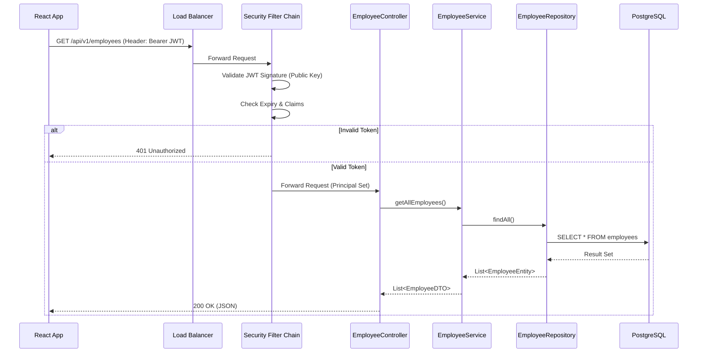

# 02 Backend Engineering Specifications

## 4. Backend Engineering Specifications

### 4.1 Runtime Environment & Language
*   **Language**: Java 21 (LTS)
*   **Framework**: Spring Boot 3.5.5
*   **Build Tool**: Maven 3.9+
*   **Container Runtime**: Docker (Eclipse Temurin JDK 21 base image recommended)

### 4.2 Application Structure & Layering
The application follows a **Domain-Driven Design (DDD)** directory structure, grouped by business modules rather than technical layers.

**Standard Package Structure:**
`com.resetrix.genesis`
 *   `config/` - Global configurations (Security, Swagger, Web).
 *   `modules/` - Feature-specific modules (e.g., `employee`, `schedule`, `auth`).
     *   `controller/` - REST Endpoints.
     *   `service/` - Business Logic.
     *   `repository/` - Data Access (JPA).
     *   `entity/` - Database Objects.
     *   `dto/` - Data Transfer Objects.
     *   `mapper/` - Object Mapping (likely MapStruct or manual).
 *   `shared/` - Common utilities, base classes, and cross-cutting concerns.
 *   `exception/` - Global error handling.

### 4.3 Dependency Overview
Key dependencies defined in `pom.xml`:
*   **Web**: `spring-boot-starter-web` (Tomcat embedded).
*   **Data**: `spring-boot-starter-data-jpa` (Hibernate), `postgresql` (Driver), `flyway-core` (Migrations).
*   **Security**: `spring-boot-starter-security`, `spring-boot-starter-oauth2-resource-server` (JWT).
*   **Cloud**: `software.amazon.awssdk` (Cognito integration).
*   **Observability**: `micrometer-core`, `spring-boot-starter-actuator`.
*   **Utilities**: `lombok` (Code boilerplate reduction), `poi-ooxml` (Excel processing).

### 4.4 API Design Principles
*   **Protocol**: RESTful APIs over HTTP/2 (where supported) or HTTP/1.1.
*   **Format**: JSON for all request/response bodies.
*   **Statelessness**: No server-side session state; relies purely on JWT tokens.
*   **Versioning**: URI path versioning (e.g., `/api/v1/employees`).

### 4.5 Authentication & Authorization Model
The system uses **OAuth2 / OIDC** with **AWS Cognito** as the Identity Provider.

**Security Flow:**
1.  Frontend authenticates with Cognito and obtains a **JWT Access Token**.
2.  Frontend sends the token in the `Authorization: Bearer <token>` header.
3.  Backend `SecurityFilterChain`:
    *   Validates the token signature using Cognito's public keys (Cached).
    *   Extracts claims using `CognitoJwtAuthenticationConverter`.
    *   Maps `cognito:groups` to Spring Security Authorities (e.g., `ROLE_ADMIN`).
4.  Standard Endpoints (e.g., `/api/v1/**`): Require valid authentication.
5.  Engine API Endpoints (`/api/engine/v1/**`): Protected by **IP Allowlisting** in addition to (or instead of) token auth, configured via `application.yaml`.

### 4.6 API Endpoint Structure & Conventions
*   **Root Context**: `/api/v1`
*   **Naming**: Plural nouns (e.g., `/employees`, `/schedules`).
*   **HTTP Verbs**:
    *   `GET`: Retrieve resources.
    *   `POST`: Create resources or detailed queries.
    *   `PUT`: Full update of a resource.
    *   `PATCH`: Partial update.
    *   `DELETE`: Remove a resource.

### 4.7 Request / Response Standards
**Success Response:**
Standard HTTP 200/201 status codes. Bodies are typically the DTO JSON.

**Standard Error Response (`ProblemDetailsDTO`):**
```json
{
  "type": "Validation Error",
  "status": 400,
  "detail": "Invalid input data",
  "instance": "/api/v1/employees",
  "errors": [
    {
      "field": "email",
      "message": "Email format is invalid"
    }
  ]
}
```

### 4.8 Validation & Error Handling Strategy
*   **Validation**: Uses standard `jakarta.validation` (`@NotNull`, `@Email`) on DTOs.
*   **Global Handling**: `GlobalExceptionHandler` (`@RestControllerAdvice`) catches exceptions.
    *   **Validation Errors**: Mapped to 400 Bad Request.
    *   **Resource Not Found**: Mapped to 404 Not Found.
    *   **Access Denied**: Mapped to 403 Forbidden.
    *   **Internal Errors**: Mapped to 500 (with generic messages for security).

### 4.9 Sequence Diagram: Authenticated Request



### 4.10 External Service Integrations
*   **AWS Cognito**: Authentication and User Management.
*   **Schedule Engine**: External microservice accessed via `FeignClient`.
    *   **Resiliency**: Configured with timeouts (e.g., 45 mins for heavy jobs) and error decoders.
    *   **Protocol**: Inter-service REST calls.
