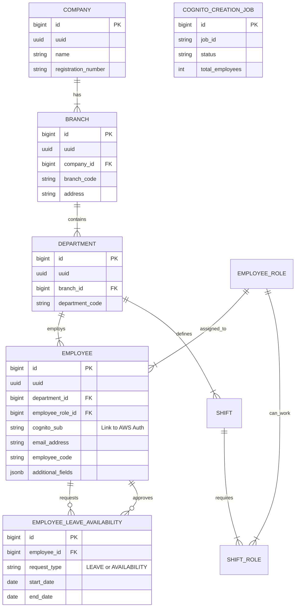

# 04 Data Architecture & Database Specifications

## 6. Data Architecture & Storage

### 6.1 Database Technology Overview
The system employs a **Polyglot Persistence** strategy:
*   **Primary Store (PostgreSQL)**: Handles relational data, transactional integrity, and core business entity storage (Employees, Schedules, Organizations).
*   **Operational Store (MongoDB)**: Handles the "messy" intermediate state of data ingestion (ETL), storing raw Excel rows and dynamic column mappings before strict validation.

### 6.2 Data Modeling Philosophy
*   **Normalized (PostgreSQL)**: 3NF normalization for core entities to ensure data consistency and reduce redundancy.
*   **Flexible (MongoDB)**: Document-based storage for ETL to accommodate varying Excel templates and "Additional Fields" without schema migrations.
*   **Soft Deletes**: All primary tables implement `soft_delete` (Boolean) to preserve historical data.

### 6.3 Entity Relationship Diagram (ERD)



### 6.4 Core Entities Overview

#### Organizational Structure
*   **Company**: The top-level tenant (e.g., "Acme Corp").
*   **Branch**: A physical location or subsidiary.
*   **Department**: A functional unit (e.g., "Logistics", "Sales").

#### Workforce Management
*   **Employee**: The core user entity. Linked to AWS Cognito via `cognito_sub`.
*   **EmployeeRole**: Defines the job title (e.g., "Driver", "Manager").
*   **Shift**: A templated shift pattern defined by a department (e.g., "Morning Shift 06:00-14:00").

### 6.5 Data Flow: Excel Ingestion Strategy
1.  **Upload**: User uploads Excel to ETL Service.
2.  **Staging**: ETL Service parses matches columns using `employee_column_mapping` (Mongo) and upserts raw documents into `employee` (Mongo).
3.  **Sync/Finalize**:
    *   API triggers synchronization (Not explicitly detailed in migration, logical step).
    *   Valid records are mapped to `EmployeeEntity` and saved to PostgreSQL.
    *   Additional unstructured fields are stored in `employees.additional_fields` (JSONB).

---

## 7. Detailed Database Specifications

### 7.1 PostgreSQL Schema
**Table: `employees`**
| Column | Type | Constraints | Description |
| :--- | :--- | :--- | :--- |
| `id` | BIGSERIAL | PK | Internal surrogate key |
| `uuid` | UUID | UNIQUE | Public identifier |
| `cognito_sub` | VARCHAR(255) | UNIQUE | AWS Cognito User Sub |
| `department_id` | BIGINT | FK | |
| `employee_code` | VARCHAR(50) | UNIQUE | Unique payroll/HR code |
| `on_planned_leave` | JSONB | | Cache of leave for scheduling |
| `is_active` | BOOLEAN | | Logic delete flag |

**Table: `cognito_creation_jobs`**
| Column | Type | Constraints | Description |
| :--- | :--- | :--- | :--- |
| `job_id` | VARCHAR | UNIQUE | UUID string for async job tracking |
| `status` | VARCHAR | | PENDING, IN_PROGRESS, COMPLETED, FAILED |
| `webhook_url` | VARCHAR | | Callback URL for completion notification |
| `successful_creations` | INT | | Metric tracking |

### 7.2 MongoDB Collections (ETL Layer)
**Collection: `employee`**
Stores the raw/processed state of an employee from the latest Excel upload.
```json
{
  "_id": ObjectId("..."),
  "EMAIL_ADDRESS": "john.doe@example.com",
  "PHONE_NUMBER": "+1234567890",
  "ROLE_PROFICIENCY": true,
  "IS_PART_TIME": "YES",
  "AVAILABILITY": [],
  "ADDITIONAL_FIELDS": {
    "UniformSize": "L",
    "EmergencyContact": "Jane Doe"
  }
}
```

**Collection: `employee_column_mapping`**
Stores configuration for mapping Excel headers to system fields.
```json
{
  "category": "DEFAULT",
  "required_columns": [
    {"engine_name": "EMAIL_ADDRESS", "label": "Email Address"},
    {"engine_name": "employee_code", "label": "Staff ID"}
  ]
}
```
