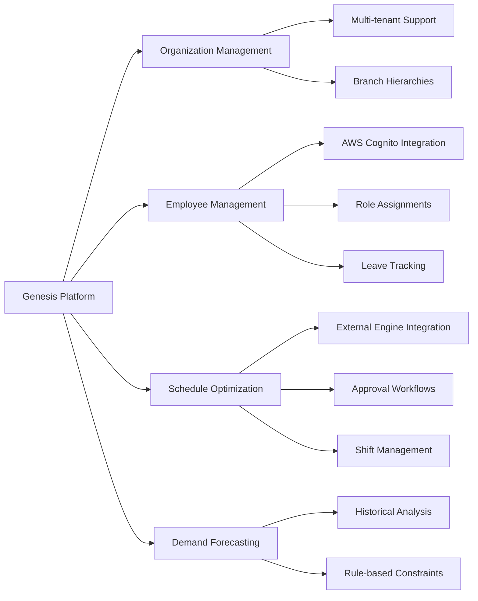

# Genesis API - Comprehensive Technical Documentation

Welcome to the **Genesis API** technical documentation. Genesis is an enterprise-grade workforce management and scheduling system built with Spring Boot, designed to handle complex organizational hierarchies, employee management, shift scheduling, and demand forecasting.

This documentation serves as your complete guide to understanding, deploying, and extending the Genesis platform.

---

## 📚 Documentation Navigation

This documentation is organized into four main sections. Start with the section most relevant to your role:

### 1. [System Architecture](ARCHITECTURE.md) 
**For: Architects, Senior Developers, Technical Leads**

Understand the high-level design and architectural decisions:
- System context and component diagrams
- Vertical Slice Architecture pattern
- Security architecture (AWS Cognito + JWT)
- Integration points with external services
- Architectural Decision Records (ADRs)

### 2. [Technical Specifications](TECHNICAL.md)
**For: Backend Developers, API Consumers**

Deep dive into implementation details:
- Complete data model with Entity Relationship Diagrams
- API standards and conventions
- Request/Response patterns
- Error handling and exception hierarchy
- Logging and observability framework

### 3. [Module Reference](MODULES.md)
**For: Feature Developers, Domain Experts**

Explore the business modules:
- 12 core business modules (Auth, Company, Employee, Schedule, etc.)
- Module responsibilities and boundaries
- Inter-module communication patterns
- Domain-specific workflows

### 4. [Operations Guide](OPERATIONS.md)
**For: DevOps Engineers, System Administrators**

Learn how to deploy and maintain the system:
- Docker containerization
- Environment configuration
- Database management
- Monitoring and health checks
- Troubleshooting guide

---

## 🎯 What is Genesis?

Genesis is a **workforce management platform** that helps organizations:

- **Manage organizational hierarchies** (Companies → Branches → Departments)
- **Handle employee lifecycle** (onboarding, role assignments, leave management)
- **Create optimized schedules** using external optimization engines
- **Forecast staffing demand** based on historical data and business rules
- **Enforce business constraints** through a flexible rule system

### Key Capabilities



---

## 🏗️ Technology Stack

### Core Framework
- **Spring Boot 3.4.0** - Modern Java application framework
- **Java 21** - Latest LTS with virtual threads and pattern matching
- **Maven** - Dependency management and build automation

### Data Layer
- **PostgreSQL** - Primary relational database
- **Flyway** - Database migration and version control
- **Hibernate/JPA** - Object-relational mapping
- **HikariCP** - High-performance connection pooling

### Security & Authentication
- **AWS Cognito** - User identity management and authentication
- **Spring Security** - Authorization framework
- **JWT (JSON Web Tokens)** - Stateless authentication
- **OAuth 2.0 Resource Server** - Token validation

### External Integrations
- **OpenFeign** - Declarative HTTP client for external services
- **AWS SDK** - Integration with AWS services (SES, SNS, SQS)
- **Schedule Engine** - External optimization engine via REST API

### Observability & Monitoring
- **SLF4J + Logback** - Structured logging
- **Spring Boot Actuator** - Health checks and metrics
- **MDC (Mapped Diagnostic Context)** - Request tracing
- **AOP (Aspect-Oriented Programming)** - Cross-cutting logging

### Development & Quality
- **OpenAPI/Swagger** - API documentation
- **SonarCloud** - Code quality analysis
- **Qodana** - Additional code analysis
- **Docker** - Containerization

---

## 🏛️ Architectural Principles

### 1. Vertical Slice Architecture
Unlike traditional layered architecture, Genesis organizes code by **business features** (modules), not technical layers. Each module is self-contained with its own:
- Controllers (API endpoints)
- Services (business logic)
- Repositories (data access)
- Entities (domain models)
- DTOs (data transfer objects)

**Benefits:**
- High cohesion within modules
- Low coupling between modules
- Easier to understand and modify features
- Clear ownership boundaries

### 2. API-First Design
All endpoints follow RESTful conventions with:
- Consistent URL patterns (`/api/v1/{resource}`)
- Standard HTTP methods (GET, POST, PUT, DELETE)
- Uniform response envelopes
- RFC 7807 Problem Details for errors

### 3. Security by Default
- All endpoints require authentication (except public health checks)
- JWT token validation on every request
- IP whitelisting for sensitive endpoints (e.g., engine callbacks)
- Structured audit logging with user context

### 4. Async-Ready
- Long-running operations (schedule generation) use async processing
- Configurable timeouts (up to 45 minutes for optimization)
- Webhook callbacks for completion notifications
- Proper connection pool sizing for concurrent operations

---

## 🚀 Quick Start Guide

### Prerequisites
- Java 21 (Eclipse Temurin or OpenJDK)
- PostgreSQL 15+
- Docker (optional, for containerized deployment)
- AWS Account (for Cognito setup)

### Local Development Setup

1. **Clone the repository**
   ```bash
   git clone <repository-url>
   cd genesis/api_app/genesis-api
   ```

2. **Configure environment variables**
   ```bash
   cp .env.example .env
   # Edit .env with your database and AWS credentials
   ```

3. **Run database migrations**
   ```bash
   ./mvnw flyway:migrate
   ```

4. **Start the application**
   ```bash
   ./mvnw spring-boot:run
   ```

5. **Access the API**
   - API Base URL: `http://localhost:8080`
   - Health Check: `http://localhost:8080/actuator/health`
   - Swagger UI: `http://localhost:8080/swagger-ui.html`

---

## 📖 Key Concepts

### Multi-Tenancy Model
Genesis supports multiple companies with isolated data:

```
Company (Tenant Root)
└── Branch (Physical Location)
    └── Department (Scheduling Unit)
        └── Employee (Staff Member)
```

### Schedule Generation Flow
1. Department creates a schedule request
2. System gathers constraints (rules, demand forecasts, employee availability)
3. External optimization engine generates optimal schedule
4. Results are stored and await approval
5. Approved schedules become active

### Authentication Flow
1. User registers via `/auth/register` (creates Cognito user + Employee record)
2. User confirms email via `/auth/confirm`
3. User logs in via `/auth/login` (receives JWT tokens)
4. Subsequent requests include `Authorization: Bearer <token>` header
5. API validates JWT signature and extracts user context

---

## 🤝 Contributing

When extending Genesis:
1. Follow the Vertical Slice pattern - add new features as self-contained modules
2. Use the shared utilities (`ValidationHelper`, `RepositoryHelper`)
3. Maintain consistent API response formats
4. Add comprehensive logging via the `LogAspect`
5. Write Flyway migrations for schema changes
6. Update this documentation

---

## 📞 Support & Resources

- **API Documentation**: See [TECHNICAL.md](TECHNICAL.md) for complete API reference
- **Architecture Details**: See [ARCHITECTURE.md](ARCHITECTURE.md) for design patterns
- **Module Guides**: See [MODULES.md](MODULES.md) for feature-specific documentation
- **Operations**: See [OPERATIONS.md](OPERATIONS.md) for deployment and monitoring

---

*Last Updated: 2026-01-30*  
*Version: 2.0*  
*Maintained by: Genesis Development Team*
