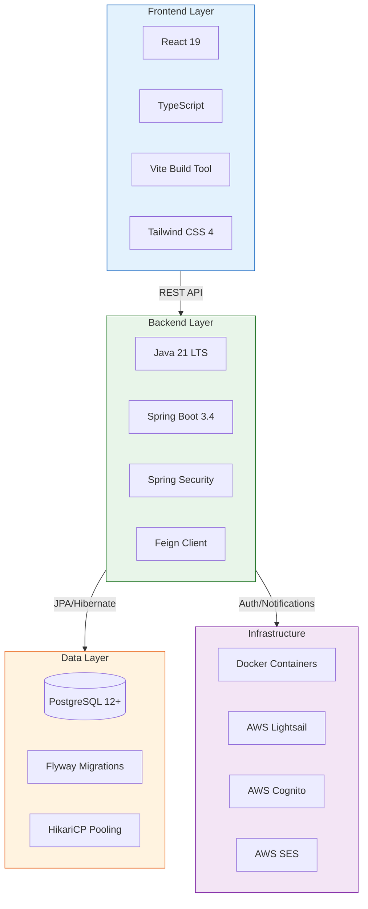

# 03 - Technology Stack

> **Genesis Workforce Management Platform - Technology Stack**
 
---
 
## System Stack Overview
 

 
---

## Backend Technology Stack

### Runtime Environment
- **Language**: Java 21 (LTS)
- **Framework**: Spring Boot 3.4.0
- **Build Tool**: Maven 3.9+

### Core Dependencies

#### Spring Framework
```xml
<dependency>
    <groupId>org.springframework.boot</groupId>
    <artifactId>spring-boot-starter-web</artifactId>
    <version>3.4.0</version>
</dependency>

<dependency>
    <groupId>org.springframework.boot</groupId>
    <artifactId>spring-boot-starter-data-jpa</artifactId>
    <version>3.4.0</version>
</dependency>

<dependency>
    <groupId>org.springframework.boot</groupId>
    <artifactId>spring-boot-starter-security</artifactId>
    <version>3.4.0</version>
</dependency>

<dependency>
    <groupId>org.springframework.boot</groupId>
    <artifactId>spring-boot-starter-actuator</artifactId>
    <version>3.4.0</version>
</dependency>
```

#### Database
- **Database**: PostgreSQL 12+
- **Driver**: `org.postgresql:postgresql`
- **Connection Pool**: HikariCP (bundled with Spring Boot)
- **Migration**: Flyway 9.x

#### Authentication & Security
- **AWS Cognito**: User authentication and management
- **JWT**: Token-based authentication
- **Spring Security**: Authorization and endpoint protection

#### HTTP Client
- **Feign**: Declarative HTTP client for external services
- **Version**: Spring Cloud OpenFeign

#### Utilities
- **Lombok**: Reduce boilerplate code
- **Jackson**: JSON processing
- **SLF4J + Logback**: Logging

### Data Processing Dependencies
- **Apache POI**: Excel file processing (employee import)
- **JSONB**: PostgreSQL JSON support for flexible fields

---

## Database Technology

### PostgreSQL 12+
**Why PostgreSQL?**
- ACID compliance for critical workforce data
- JSONB support for flexible employee attributes
- Advanced indexing for performance
- Mature ecosystem and tooling

**Key Features Used**:
- JSONB columns for `additional_fields`, `schedule_data`
- Foreign key constraints for referential integrity
- Indexes on frequently queried columns
- Soft delete pattern with `is_active`, `deleted_at`

---

## Infrastructure & Deployment

### Containerization
- **Docker**: Application containerization
- **Dockerfile**: Located in project root

### Cloud Services (AWS)
- **AWS Cognito**: User authentication
- **AWS SES**: Email notifications (configured)
- **AWS SQS/SNS**: Message queue (configured)

### Deployment Platform
- **Staging**: Digital Ocean (Droplets)
- **Production**: AWS Lightsail (Scalable Instances)
- **Containerization**: Docker-based deployment (Source → Docker → Staging → Prod)

---

## Frontend Technology Stack

- **Framework**: React 19.1.0
- **Build Tool**: Vite 6.x (with SWC)
- **Language**: TypeScript ~5.8
- **Styling**: Tailwind CSS 4.x
- **UI Components**: Radix UI, Headless UI
- **Routing**: @tanstack/react-router
- **State/Data**: @tanstack/react-query
- **Forms**: React Hook Form + Zod

---

## Development Tools

### Version Control
- **Git**: Source control
- **GitHub**: Repository hosting

### Build & Dependency Management
- **Maven**: Java dependency management and build
- **Maven Wrapper**: Included for consistent builds

### Testing
- **JUnit 5**: Unit testing framework
- **Spring Boot Test**: Integration testing
- **Mockito**: Mocking framework

### Code Quality
- **Lombok**: Code generation
- **SLF4J**: Logging abstraction

---

## Monitoring & Observability

### Application Monitoring
- **Spring Boot Actuator**: Health checks, metrics
- **Micrometer**: Metrics collection (HikariCP integration)

### Logging
- **Logback**: Logging implementation
- **SLF4J**: Logging facade
- **MDC**: Contextual logging (requestId, userId)

### External Monitoring

- Prometheus?
- Grafana?
- ELK Stack?

---

## External Integrations

### Optimization Engine
- **Protocol**: HTTP/REST
- **Client**: Feign
- **Timeout**: 45 minutes
- **Retry**: Disabled

### AWS Services
- **Cognito**: User pool management
- **SES**: Email delivery
- **SQS/SNS**: Message queue (configured, not actively used)

---

## Technology Decisions

### Why Spring Boot 3.4.0?
- Virtual threads for improved concurrency
- Native compilation support (GraalVM)
- Latest security patches
- OAuth 2.1 support

### Why Java 21?
- LTS release with long-term support
- Virtual threads (Project Loom)
- Pattern matching improvements
- Performance enhancements

### Why PostgreSQL over NoSQL?
- ACID compliance for workforce data
- Complex joins for reporting
- JSONB for flexibility where needed
- Mature tooling and ecosystem

### Why Feign over RestTemplate?
- Declarative HTTP client
- Less boilerplate code
- Better integration with Spring Cloud
- Easier to test and mock

### Why AWS Cognito?
- Managed authentication service
- SOC 2, HIPAA, GDPR compliant
- MFA support out of the box
- Scales automatically

---

## Version Matrix

| Component | Version | Notes |
|-----------|---------|-------|
| Java | 21 (LTS) | Required |
| Spring Boot | 3.4.0 | Core framework |
| PostgreSQL | 12+ | Database |
| Maven | 3.9+ | Build tool |
| Docker | 20.10+ | Containerization |
| AWS Cognito | Latest | Authentication |

---

## Next Steps

1. **Review** [04_BACKEND_SPECIFICATIONS.md](04_BACKEND_SPECIFICATIONS.md) for detailed backend architecture
2. **Provide** frontend technology stack details
3. **Confirm** deployment platform and monitoring tools

---


