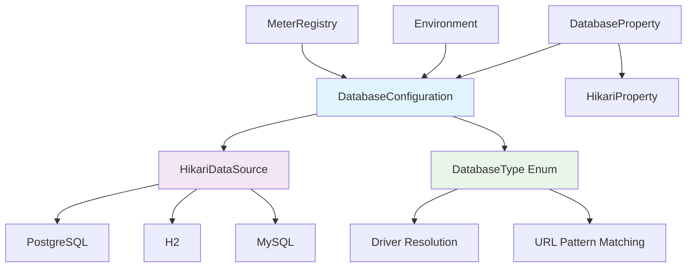

# Database Connection Pool Architecture

## Decision: HikariCP as Connection Pool Implementation

**Date:** 2025-12-24  
**Status:** Implemented  
**Context:** The application requires efficient database connectivity with connection pooling to handle concurrent database operations while maintaining performance and resource efficiency.

## Solution Overview

The system implements HikariCP as the primary connection pool manager, configured through a centralized `DatabaseConfiguration` class that supports multiple database types with optimized settings for each.

### Key Components



## Configuration Architecture

### Database Type Support
The system supports three database types with automatic driver detection:

| Database | JDBC Prefix | Driver Class | Auto-detected |
|----------|-------------|--------------|---------------|
| PostgreSQL | `jdbc:postgresql:` | `org.postgresql.Driver` | Yes |
| H2 | `jdbc:h2:` | `org.h2.Driver` | Yes |
| MySQL | `jdbc:mysql:` | `com.mysql.cj.jdbc.Driver` | Yes |

### Connection Pool Settings

**Default Configuration:**
- Maximum Pool Size: 10 connections
- Minimum Idle: 10 connections
- Connection Timeout: 30 seconds
- Idle Timeout: 10 minutes
- Max Lifetime: 30 minutes
- Auto-commit: Disabled (explicit transaction control)
- Read-only: Disabled

### Database-Specific Optimizations

#### PostgreSQL Optimizations
```yaml
tcpKeepAlive: true
ApplicationName: {app-name}-{profile}
assumeMinServerVersion: 12.0
reWriteBatchedInserts: true
prepareThreshold: 5
preparedStatementCacheQueries: 250
preparedStatementCacheSizeMiB: 5
maintainTimeStats: false
```

#### H2 Optimizations
```yaml
DB_CLOSE_DELAY: -1
DB_CLOSE_ON_EXIT: FALSE
CACHE_SIZE: 65536
LOCK_TIMEOUT: 10000
```

## Property Configuration Structure

```yaml
spring:
  datasource:
    url: jdbc:postgresql://${POSTGRES_DB_HOST}:${POSTGRES_DB_PORT}/${POSTGRES_DB_NAME}
    username: ${POSTGRES_DB_USER}
    password: ${POSTGRES_DB_PASS}
    driver-class-name: org.postgresql.Driver
    
    hikari:
      maximum-pool-size: ${DB_POOL_SIZE:10}
      minimum-idle: ${DB_POOL_MIN_IDLE:2}
      idle-timeout: ${DB_IDLE_TIMEOUT:300000}
      max-lifetime: ${DB_MAX_LIFETIME:1800000}
      connection-timeout: ${DB_CONNECTION_TIMEOUT:30000}
      leak-detection-threshold: ${DB_LEAK_DETECTION:60000}
```

## Monitoring and Observability

### Metrics Integration
- **Micrometer Integration:** Automatic metrics collection when `MeterRegistry` is available
- **JMX Disabled:** MBean registration disabled by default for security
- **Logging:** Comprehensive configuration logging with sensitive data masking

### Pool Naming Strategy
Pool names are automatically generated based on active Spring profiles:
- No profiles: `hikari-pool`
- With "test" profile: `hikari-pool-test`
- With multiple profiles: `hikari-pool-profile1-profile2`

## Security Considerations

### Sensitive Data Protection
- **URL Masking:** Credentials in JDBC URLs are masked in logs
- **Password Protection:** Passwords are never logged in plain text
- **Environment Variables:** Sensitive data sourced from environment variables

### Connection Security
- **Auto-commit Disabled:** Prevents accidental data persistence
- **Leak Detection:** Configurable connection leak detection threshold
- **Validation:** URL validation before connection pool creation

## Testing Strategy

### Comprehensive Test Coverage
- **Unit Tests:** 100% coverage for configuration classes
- **Integration Tests:** Database type detection and configuration
- **Edge Cases:** Null values, invalid URLs, unsupported databases
- **Reflection Tests:** Private method behavior verification

### Test Database Configuration
```yaml
# Test configuration uses H2 in-memory database
spring:
  datasource:
    url: jdbc:h2:mem:testdb;MODE=PostgreSQL
    username: sa
    password: 
    hikari:
      maximum-pool-size: 2
      minimum-idle: 1
```

## Rationale

1. **Performance:** HikariCP is known as the fastest connection pool for Java
2. **Simplicity:** Clean API with sensible defaults
3. **Monitoring:** Built-in support for Micrometer metrics
4. **Flexibility:** Support for multiple database types with optimized settings
5. **Safety:** Sensitive data protection and validation

## Trade-offs

- **Memory Usage:** Default minimum idle equals maximum pool size (can be configured)
- **Complexity:** Additional abstraction layer over Spring Boot's auto-configuration
- **Learning Curve:** Custom configuration requires understanding of HikariCP properties

## Related Decisions
- [JPA Configuration](../decisions/jpa-configuration.md)
- [Database Migration Strategy](../decisions/database-migration.md)

---

*This configuration provides a production-ready database connection pool with optimizations for different database types, comprehensive monitoring, and security considerations.*