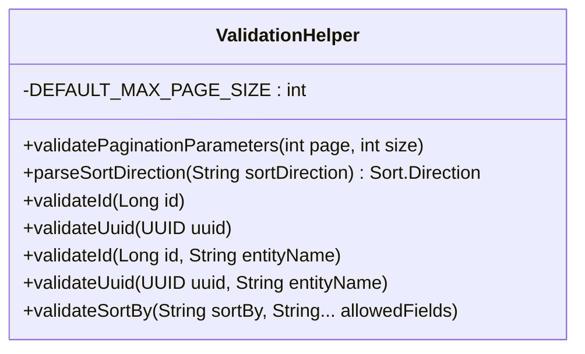

## Shared Core Components

This segment introduces foundational utility classes and response structures that form the backbone of the application's data access and API response patterns.

### Repository Helper Pattern

The `RepositoryHelper` class provides standardized methods for entity retrieval with consistent error handling:

```java
// Find entity by database ID
T entity = RepositoryHelper.findByIdOrThrow(repository, id, Entity.class);

// Find entity by UUID
T entity = RepositoryHelper.findByUuidOrThrow(repository, uuid, Entity.class);
```

Both methods throw `ResourceNotFoundException` with descriptive messages when entities are not found, ensuring consistent error handling across all repositories.

### UUID Repository Interface

The `UuidRepository` interface extends Spring Data's `JpaRepository` to add UUID-based lookup capabilities:

```java
@NoRepositoryBean
public interface UuidRepository<T> extends JpaRepository<T, Long> {
    Optional<T> findByUuid(UUID uuid);
}
```

This interface serves as a base for repositories that need to support both numeric ID and UUID lookups, providing a clean separation of concerns.

### Validation Helper

The `ValidationHelper` class provides comprehensive validation for common parameters:



Key validation features:
- **Pagination**: Validates page (≥0) and size (1-1000) parameters
- **Sorting**: Parses sort direction (ASC/DESC) and validates sort fields against allowed values
- **Identifiers**: Validates both numeric IDs (positive) and UUIDs (non-null)
- **Entity-specific validation**: Provides overloaded methods with entity names for better error messages

### Generic Service Interface

The `IGenericService` interface defines a comprehensive CRUD contract for services:

```java
public interface IGenericService<T, K> {
    PagedResponse<K> getAll(int page, int size, String sortBy, String sortDirection);
    K getById(Long id);
    K getByUuid(UUID uuid);
    K save(T entity);
    K update(Long id, T entity);
    K updateByUuid(UUID uuid, T entity);
    void softDelete(Long id);
    void softDeleteByUuid(UUID uuid);
    void delete(Long id);
    void deleteByUuid(UUID uuid);
}
```

This interface supports both numeric ID and UUID operations, pagination, and soft/hard deletion patterns.

### API Response Structures

#### ApiResponse Record
A standardized response wrapper for all API endpoints:

```java
public record ApiResponse<T>(
    Boolean success,
    T data,
    String message,
    Instant timestamp,
    String path
) {
    public static <T> ApiResponse<T> success(T data, String message, String path);
    public static <T> ApiResponse<T> error(String message, String path);
}
```

Features:
- Type-safe generic response wrapper
- Success/error factory methods
- Automatic timestamp generation
- JSON serialization with `@JsonInclude(NON_NULL)`

#### PagedResponse Record
A specialized response for paginated data: