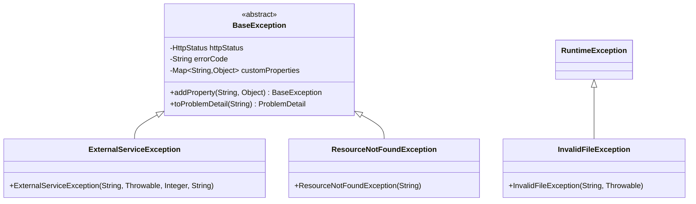
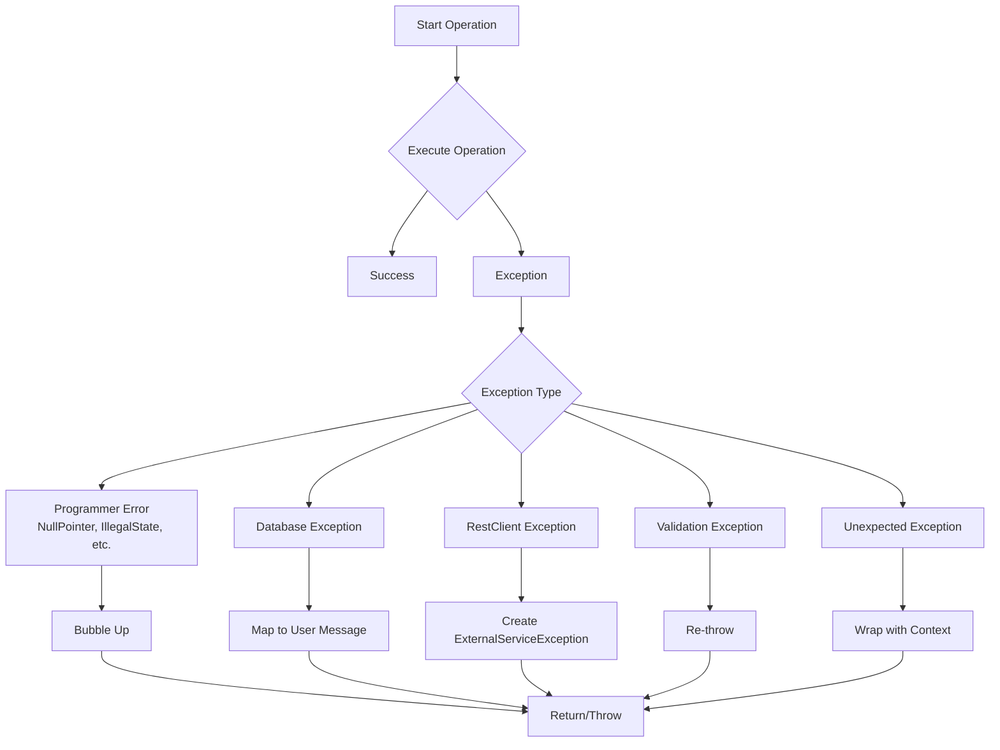

# Exception Handling Architecture

## Overview
This segment introduces a comprehensive exception handling framework with centralized error management, structured error responses, and a service operation executor for consistent error handling across the application.

## Architecture Components

### 1. Base Exception Hierarchy



**Key Classes:**
- **BaseException**: Abstract base class providing consistent error structure with HTTP status, error codes, and custom properties
- **ExternalServiceException**: For external service failures with status code mapping and response body capture
- **ResourceNotFoundException**: Standard 404 resource not found errors
- **InvalidFileException**: File validation and processing errors

### 2. Global Exception Handler

**GlobalExceptionHandler** extends `ResponseEntityExceptionHandler` to provide centralized exception handling:

```java
@RestControllerAdvice
public class GlobalExceptionHandler extends ResponseEntityExceptionHandler {
    // Handles BaseException hierarchy
    @ExceptionHandler(BaseException.class)
    public ResponseEntity<ProblemDetail> handleBaseException(...)
    
    // Handles validation errors from @Valid
    @Override
    protected ResponseEntity<Object> handleMethodArgumentNotValid(...)
    
    // Handles constraint violations
    @ExceptionHandler(ConstraintViolationException.class)
    public ResponseEntity<ProblemDetail> handleConstraintViolationException(...)
}
```

**Response Format (RFC 7807 Problem Details):**
```json
{
  "type": "about:blank",
  "title": "Bad Request",
  "status": 400,
  "detail": "Validation failed",
  "instance": "/api/users",
  "errorCode": "VALIDATION_ERROR",
  "errors": [
    {
      "field": "email",
      "message": "must be a valid email"
    }
  ]
}
```

### 3. Service Operation Executor

**ServiceOperationExecutor** provides a unified pattern for executing service operations with consistent error handling:



**Key Features:**
- **Trace ID Management**: Automatic correlation ID generation/retrieval from MDC
- **Exception Categorization**: 
  - Programmer errors (bubbled up)
  - Database exceptions (mapped to user-friendly messages)
  - External service errors (wrapped with context)
  - Validation errors (preserved)
- **Response Body Truncation**: Limits external service response bodies to 10KB
- **Operation Context**: Includes operation type (RETRIEVE, SAVE, UPDATE, DELETE, OTHER) in logs

**Database Exception Mapping:**
- `OptimisticLockingFailureException` → "Concurrent modification detected"
- `DeadlockLoserDataAccessException` → "Database deadlock detected"
- `EntityNotFoundException` → Operation-specific messages
- `DataIntegrityViolationException` → Constraint-specific messages

### 4. Constants and Enums

**ServiceOperationExecutorConstant:**
```java
public final class ServiceOperationExecutorConstant {
    public static final String TRUNCATION_INDICATOR = "\n\n--- RESPONSE TRUNCATED (exceeded 10KB limit) ---";
    public static final String MDC_REQUEST_ID_KEY = "requestId";
    public static final int MAX_RESPONSE_BODY_SIZE = 10_000;
}
```

**OperationStatus Enum:**
```java
public enum OperationStatus {
    RETRIEVE, SAVE, UPDATE, DELETE, OTHER
}
```

## Design Decisions

### 1. RFC 7807 Compliance
- Uses Spring's `ProblemDetail` for standardized error responses
- Consistent `about:blank` type for application-specific errors
- Structured error details with field-level validation information

### 2. Centralized Error Handling
- Single `GlobalExceptionHandler` for all REST controllers
- Consistent logging with trace IDs
- Structured error responses across all endpoints

### 3. Defensive Programming
- `ServiceOperationExecutor` validates all inputs (non-null checks)
- Programmer errors (NPE, IllegalState) are bubbled up for immediate fixing
- Unexpected exceptions are wrapped with context for debugging

### 4. External Service Integration
- `ExternalServiceException` captures HTTP status, response body, and cause
- Response body truncation prevents memory issues with large error responses
- Status code mapping to appropriate HTTP statuses

## Usage Examples

### Basic Service Operation
```java
public User getUser(String id) {
    return ServiceOperationExecutor.execute(
        () -> userRepository.findById(id)
            .orElseThrow(() -> new ResourceNotFoundException("User not found")),
        OperationStatus.RETRIEVE,
        (message, cause) -> new RuntimeException("Failed to retrieve user", cause)
    );
}
```

### Void Operation
```java
public void deleteUser(String id) {
    ServiceOperationExecutor.executeVoid(
        () -> userRepository.deleteById(id),
        OperationStatus.DELETE,
        (message, cause) -> new RuntimeException("Failed to delete user", cause)
    );
}
```

### Custom Exception with Properties
```java
throw new ExternalServiceException(
    "Payment service failed",
    cause,
    503,
    "{\"error\": \"service_unavailable\"}"
).addProperty("retryAfter", "300s");
```

## Dependencies Added
- `spring-boot-starter-validation`: For bean validation and constraint violation handling

## Testing Strategy
Comprehensive test coverage includes:
- `GlobalExceptionHandlerTest`: Handler behavior with various exception types
- `BaseExceptionTest`: ProblemDetail creation and property management
- `ExternalServiceExceptionTest`: Status code mapping and property handling
- `ServiceOperationExecutorTest`: Full branch coverage of exception handling logic

## Security Considerations
- Response body truncation prevents exposure of potentially sensitive error details
- Structured error responses avoid information leakage
- Trace IDs in logs enable debugging without exposing internal details to users