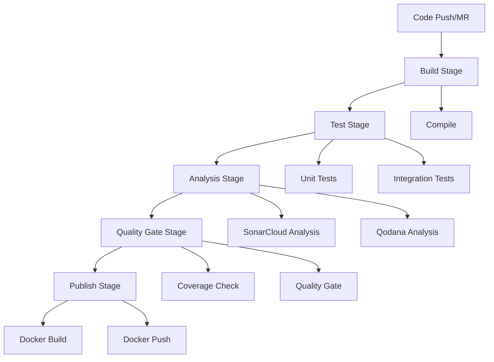

# CI/CD Pipeline Documentation

## Pipeline Overview

## Pipeline Stages

### 1. Build Stage
**Job**: `build`
- **Image**: `maven:3.9-eclipse-temurin-21`
- **Purpose**: Compile the application
- **Artifacts**: `target/` directory
- **Triggers**: Merge requests, dev branch, main branch

### 2. Test Stage
**Job**: `test`
- **Image**: `maven:3.9-eclipse-temurin-21`
- **Purpose**: Execute tests with coverage
- **Reports**: JUnit XML reports
- **Coverage**: JaCoCo integration
- **Triggers**: Merge requests, dev branch, main branch

### 3. Analysis Stage
#### SonarCloud Analysis
**Job**: `sonarcloud-analysis`
- **Image**: `sonarsource/sonar-scanner-cli:latest`
- **Features**:
  - Pull request analysis for merge requests
  - Branch analysis for dev/main branches
  - Quality gate wait enabled
  - JaCoCo coverage integration

#### Qodana Analysis
**Job**: `qodana`
- **Component**: Qodana GitLab CI template
- **Features**:
  - Static code analysis
  - Code quality checks
  - MR comment integration
  - Coverage directory support

### 4. Quality Gate Stage
**Job**: `quality-gate-check`
- **Image**: `alpine:latest`
- **Checks**:
  1. SonarCloud Quality Gate status
  2. SonarCloud coverage (minimum 80%)
  3. JaCoCo coverage (minimum 80%)
- **Failure Conditions**: Any check below threshold

### 5. Publish Stage
**Job**: `docker-publish`
- **Image**: `docker:latest`
- **Services**: Docker-in-Docker
- **Tagging Strategy**:
  - **Tags**: `vX.Y.Z` → versioned image + `latest`
  - **Main Branch**: `rc-{pipeline_id}` + `rc-latest`
  - **Dev Branch**: `dev-{pipeline_id}` + `dev-latest`
- **Registry**: Docker Hub

## Environment Variables
| Variable | Purpose | Required For |
|----------|---------|--------------|
| `GITHUB_USERNAME` | GitHub authentication | Maven builds |
| `GITHUB_TOKEN` | GitHub token | Maven builds |
| `SONAR_TOKEN` | SonarCloud authentication | Sonar analysis |
| `DOCKERHUB_USERNAME` | Docker Hub username | Docker publish |
| `DOCKERHUB_PASSWORD` | Docker Hub password | Docker publish |

## Quality Gates
### Coverage Requirements
- **Minimum Threshold**: 80% instruction coverage
- **Tools**: SonarCloud + JaCoCo dual verification
- **Validation**: Both tools must pass threshold

### Analysis Integration
- **SonarCloud Project**: `horaion`
- **SonarCloud Organization**: `weehong`
- **Qodana Image**: `jetbrains/qodana-jvm:2025.2`