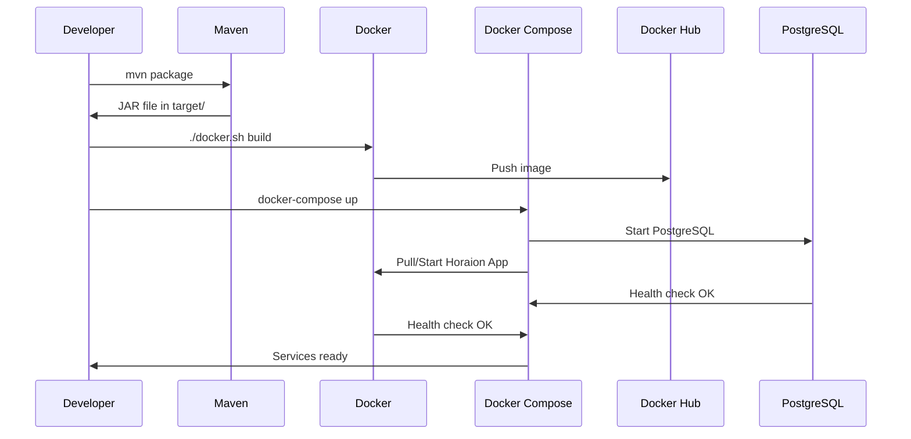

# Docker Deployment

This document describes the Docker-based deployment setup for the Horaion application, including containerization, Docker Compose orchestration, and Docker Hub integration.

## Overview

The deployment infrastructure uses a multi-stage Docker build process and Docker Compose for local development and testing environments. The setup includes:

- **Dockerfile**: Multi-stage build for optimized Spring Boot application container
- **Docker Compose**: Orchestration with PostgreSQL database
- **Environment Configuration**: Separate configuration files for different deployment scenarios
- **Build Script**: Automated Docker image build and push to Docker Hub

## Architecture

```mermaid
graph TB
    subgraph "Build Process"
        A[Source Code] --> B[Maven Package]
        B --> C[JAR File]
        C --> D[Multi-stage Docker Build]
        D --> E[Docker Image]
    end
    
    subgraph "Runtime Environment"
        E --> F[Docker Compose]
        F --> G[Horaion App Container]
        F --> H[PostgreSQL Container]
        G --> I[Port 8100]
        H --> J[Port 54321]
        G -.->|Health Check| K[/actuator/health]
        H -.->|Health Check| L[pg_isready]
    end
    
    subgraph "External Services"
        M[Docker Hub] --> N[Image Registry]
        O[Auth0] --> P[Authentication]
    end
    
    E --> M
    G --> O
```

## Configuration Files

### Environment Variables

Two example environment files are provided for different deployment scenarios:

#### .env.compose.example - Docker Compose Configuration
```bash
# Docker Image Configuration
HORAION_APP_IMAGE=horaion-app:latest

# Application Configuration
SPRING_PROFILE=sit
APP_PORT=8100

# PostgreSQL Database Configuration
POSTGRES_DB_NAME=horaion
POSTGRES_DB_USER=horaion
POSTGRES_DB_PASS=horaion123
POSTGRES_DB_PORT=54321

# Database Connection Pool Configuration
DB_POOL_SIZE=10
DB_POOL_MIN_IDLE=2
DB_IDLE_TIMEOUT=300000
DB_MAX_LIFETIME=1800000
DB_CONNECTION_TIMEOUT=30000
DB_LEAK_DETECTION=60000

# Auth0 Configuration (Required)
AUTH0_DOMAIN=your-auth0-domain.auth0.com
AUTH0_AUDIENCE=your-auth0-audience

# CORS Configuration
CORS_ALLOWED_ORIGINS=http://localhost:3000
CORS_ALLOWED_METHODS=GET,POST,PUT,PATCH,DELETE,OPTIONS
CORS_ALLOWED_HEADERS=Authorization,Content-Type,Accept,X-Request-Id
CORS_EXPOSED_HEADERS=X-Request-Id
CORS_ALLOW_CREDENTIALS=true
CORS_MAX_AGE=3600

# Logging Configuration
SHOW_SQL_FLAG=false
```

#### .env.docker.example - Docker Build Configuration
```bash
# === Credentials (Never commit this file with real credentials!) ===
DOCKERHUB_USERNAME=
DOCKERHUB_PASSWORD=

IMAGE_NAME=horaion-app
VERSION=1.0.0
DOCKERFILE_PATH=Dockerfile
BUILD_CONTEXT=.
PLATFORMS=linux/amd64,linux/arm64
```

## Dockerfile

The Dockerfile uses a multi-stage build process for optimized image size and security:

### Stage 1: Extractor
```dockerfile
FROM amazoncorretto:21-alpine AS extractor
WORKDIR /extract
COPY target/*.jar app.jar
RUN java -Djarmode=layertools -jar app.jar extract
```

### Stage 2: Runtime
```dockerfile
FROM amazoncorretto:21-alpine
# Create non-root user for security
RUN addgroup -g 1000 appgroup && \
    adduser -u 1000 -G appgroup -s /bin/sh -D appuser

WORKDIR /app
RUN mkdir -p /app/logs && chown -R appuser:appgroup /app

# Copy Spring Boot layers
COPY --from=extractor --chown=appuser:appgroup /extract/dependencies/ ./ 
COPY --from=extractor --chown=appuser:appgroup /extract/spring-boot-loader/ ./ 
COPY --from=extractor --chown=appuser:appgroup /extract/snapshot-dependencies/ ./ 
COPY --from=extractor --chown=appuser:appgroup /extract/application/ ./ 

USER appuser
EXPOSE 8080

# Health check configuration
HEALTHCHECK --interval=30s --timeout=3s --start-period=40s --retries=3 \
    CMD wget -q --spider http://localhost:8080/actuator/health || exit 1

ENTRYPOINT ["java", \
    "-XX:+UseContainerSupport", \
    "-XX:MaxRAMPercentage=75.0", \
    "-Djava.security.egd=file:/dev/./urandom", \
    "org.springframework.boot.loader.launch.JarLauncher"]
```

## Docker Compose Configuration

The compose.yaml file defines two services:

### Application Service (horaion-app)
- **Image**: Configurable via `HORAION_APP_IMAGE`
- **Port**: 8100 (mapped from container port 8100)
- **Depends on**: PostgreSQL with health check condition
- **Environment**: Comprehensive configuration including database, Auth0, CORS, and logging
- **Health Check**: HTTP health check on `/actuator/health` endpoint
- **Volumes**: Persistent logs volume
- **Network**: Custom `horaion-network`

### Database Service (postgres)
- **Image**: `postgres:15-alpine`
- **Port**: 54321 (mapped from container port 5432)
- **Environment**: Database credentials and timezone
- **Volumes**: Persistent data volume
- **Health Check**: PostgreSQL readiness check using `pg_isready`

### Network and Volumes
- **Network**: `horaion-network` (bridge driver)
- **Volumes**: 
  - `postgres_data`: PostgreSQL database storage
  - `app_logs`: Application logs storage

## Build and Deployment Script

The docker.sh script automates the Docker image build and push process:

### Features
- Environment variable validation
- Docker daemon availability check
- Secure Docker Hub login (password via stdin)
- JAR file existence verification
- Multi-architecture tagging (version and latest)
- Comprehensive error handling and colored output

### Usage
```bash
# Make script executable
chmod +x deployments/docker.sh

# Run the script
cd deployments
./docker.sh
```

### Prerequisites
1. Docker installed and running
2. Maven package built: `mvn package`
3. `.env.docker` file configured with Docker Hub credentials
4. Docker Hub account with repository access

## Health Monitoring

Both services include health checks for reliable orchestration:

### Application Health Check
```yaml
healthcheck:
  test: [ "CMD", "wget", "--quiet", "--tries=1", "--spider", "http://localhost:8100/actuator/health" ]
  interval: 10s
  timeout: 5s
  retries: 5
  start_period: 90s
```

### Database Health Check
```yaml
healthcheck:
  test: [ "CMD-SHELL", "pg_isready -U ${POSTGRES_DB_USER:-horaion} -d ${POSTGRES_DB_NAME:-horaion}" ]
  interval: 10s
  timeout: 5s
  retries: 5
  start_period: 30s
```

## Security Considerations

1. **Non-root User**: Application runs as non-root user `appuser`
2. **Secret Management**: Credentials stored in environment files (excluded from version control)
3. **Network Isolation**: Custom bridge network for service communication
4. **Health Monitoring**: Comprehensive health checks for service reliability
5. **Resource Limits**: Container memory optimization with `-XX:MaxRAMPercentage=75.0`

## Deployment Workflow



## Troubleshooting

### Common Issues

1. **"No JAR file found in target/"**
   - Run `mvn package` first to build the application JAR

2. **Docker login failures**
   - Verify Docker Hub credentials in `.env.docker`
   - Ensure Docker daemon is running: `docker info`

3. **Port conflicts**
   - Modify `APP_PORT` and `POSTGRES_DB_PORT` in `.env.compose`

4. **Database connection issues**
   - Verify PostgreSQL health check passes
   - Check database credentials match between services


### Logs Access
```bash
# Application logs
docker logs horaion-app

# Database logs
docker logs horaion-postgres

# Follow logs in real-time
docker logs -f horaion-app
```

## Next Steps

1. Configure CI/CD pipeline integration
2. Set up production environment variables
3. Implement database backup strategy
4. Configure monitoring and alerting
5. Set up SSL/TLS termination