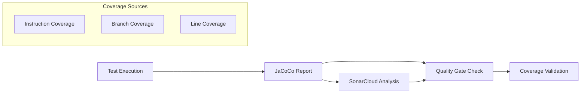

# Quality Analysis Tools

## SonarCloud Integration

### Configuration
```properties
sonar.projectKey=horaion
sonar.organization=weehong
sonar.host.url=https://sonarcloud.io
sonar.sources=src/main/java
sonar.tests=src/test/java
sonar.java.binaries=target/classes
sonar.java.test.binaries=target/test-classes
sonar.coverage.jacoco.xmlReportPaths=target/site/jacoco/jacoco.xml
```

### Pull Request Analysis
For merge requests, additional parameters:
```properties
sonar.pullrequest.key=${CI_MERGE_REQUEST_IID}
sonar.pullrequest.branch=${CI_MERGE_REQUEST_SOURCE_BRANCH_NAME}
sonar.pullrequest.base=${CI_MERGE_REQUEST_TARGET_BRANCH_NAME}
```

## Qodana Integration

### Configuration
```yaml
args: 
  --coverage-dir,$CI_PROJECT_DIR/.qodana/code-coverage
  --image,jetbrains/qodana-jvm:2025.2
  --env,GITHUB_USERNAME=${GITHUB_USERNAME}
  --env,GITHUB_TOKEN=${GITHUB_TOKEN}
```

### Features
- **MR Mode**: Automated code review comments
- **Result Upload**: Centralized analysis results
- **Fix Suggestions**: Read-only mode (no auto-push)
- **Coverage Integration**: Uses JaCoCo reports

## Coverage Analysis

### Dual Verification System


### Quality Gate Script
The pipeline includes a comprehensive quality gate check that:
1. **Verifies SonarCloud Quality Gate Status**
2. **Validates SonarCloud Coverage** (≥80%)
3. **Validates JaCoCo Coverage** (≥80%)
4. **Provides Detailed Failure Messages**

### Coverage Threshold Enforcement
```bash
# Minimum coverage threshold
COVERAGE_THRESHOLD="80"

# JaCoCo calculation
MISSED=$(xmllint --xpath "string(//report/counter[@type='INSTRUCTION']/@missed)" "$JACOCO_REPORT")
COVERED=$(xmllint --xpath "string(//report/counter[@type='INSTRUCTION']/@covered)" "$JACOCO_REPORT")
JACOCO_COVERAGE=$((COVERED * 100 / (MISSED + COVERED)))
```

## Security Considerations
- **Token Management**: All sensitive tokens stored as CI variables
- **No Hardcoded Secrets**: All credentials injected via environment
- **Secure Protocols**: TLSv1.2 enforced for Maven downloads
- **Docker Security**: Password passed via stdin, not command line