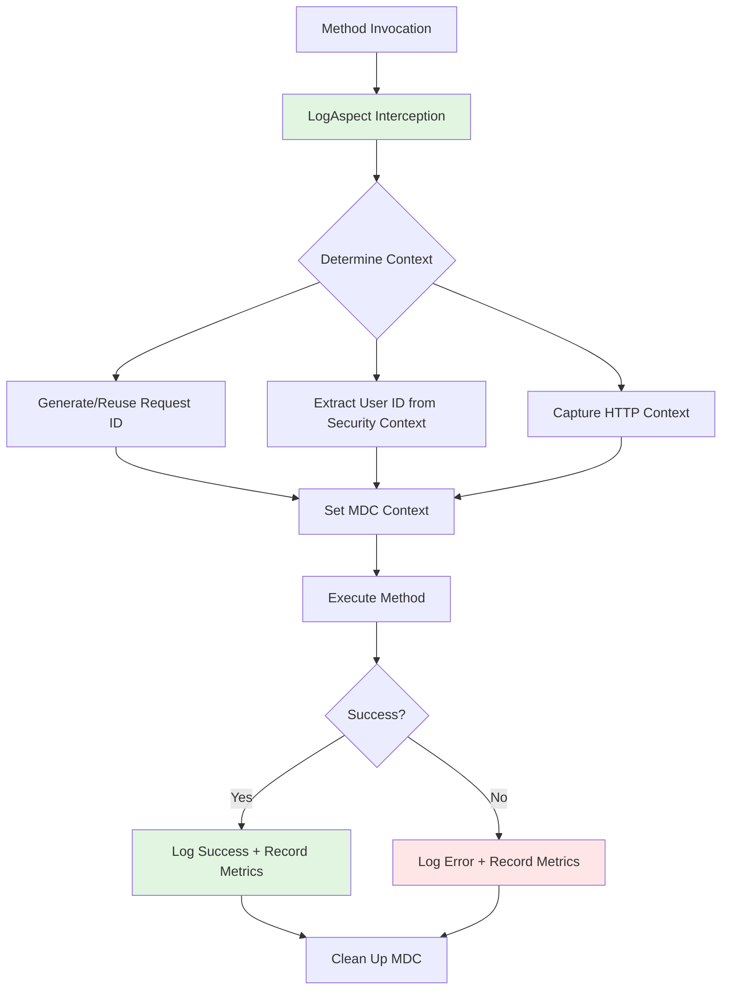

# ADR 0003: Cross-Cutting Logging and Metrics Aspect

## Status
Accepted

## Context
As the Horaion application grows, we need consistent logging and monitoring across all service and controller methods. Manual logging in each method would lead to:
- Inconsistent log formats
- Missing performance metrics
- Duplicated error handling code
- Difficulty correlating logs across request boundaries

## Decision
Implement a Spring AOP aspect (`LogAspect`) that automatically logs method execution, captures metrics, and enriches logs with contextual information (request ID, user ID, HTTP context).

## Solution Components

### 1. LogAspect Architecture


### 2. Key Features
- **Automatic Request Tracing**: Generates unique 8-character request IDs for log correlation
- **User Context**: Extracts authenticated user ID from Spring Security context
- **HTTP Context**: Captures HTTP method and endpoint for web requests
- **Performance Monitoring**: Records execution time and classifies as success/failure
- **Slow Execution Detection**: Configurable threshold for warning logs
- **Exception Handling**: Wraps checked exceptions while preserving runtime exceptions

### 3. Configuration Properties
```yaml
app:
  logging:
    aspect:
      enabled: true  # Toggle aspect on/off
      slow-execution-threshold-ms: 1000  # Threshold for WARN logs
```

### 4. MDC (Mapped Diagnostic Context) Fields
| Field | Description | Example |
|-------|-------------|---------|
| `requestId` | Unique request identifier | `A1B2C3D4` |
| `method` | Executing method signature | `UserService.createUser()` |
| `userId` | Authenticated user ID | `user123` |
| `httpMethod` | HTTP method (if web request) | `POST` |
| `endpoint` | HTTP endpoint (if web request) | `/api/users` |

### 5. Metrics Collected
- **Metric Name**: `app.method.execution`
- **Tags**: 
  - `method`: Method signature
  - `status`: `success` or `failure`
- **Unit**: Milliseconds

## Consequences

### Positive
1. **Consistent Logging**: All methods follow the same logging pattern
2. **Observability**: Built-in metrics and structured logs
3. **Reduced Boilerplate**: No manual logging in business methods
4. **Correlation**: Request IDs enable tracing across service boundaries
5. **Configurable**: Can be disabled or tuned via properties

### Negative
1. **Runtime Overhead**: Aspect adds small performance overhead
2. **Complexity**: Introduces AOP dependency and configuration
3. **Testing**: Requires careful mocking of security and HTTP contexts

### Neutral
1. **Exception Wrapping**: Checked exceptions are wrapped in `MethodExecutionException`
2. **Log Volume**: May increase log volume in high-traffic applications

## Implementation Details

### Pointcut Definitions
```java
// Service methods in application packages
@Pointcut("execution(public * com.horaion.app..services..*(..))")

// Controller methods (Spring MVC)
@Pointcut("within(@org.springframework.web.bind.annotation.RestController *) || " +
          "within(@org.springframework.stereotype.Controller *)")
```

### Conditional Activation
The aspect is conditionally enabled via `@ConditionalOnProperty`, allowing it to be disabled in test environments or for performance tuning.

### Logback Configuration
Enhanced log pattern includes MDC fields:
```
%d{yyyy-MM-dd HH:mm:ss} [%thread] %-5level %logger{36} [%X{requestId}] [%X{userId}] - %msg%n
```

## Testing Strategy
Comprehensive test coverage includes:
- Success and failure scenarios
- MDC context management
- Security context extraction
- HTTP context handling
- Exception wrapping behavior
- Performance threshold detection

## Related Decisions
- ADR 0001: Spring Boot Foundation
- ADR 0002: Checkstyle and Code Quality
- Future: Distributed Tracing Integration