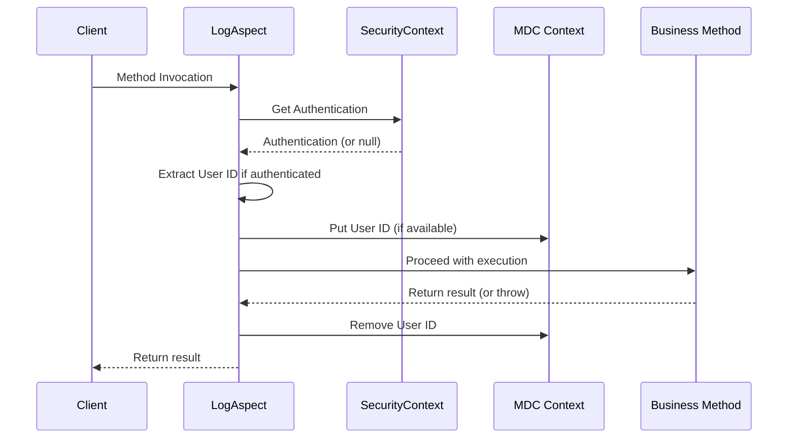

# Security-Aware Logging Design

## Overview
The logging system is designed to be security-conscious while providing necessary observability. It integrates with Spring Security to extract user context without exposing sensitive information.

## Security Considerations

### 1. User Identification
- Extracts user ID from Spring Security `Authentication` object
- Handles anonymous users gracefully (no user ID in logs)
- Validates authentication state before extracting credentials
- Falls back gracefully if security context is unavailable

### 2. Information Exposure
**Logged Information:**
- User ID (non-sensitive identifier)
- Method signatures (business logic)
- Execution times (performance)
- HTTP endpoints (public API paths)

**NOT Logged:**
- Passwords or credentials
- Sensitive request/response payloads
- Personal Identifiable Information (PII)
- Security tokens or session IDs

### 3. Context Management


### 4. Error Handling Security
- Exception messages are logged but not detailed stack traces in production
- Security exceptions are handled gracefully without exposing internals
- No sensitive data in error messages or log contexts

## Configuration Security

### Test Environment
In test profiles, the logging aspect is disabled to prevent interference with unit tests:
```yaml
app:
  logging:
    aspect:
      enabled: false  # Disabled in tests
```

### Production Considerations
- File logging with rotation and size limits
- No sensitive data in log patterns
- Audit logging separation (future consideration)

## Compliance Aspects
- **GDPR**: User IDs are the only user data logged
- **PCI DSS**: No payment data in logs
- **HIPAA**: No health information in logs
- **SOC2**: Audit trail through request correlation