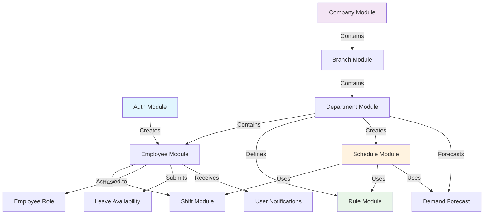
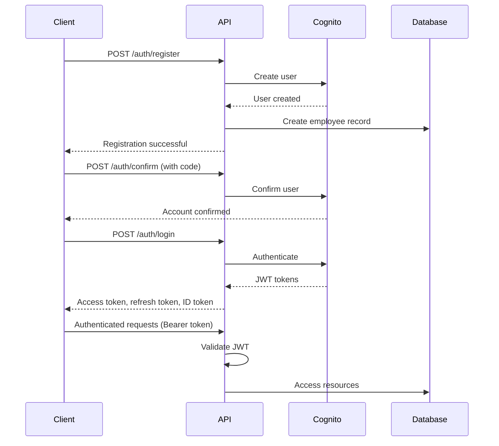
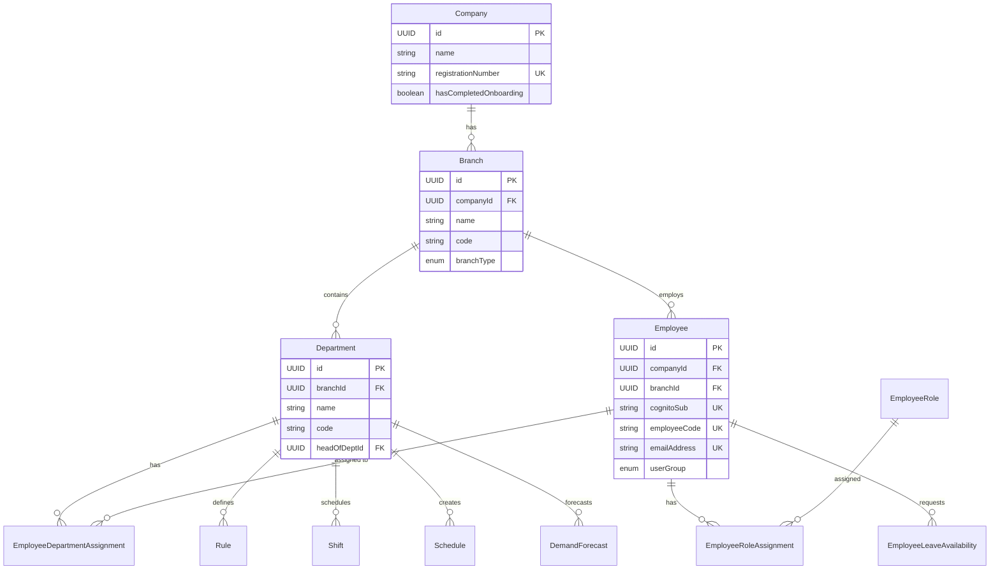

# Horaion Modules Overview

## Introduction

Horaion is a workforce management system built with **Spring Boot** and following **Vertical Slice Architecture**. Each module encapsulates all components needed for a specific business domain, providing clear boundaries and maintainability.

## Architecture Pattern

The application follows **Vertical Slice Architecture** where each module contains:

```
{module}/
├── controllers/     # REST API endpoints
├── services/       # Business logic
├── repositories/   # Data access layer
├── entities/       # JPA entities
├── requests/       # Request DTOs
├── responses/      # Response DTOs
├── mappers/        # Entity-DTO mapping
├── exceptions/     # Domain-specific exceptions
└── validators/     # Custom validation logic
```

## Module Catalog

### Core Business Modules

| Module | Path | Purpose | Key Features |
|--------|------|---------|--------------|
| **[Auth](./01-auth-module.md)** | `modules/auth/` | User authentication and registration | AWS Cognito integration, JWT tokens, email verification |
| **[Company](./02-company-module.md)** | `modules/company/` | Organization management | Company registration, onboarding tracking |
| **[Branch](./03-branch-module.md)** | `modules/branch/` | Location management | Multi-location support, geographic coordinates, branch hierarchy |
| **[Department](./04-department-module.md)** | `modules/department/` | Organizational units | Hierarchical departments, budget tracking, head of department |
| **[Employee](./05-employee-module.md)** | `modules/employee/` | Employee management | CRUD operations, bulk import, Cognito integration, role/department assignments |
| **[Shift](./06-shift-module.md)** | `modules/shift/` | Shift patterns | Multiple shift types, role requirements, time blocks |
| **[Rule](./07-rule-module.md)** | `modules/rule/` | Dynamic business rules | Template-based rules, provider system, field configurations |
| **[Demand Forecast](./08-demand-forecast-module.md)** | `modules/demandforecast/` | Workforce demand planning | Role-based demand forecasting, date range planning |
| **[Schedule](./09-schedule-module.md)** | `modules/schedule/` | Schedule generation | External engine integration, approval workflow, result tracking |
| **[Leave Availability](./10-leave-availability-module.md)** | `modules/employeeleaveavailability/` | Leave request management | Leave requests, approval workflow, notifications |
| **[Me](./11-me-module.md)** | `modules/me/` | Current user profile | User profile, notifications, permissions |

## Module Relationships



## Technology Stack

### Core Framework
- **Spring Boot 3.4.0** - Application framework
- **Java 21** - Programming language
- **PostgreSQL** - Relational database
- **Flyway** - Database migrations

### Security
- **AWS Cognito** - Authentication provider
- **Permit.io** - Authorization (RBAC/ABAC)
- **Spring Security** - Security framework
- **JWT** - Token-based authentication

### External Integrations
- **AWS SES** - Email notifications
- **AWS SNS/SQS** - Message queue system
- **External Schedule Engine** - Optimization engine

### Development Tools
- **OpenAPI/Swagger** - API documentation
- **JaCoCo** - Code coverage
- **Checkstyle** - Code quality
- **SonarCloud** - Code analysis
- **Qodana** - Code quality

## API Design Principles

### RESTful Conventions
All modules follow consistent REST patterns:
- `POST /api/v1/{resource}` - Create
- `GET /api/v1/{resource}` - List (paginated)
- `GET /api/v1/{resource}/{id}` - Get by ID
- `PUT /api/v1/{resource}/{id}` - Update
- `DELETE /api/v1/{resource}/{id}` - Delete (soft delete preferred)

### Response Format
All endpoints return standardized responses:

```json
{
  "success": true,
  "data": { /* response data */ },
  "error": null
}
```

### Pagination
Standard pagination parameters across all list endpoints:
- `page` - Page number (0-indexed, default: 0)
- `size` - Items per page (default: 10-20)
- `sort` - Sort field and direction (e.g., "name,asc")

### Error Handling
Consistent error responses following RFC 7807 Problem Details:

```json
{
  "type": "about:blank",
  "title": "Not Found",
  "status": 404,
  "detail": "Resource not found",
  "instance": "/api/v1/resource/123",
  "errors": [
    {
      "field": "fieldName",
      "message": "Validation error message"
    }
  ]
}
```

## Security Model

### Authentication Flow


### Authorization Levels

| Role | Access Level | Typical Users |
|------|-------------|---------------|
| **system-owner** | Full system access across all companies | Platform administrators |
| **system-administrator** | Cross-company administrative access | System managers |
| **privileged-system-user** | Department-level management | Department heads, managers |
| **user** | Personal data access only | Regular employees |

### Permission Model
- **Resource-based**: Each module defines resources (e.g., `company`, `employee`, `schedule`)
- **Action-based**: Standard actions (create, read, update, delete, approve)
- **Annotation-driven**: `@PermitCheck(action = "read", resource = "company")`

## Data Model Overview

### Core Entities Hierarchy



### Common Patterns

#### Audit Fields
All entities include standard audit fields:
- `createdAt` - Creation timestamp
- `updatedAt` - Last modification timestamp
- `createdBy` - User who created (optional)
- `updatedBy` - User who last modified (optional)

#### Soft Delete
Most entities support soft deletion:
- `softDelete` - Boolean flag
- `deletedAt` - Deletion timestamp
- `isActive` - Business active status

#### UUID Primary Keys
All entities use UUID primary keys for:
- Security (non-sequential IDs)
- Distribution (no central sequence)
- Compatibility (microservices-ready)

## Common Features Across Modules

### Pagination Support
All listing endpoints support pagination with consistent parameters.

### Search Capabilities
Most modules provide search endpoints for name-based lookups.

### Soft Delete
Entities can be soft deleted to maintain referential integrity and audit trails.

### Role-Based Access Control
All endpoints are protected with `@PermitCheck` annotations.

### Exception Handling
Each module has dedicated exception handlers for domain-specific errors.

### OpenAPI Documentation
All endpoints include comprehensive Swagger/OpenAPI annotations.

## Inter-Module Dependencies

### High Cohesion Modules
- **Auth ↔ Employee**: Registration creates employee records
- **Department ↔ Schedule**: Departments create schedules
- **Employee ↔ Leave**: Employees submit leave requests

### Shared Infrastructure
All modules utilize shared components:
- **Security Context Service** - Current user context
- **Notification Service** - Email and in-app notifications
- **AWS Services** - Cognito, SES, SNS, SQS
- **Permit.io** - Authorization decisions

## Getting Started

### Module Documentation
Each module has dedicated documentation covering:
1. **Architecture** - Design decisions and patterns
2. **Data Model** - Entities and relationships
3. **API Endpoints** - Complete endpoint reference
4. **Business Logic** - Key workflows and validation
5. **Security** - Access control and permissions
6. **Testing** - Test strategies and examples

### Quick Links
- [Authentication Module](./01-auth-module.md) - Start here for user management
- [Company Module](./02-company-module.md) - Multi-tenant organization setup
- [Employee Module](./05-employee-module.md) - Workforce management
- [Schedule Module](./09-schedule-module.md) - Shift scheduling
- [Rule Module](./07-rule-module.md) - Dynamic business rules

## Development Workflow

1. **Authentication**: Register and authenticate users via Auth module
2. **Organization Setup**: Create companies, branches, departments
3. **Workforce**: Import or create employees
4. **Shift Configuration**: Define shift patterns and requirements
5. **Business Rules**: Configure department-specific rules
6. **Demand Planning**: Create demand forecasts
7. **Schedule Generation**: Generate optimized schedules
8. **Leave Management**: Handle employee leave requests

## Next Steps

For detailed information about each module, refer to the individual module documentation files listed above.
