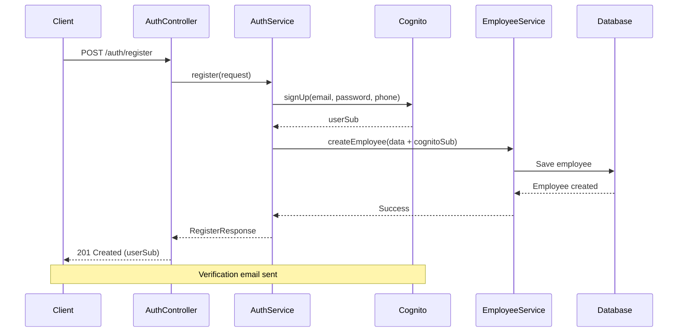
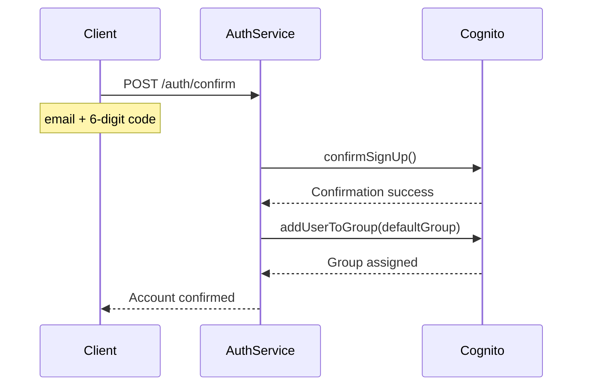
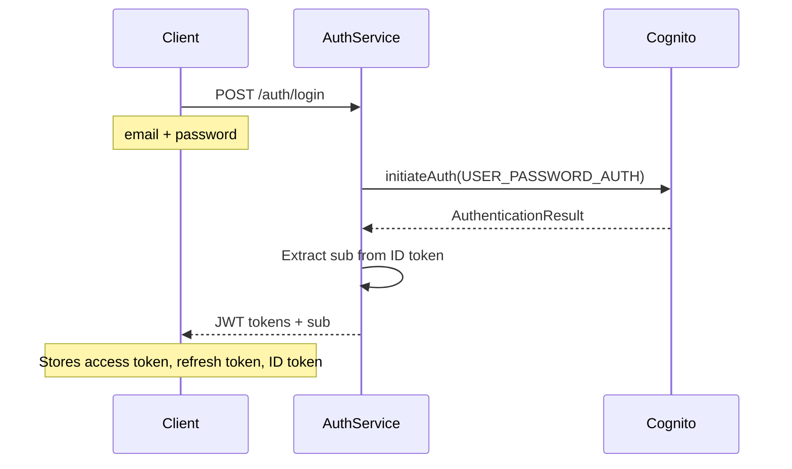
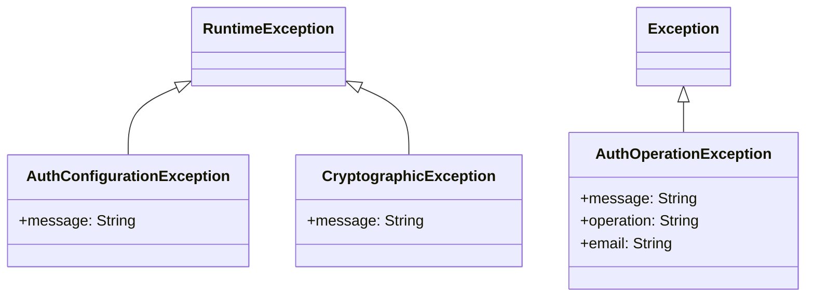

# Authentication Module

## Overview

The Authentication module provides user registration, login, and account verification using **AWS Cognito** as the identity provider. This module handles the complete authentication lifecycle from registration to token refresh.

**Location**: [`modules/auth/`](../../src/main/java/com/horaion/app/modules/auth/)

## Architecture

### Module Structure

```
auth/
├── constants/
│   ├── AuthConstant.java              # Authentication constants
│   └── ValidationConstant.java        # Validation patterns and rules
├── controllers/
│   └── AuthController.java            # REST API endpoints
├── exceptions/
│   ├── AuthConfigurationException.java
│   ├── AuthOperationException.java
│   ├── CryptographicException.java
│   └── handlers/
│       └── AuthExceptionHandler.java  # Centralized error handling
├── requests/
│   ├── ConfirmAccountRequest.java     # Account confirmation
│   ├── LoginRequest.java              # Login credentials
│   ├── RefreshTokenRequest.java       # Token refresh
│   ├── RegisterRequest.java           # User registration with employee data
│   └── ResendCodeRequest.java         # Resend verification code
├── responses/
│   ├── ConfirmSignUpResponse.java
│   ├── LoginResponse.java
│   ├── RefreshTokenResponse.java
│   ├── RegisterResponse.java
│   └── ResendConfirmationCodeResponse.java
├── services/
│   ├── IAuthService.java              # Service interface
│   └── AuthService.java               # Business logic
├── utils/
│   └── ExceptionWrappingExecutor.java # Error handling utility
└── validators/
    ├── E164PhoneValidator.java        # Phone number validation
    ├── RegisterRequestValidator.java  # Custom registration validation
    ├── ValidE164Phone.java            # Phone annotation
    └── ValidRegisterRequest.java      # Registration annotation
```

## Authentication Flow

### Registration Flow



### Rollback on Failure

If employee creation fails after Cognito user creation, the system automatically rolls back:

```java
try {
    SignUpResponse cognitoResponse = cognitoClient.signUp(signUpRequest);
    employeeService.createEmployee(employeeRequest);
} catch (Exception e) {
    // Rollback: Delete Cognito user
    deleteCognitoUser(request.email());
    throw e;
}
```

### Confirmation Flow



### Login Flow



## API Endpoints

### Base URL
```
/api/v1/auth
```

### Public Endpoints
All authentication endpoints are public (no authentication required):

#### 1. Register User

```http
POST /api/v1/auth/register
Content-Type: application/json

{
  "email": "user@example.com",
  "password": "SecureP@ss1",
  "phoneNumber": "+1234567890",
  "firstName": "John",
  "lastName": "Doe",
  "companyId": "550e8400-e29b-41d4-a716-446655440000",
  "branchId": "550e8400-e29b-41d4-a716-446655440001",
  "employeeCode": "EMP001",
  "hireDate": "2024-01-15",
  "dateOfBirth": "1990-05-20",
  "employmentType": "FULL_TIME",
  "userGroup": "user"
}
```

**Validation Rules**:
- **Email**: Required, valid email format
- **Password**: 8-128 characters with uppercase, lowercase, digit, and special character
- **Phone Number**: Required, E.164 format (e.g., +12025551234)
- **User Group**: SYSTEM_OWNER, PRIVILEGED_SYSTEM_USER, or USER
- **Company ID**: Required for system owners
- **Branch ID**: Required for non-system-owners

**Response (201 Created)**:
```json
{
  "userId": "cognito-sub-123456"
}
```

#### 2. Confirm Account

```http
POST /api/v1/auth/confirm
Content-Type: application/json

{
  "email": "user@example.com",
  "confirmationCode": "123456"
}
```

**Response (200 OK)**:
```json
{
  "message": "Account confirmed successfully",
  "confirmed": true
}
```

#### 3. Login

```http
POST /api/v1/auth/login
Content-Type: application/json

{
  "email": "user@example.com",
  "password": "SecureP@ss1"
}
```

**Response (200 OK)**:
```json
{
  "sub": "cognito-sub-123456",
  "accessToken": "eyJhbGciOiJSUzI1NiIsInR5cCI6IkpXVCJ9...",
  "refreshToken": "eyJjdHkiOiJKV1QiLCJlbmMiOiJBMjU2R0NNIiwiYWxnIjoiUlNBLU9BRVAifQ...",
  "idToken": "eyJraWQiOiJLeXl0Qm5DeFwvMEhkVXVDeTBLa2R3IiwiYWxnIjoiUlMyNTYifQ...",
  "expiresIn": 3600,
  "tokenType": "Bearer"
}
```

#### 4. Resend Confirmation Code

```http
POST /api/v1/auth/resend-code
Content-Type: application/json

{
  "email": "user@example.com"
}
```

**Response (200 OK)**:
```json
{
  "message": "If this email is registered, you will receive a verification code shortly",
  "deliveryMedium": "EMAIL",
  "destination": "u***@e***.com"
}
```

**Security Note**: Returns generic message to prevent user enumeration attacks.

#### 5. Refresh Token

```http
POST /api/v1/auth/refresh
Content-Type: application/json

{
  "refreshToken": "eyJjdHkiOiJKV1QiLCJlbmMiOiJBMjU2R0NNIiwiYWxnIjoiUlNBLU9BRVAifQ..."
}
```

**Response (200 OK)**:
```json
{
  "accessToken": "eyJhbGciOiJSUzI1NiIsInR5cCI6IkpXVCJ9...",
  "expiresIn": 3600,
  "tokenType": "Bearer"
}
```

## Business Logic

### Password Policy

Enforced by AWS Cognito:
- Minimum 8 characters, maximum 128 characters
- At least one uppercase letter (A-Z)
- At least one lowercase letter (a-z)
- At least one digit (0-9)
- At least one special character (!@#$%^&*()_+-={}[]:;"'<>,.?/)

### Phone Number Validation

Custom E.164 format validator:
```java
Pattern: ^\\+[1-9]\\d{1,14}$
Examples:
  Valid: +12025551234, +442071234567
  Invalid: 12345, +0123456789, 123-456-7890
```

### Secret Hash Calculation

For Cognito clients with client secrets:
```java
SECRET_HASH = HMAC-SHA256(clientSecret, username + clientId)
```

### JWT Sub Extraction

The service extracts the `sub` claim from the ID token:
```java
private String extractSubFromIdToken(String idToken) {
    String[] parts = idToken.split("\\.");
    String payload = new String(Base64.getUrlDecoder().decode(parts[1]));
    // Parse "sub" claim from JSON payload
    return subValue;
}
```

## Security Considerations

### User Enumeration Prevention

The resend code endpoint uses a generic response to prevent attackers from determining valid email addresses:

```java
// Always returns success-like message
String genericMessage = "If this email is registered, you will receive a verification code shortly";

if (!employeeService.existsByEmailAddress(request.email())) {
    return new ResendConfirmationCodeResponse(genericMessage, null, null);
}
```

### Email Masking in Logs

All email addresses are masked in logs for privacy:
```java
private String maskEmail(String email) {
    int atIndex = email.indexOf('@');
    return email.charAt(0) + "***@" + email.substring(atIndex + 1);
}
```

### Transaction Safety

Compensation transaction pattern ensures data consistency:
1. Create Cognito user
2. Create employee record
3. If step 2 fails → Delete Cognito user (rollback)

## Error Handling

### Exception Hierarchy



### Error Responses

#### Invalid Credentials (401)
```json
{
  "type": "about:blank",
  "title": "Unauthorized",
  "status": 401,
  "detail": "Invalid email or password",
  "instance": "/api/v1/auth/login"
}
```

#### User Already Exists (409)
```json
{
  "type": "about:blank",
  "title": "Account Already Exists",
  "status": 409,
  "detail": "An account with this email address already exists",
  "instance": "/api/v1/auth/register",
  "errors": [
    {
      "field": "email",
      "message": "An account with this email address already exists"
    }
  ]
}
```

#### Invalid/Expired Code (400)
```json
{
  "type": "about:blank",
  "title": "Verification Failed",
  "status": 400,
  "detail": "Either email or verification is invalid or expired. Please check your email or verification code is correct.",
  "instance": "/api/v1/auth/confirm",
  "errors": [
    {
      "field": "confirmationCode",
      "message": "Either email or verification is invalid or expired..."
    }
  ]
}
```

## Configuration

### Required Environment Variables

```bash
# AWS Cognito Configuration
AWS_COGNITO_USER_POOL_ID=ap-southeast-1_xxxxx
AWS_COGNITO_CLIENT_ID=xxxxxxxxxxxxxxxxxxxxxxxxxx
AWS_COGNITO_CLIENT_SECRET=xxxxxxxxxxxxxxxxxxxxxxxxxxxxxxxxxxxxxxxxxxxxxxxx
AWS_REGION=ap-southeast-1

# Optional: Default user group
COGNITO_DEFAULT_USER_GROUP=user
```

### Application Properties

```yaml
aws:
  cognito:
    region: ${AWS_REGION}
    user-pool-id: ${AWS_COGNITO_USER_POOL_ID}
    client-id: ${AWS_COGNITO_CLIENT_ID}
    client-secret: ${AWS_COGNITO_CLIENT_SECRET}
    default-user-group: ${COGNITO_DEFAULT_USER_GROUP:user}
```

### Cognito User Attributes

When creating users, the following attributes are set:

| Attribute | Source | Verified |
|-----------|--------|----------|
| `email` | RegisterRequest.email | Auto-verified |
| `phone_number` | RegisterRequest.phoneNumber | Auto-verified |
| `given_name` | RegisterRequest.firstName | - |
| `family_name` | RegisterRequest.lastName | - |
| `name` | firstName + lastName | - |
| `custom:employee_code` | Generated or provided | - |

## Integration Points

### Employee Service Integration

The auth service creates employee records during registration:

```java
public RegisterResponse register(RegisterRequest request) {
    // 1. Create Cognito user
    SignUpResponse awsResponse = cognitoClient.signUp(signUpRequest);
    
    // 2. Create employee record
    try {
        CreateEmployeeRequest employeeRequest = buildEmployeeRequest(request, awsResponse.userSub());
        employeeService.createEmployee(employeeRequest);
    } catch (Exception e) {
        // Rollback: Delete Cognito user
        deleteCognitoUser(request.email());
        throw e;
    }
    
    return new RegisterResponse(awsResponse.userSub());
}
```

### Cognito Group Assignment

After confirmation, users are added to their designated group:

```java
private void addUserToGroup(String email) {
    String groupName = "user";  // Default group
    
    AdminAddUserToGroupRequest groupRequest = AdminAddUserToGroupRequest.builder()
        .userPoolId(cognitoProperty.getUserPoolId())
        .username(email)
        .groupName(groupName)
        .build();
    
    cognitoClient.adminAddUserToGroup(groupRequest);
}
```

## Testing

### Unit Tests

**Location**: [`test/.../modules/auth/`](../../src/test/java/com/horaion/app/modules/auth/)

**Test Coverage**:
- Registration with various user groups
- Confirmation with valid/invalid codes
- Login with correct/incorrect credentials
- Token refresh scenarios
- Rollback mechanism when employee creation fails
- Exception handling for all Cognito errors

### Postman Collection

**Location**: [`postman/Auth.postman_collection.json`](../../postman/Auth.postman_collection.json)

**Test Scenarios**:
- Register User
- Register System Owner
- Confirm Account
- Resend Confirmation Code
- Login (Standard User)
- Login (System Owner)
- Login (Privileged System User)
- Refresh Token

## Security Best Practices

### 1. Password Security
- Never logged or stored in plain text
- Transmitted only over HTTPS
- Validated by Cognito before storage
- Uses `@JsonProperty(access = WRITE_ONLY)` in DTOs

### 2. Email Privacy
- Masked in all log statements
- Generic responses for non-existent users
- Rate limiting via Cognito

### 3. Token Security
- Short-lived access tokens (1 hour)
- Refresh tokens for token renewal
- ID tokens contain user claims
- All tokens signed by Cognito

### 4. Error Messages
- Generic messages for security-sensitive operations
- No information leakage about user existence
- Consistent response timing

## Common Use Cases

### Use Case 1: Standard Employee Registration

```javascript
// 1. Register
POST /auth/register
{
  "email": "employee@company.com",
  "password": "SecurePass123!",
  "phoneNumber": "+12025551234",
  "firstName": "Jane",
  "lastName": "Doe",
  "branchId": "branch-uuid",
  "userGroup": "user"
}
// Response: { userId: "cognito-sub" }

// 2. Check email for verification code

// 3. Confirm account
POST /auth/confirm
{
  "email": "employee@company.com",
  "confirmationCode": "123456"
}
// Response: { message: "Account confirmed", confirmed: true }

// 4. Login
POST /auth/login
{
  "email": "employee@company.com",
  "password": "SecurePass123!"
}
// Response: { sub, accessToken, refreshToken, idToken, expiresIn, tokenType }

// 5. Use access token for authenticated requests
GET /api/v1/me
Authorization: Bearer {accessToken}
```

### Use Case 2: System Owner Registration

```javascript
POST /auth/register
{
  "email": "owner@company.com",
  "password": "SecurePass123!",
  "phoneNumber": "+12025551234",
  "firstName": "John",
  "lastName": "Smith",
  "companyId": "company-uuid",
  // Note: No branchId required for system owners
  "userGroup": "system-owner"
}
```

## Troubleshooting

### Common Issues

#### 1. User Already Exists Error
**Symptom**: 409 Conflict during registration
**Cause**: Email already registered in Cognito or database
**Solution**: User should login or use password reset

#### 2. Invalid Verification Code
**Symptom**: 400 Bad Request during confirmation
**Causes**:
- Code expired (valid for 24 hours)
- Code already used
- Incorrect code entered
**Solution**: Resend confirmation code

#### 3. Employee Creation Fails but Cognito User Created
**Symptom**: Can't register with same email again
**Cause**: Rollback mechanism failed
**Solution**: Manually delete Cognito user via AWS Console

#### 4. Client Secret Hash Errors
**Symptom**: Authentication fails with secret hash mismatch
**Cause**: Incorrect client secret or calculation
**Solution**: Verify client secret in configuration

## Configuration Examples

### Development Environment
```yaml
aws:
  cognito:
    user-pool-id: ap-southeast-1_DEV12345
    client-id: dev-client-id
    client-secret: dev-client-secret
    default-user-group: user
```

### Production Environment
```yaml
aws:
  cognito:
    user-pool-id: ${AWS_COGNITO_USER_POOL_ID}
    client-id: ${AWS_COGNITO_CLIENT_ID}
    client-secret: ${AWS_COGNITO_CLIENT_SECRET}
    default-user-group: user
```

## Related Documentation

- [Employee Module](./05-employee-module.md) - Employee record management
- [Security Architecture](../02-design/security.md) - Overall security design
- [AWS Cognito Configuration](../04-operations/configuration.md) - Cognito setup guide
- [Me Module](./11-me-module.md) - Current user profile
