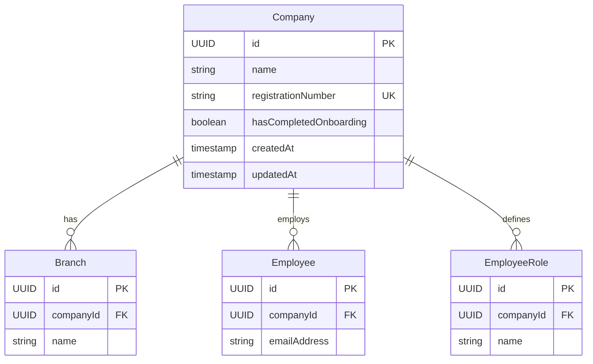
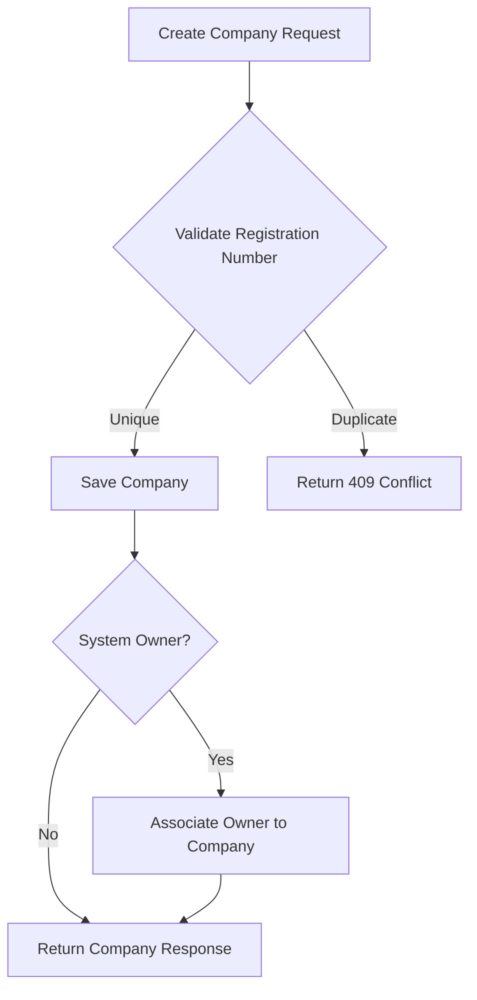

# Company Module

## Overview

The Company module manages organizational entities that represent companies using the Horaion platform. Each company serves as a multi-tenant boundary with its own branches, departments, employees, and resources.

**Location**: [`modules/company/`](../../src/main/java/com/horaion/app/modules/company/)

## Module Structure

```
company/
├── controllers/
│   └── CompanyController.java         # REST API endpoints
├── entities/
│   └── Company.java                   # JPA entity
├── exceptions/
│   ├── CompanyNotFoundException.java
│   ├── DuplicateRegistrationNumberException.java
│   └── handlers/
│       └── CompanyExceptionHandler.java
├── mappers/
│   └── CompanyMapper.java             # Entity-DTO mapping
├── repositories/
│   └── CompanyRepository.java         # Data access
├── requests/
│   ├── CreateCompanyRequest.java
│   └── UpdateCompanyRequest.java
├── responses/
│   └── CompanyResponse.java
└── services/
    ├── ICompanyService.java           # Service interface
    └── CompanyService.java            # Business logic
```

## Data Model

### Company Entity

```java
@Entity
@Table(name = "companies")
public class Company {
    @Id
    @GeneratedValue(strategy = GenerationType.UUID)
    private UUID id;
    
    @Column(nullable = false, length = 255)
    private String name;
    
    @Column(name = "registration_number", unique = true, nullable = false, length = 50)
    private String registrationNumber;
    
    @Column(name = "has_completed_onboarding", nullable = false)
    private Boolean hasCompletedOnboarding = false;
    
    @Column(name = "created_at", nullable = false, updatable = false)
    private Instant createdAt;
    
    @Column(name = "updated_at", nullable = false)
    private Instant updatedAt;
}
```

### Entity Relationships



## API Endpoints

### Base URL
```
/api/v1/companies
```

### Authentication
All endpoints require Bearer token authentication with appropriate permissions.

### Endpoints

#### 1. Create Company

```http
POST /api/v1/companies
Authorization: Bearer {token}
Content-Type: application/json

{
  "name": "Acme Corporation",
  "registrationNumber": "REG-12345"
}
```

**Permission**: `create:company`

**Response (201 Created)**:
```json
{
  "success": true,
  "data": {
    "id": "550e8400-e29b-41d4-a716-446655440000",
    "name": "Acme Corporation",
    "registrationNumber": "REG-12345",
    "hasCompletedOnboarding": false,
    "createdAt": "2024-01-15T10:30:00Z",
    "updatedAt": "2024-01-15T10:30:00Z"
  },
  "error": null
}
```

#### 2. Get All Companies (Paginated)

```http
GET /api/v1/companies?page=0&size=10
Authorization: Bearer {token}
```

**Permission**: `read:company`

**Response (200 OK)**:
```json
{
  "success": true,
  "data": {
    "content": [
      {
        "id": "550e8400-e29b-41d4-a716-446655440000",
        "name": "Acme Corporation",
        "registrationNumber": "REG-12345",
        "hasCompletedOnboarding": true,
        "createdAt": "2024-01-15T10:30:00Z",
        "updatedAt": "2024-01-15T10:30:00Z"
      }
    ],
    "pageable": {
      "pageNumber": 0,
      "pageSize": 10
    },
    "totalElements": 1,
    "totalPages": 1,
    "last": true,
    "first": true
  },
  "error": null
}
```

#### 3. Get Company by ID

```http
GET /api/v1/companies/{id}
Authorization: Bearer {token}
```

**Permission**: `read:company`

#### 4. Get Company by Registration Number

```http
GET /api/v1/companies/registration/{registrationNumber}
Authorization: Bearer {token}
```

**Permission**: `read:company`

#### 5. Search Companies by Name

```http
GET /api/v1/companies/search?name=Acme
Authorization: Bearer {token}
```

**Permission**: `read:company`

**Response**: Array of companies matching the search term (partial match, case-insensitive)

#### 6. Update Company

```http
PUT /api/v1/companies/{id}
Authorization: Bearer {token}
Content-Type: application/json

{
  "name": "Acme Corporation Ltd."
}
```

**Permission**: `update:company`

#### 7. Delete Company

```http
DELETE /api/v1/companies/{id}
Authorization: Bearer {token}
```

**Permission**: `delete:company`

**Response**: 204 No Content

#### 8. Complete Onboarding

```http
POST /api/v1/companies/{id}/complete-onboarding
Authorization: Bearer {token}
```

**Permission**: `update:company`

**Purpose**: Marks company setup as complete, typically called by system owners after initial configuration.

## Business Logic

### Company Creation Workflow



### Onboarding Flow

The `hasCompletedOnboarding` flag tracks whether a company has completed its initial setup:

1. **Created**: `hasCompletedOnboarding = false`
2. **Setup Process**:
   - Create branches
   - Create departments
   - Import employees
   - Configure roles and shifts
3. **Completed**: Call `/complete-onboarding` to mark as done

### Validation Rules

#### Name Validation
- Required
- Maximum 255 characters
- Must not be blank

#### Registration Number Validation
- Required
- Maximum 50 characters
- Must be unique across all companies
- Format validation (alphanumeric, hyphens allowed)

## Access Control

### Role-Based Access

| Role | List | View | Create | Update | Delete |
|------|------|------|--------|--------|--------|
| **system-owner** | ✓ All | ✓ All | ✓ | ✓ All | ✓ All |
| **system-administrator** | ✓ All | ✓ All | ✓ | ✓ All | ✓ All |
| **privileged-system-user** | ✓ Own company | ✓ Own company | ✗ | ✓ Own company | ✗ |
| **user** | ✓ Own company | ✓ Own company | ✗ | ✗ | ✗ |

### Access Validation

```java
public CompanyResponse getById(UUID id) {
    Company company = companyRepository.findById(id)
        .orElseThrow(() -> new CompanyNotFoundException(id));
    
    // System admins can access any company
    if (!securityContextService.isSystemAdministrator()) {
        // Regular users can only access their own company
        UUID currentCompanyId = securityContextService.getRequiredCurrentCompanyId();
        if (!company.getId().equals(currentCompanyId)) {
            throw new UnauthorizedResourceAccessException("company", id);
        }
    }
    
    return companyMapper.toResponse(company);
}
```

## Database Schema

### Table: companies

```sql
CREATE TABLE companies (
    id UUID PRIMARY KEY DEFAULT gen_random_uuid(),
    name VARCHAR(255) NOT NULL,
    registration_number VARCHAR(50) UNIQUE NOT NULL,
    has_completed_onboarding BOOLEAN NOT NULL DEFAULT FALSE,
    created_at TIMESTAMPTZ NOT NULL DEFAULT CURRENT_TIMESTAMP,
    updated_at TIMESTAMPTZ NOT NULL DEFAULT CURRENT_TIMESTAMP
);

-- Indexes
CREATE INDEX idx_companies_name ON companies(name);
CREATE UNIQUE INDEX idx_companies_registration_number ON companies(registration_number);

-- Comments
COMMENT ON TABLE companies IS 'Organizations using the Horaion platform';
COMMENT ON COLUMN companies.registration_number IS 'Official business registration number';
COMMENT ON COLUMN companies.has_completed_onboarding IS 'Flag indicating if company setup/onboarding has been completed';
```

### Audit Trail

Companies are automatically tracked with:
- `created_at`: Set on creation (immutable)
- `updated_at`: Auto-updated via database trigger

```sql
CREATE TRIGGER trg_companies_updated_at
    BEFORE UPDATE ON companies
    FOR EACH ROW
    EXECUTE FUNCTION update_updated_at_column();
```

## Service Layer

### Interface: ICompanyService

```java
public sealed interface ICompanyService permits CompanyService {
    CompanyResponse create(CreateCompanyRequest request);
    CompanyResponse getById(UUID id);
    CompanyResponse getByRegistrationNumber(String registrationNumber);
    Page<CompanyResponse> getAll(Pageable pageable);
    List<CompanyResponse> searchByName(String name);
    CompanyResponse update(UUID id, UpdateCompanyRequest request);
    void delete(UUID id);
    CompanyResponse completeOnboarding(UUID id);
}
```

### Key Methods

#### Create Company with Validation

```java
@Override
@Transactional
public CompanyResponse create(CreateCompanyRequest request) {
    // Check for duplicate registration number
    if (companyRepository.existsByRegistrationNumber(request.registrationNumber())) {
        throw new DuplicateRegistrationNumberException(request.registrationNumber());
    }
    
    Company company = Company.builder()
        .name(request.name())
        .registrationNumber(request.registrationNumber())
        .hasCompletedOnboarding(false)
        .createdAt(Instant.now())
        .updatedAt(Instant.now())
        .build();
    
    Company saved = companyRepository.save(company);
    
    return companyMapper.toResponse(saved);
}
```

## Exception Handling

### Custom Exceptions

#### CompanyNotFoundException
```java
public class CompanyNotFoundException extends RuntimeException {
    public CompanyNotFoundException(UUID id) {
        super("Company not found with id: " + id);
    }
}
```

**HTTP Status**: 404 Not Found

#### DuplicateRegistrationNumberException
```java
public class DuplicateRegistrationNumberException extends RuntimeException {
    public DuplicateRegistrationNumberException(String registrationNumber) {
        super("Company already exists with registration number: " + registrationNumber);
    }
}
```

**HTTP Status**: 409 Conflict

### Exception Handler

```java
@RestControllerAdvice
@Order(Ordered.HIGHEST_PRECEDENCE)
public class CompanyExceptionHandler {
    
    @ExceptionHandler(CompanyNotFoundException.class)
    @ResponseStatus(HttpStatus.NOT_FOUND)
    public ErrorResponse handleCompanyNotFound(CompanyNotFoundException ex) {
        return new ErrorResponse(
            HttpStatus.NOT_FOUND.value(),
            "COMPANY_NOT_FOUND",
            ex.getMessage()
        );
    }
}
```

## Testing

### Unit Tests

**Coverage Areas**:
- Company creation with validation
- Duplicate registration number handling
- Get by ID with access control
- Search functionality
- Update operations
- Onboarding completion

### Integration Tests

**Postman Collection**: [`postman/Company.postman_collection.json`](../../postman/Company.postman_collection.json)

**Test Scenarios**:
- CRUD operations
- Pagination and sorting
- Search by name
- Access control validation
- Error handling

## Use Cases

### Use Case 1: New Company Registration

```bash
# System owner creates a new company
POST /api/v1/companies
{
  "name": "Tech Solutions Inc.",
  "registrationNumber": "TECH-2024-001"
}

# Response includes company ID for subsequent operations
# System owner then creates branches, departments, etc.

# After setup is complete
POST /api/v1/companies/{id}/complete-onboarding
```

### Use Case 2: Company Information Lookup

```bash
# Search by partial name
GET /api/v1/companies/search?name=Tech

# Get by registration number
GET /api/v1/companies/registration/TECH-2024-001

# Get full details
GET /api/v1/companies/{id}
```

## Performance Considerations

### Indexing Strategy
- **Name index**: Supports search operations
- **Registration number unique index**: Ensures uniqueness and fast lookup

### Caching
Consider caching company data as it changes infrequently:
```java
@Cacheable(value = "companies", key = "#id")
public CompanyResponse getById(UUID id) {
    // Implementation
}
```

## Related Modules

- [Branch Module](./03-branch-module.md) - Company locations
- [Employee Module](./05-employee-module.md) - Company workforce
- [Department Module](./04-department-module.md) - Organizational structure
- [Employee Role Module](./05-employee-module.md#employee-roles) - Company-scoped roles

## Migration History

- **V2**: Initial companies table creation
- **V19**: Added `has_completed_onboarding` flag

## Best Practices

1. **Unique Registration Numbers**: Always validate registration number uniqueness before creating companies
2. **Onboarding Tracking**: Use the onboarding flag to guide setup wizards
3. **Access Control**: Validate company access in all operations unless user is system administrator
4. **Search Optimization**: Use search endpoint for typeahead/autocomplete features
5. **Pagination**: Always use pagination for company listings in multi-tenant environments
