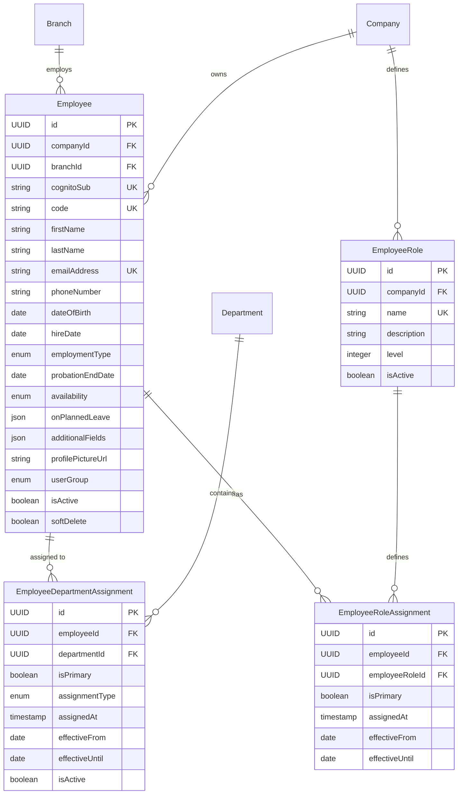
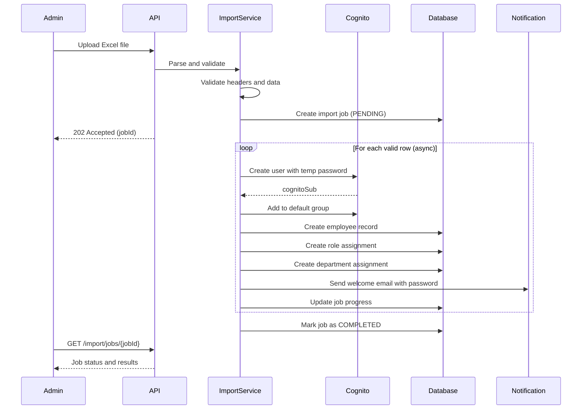
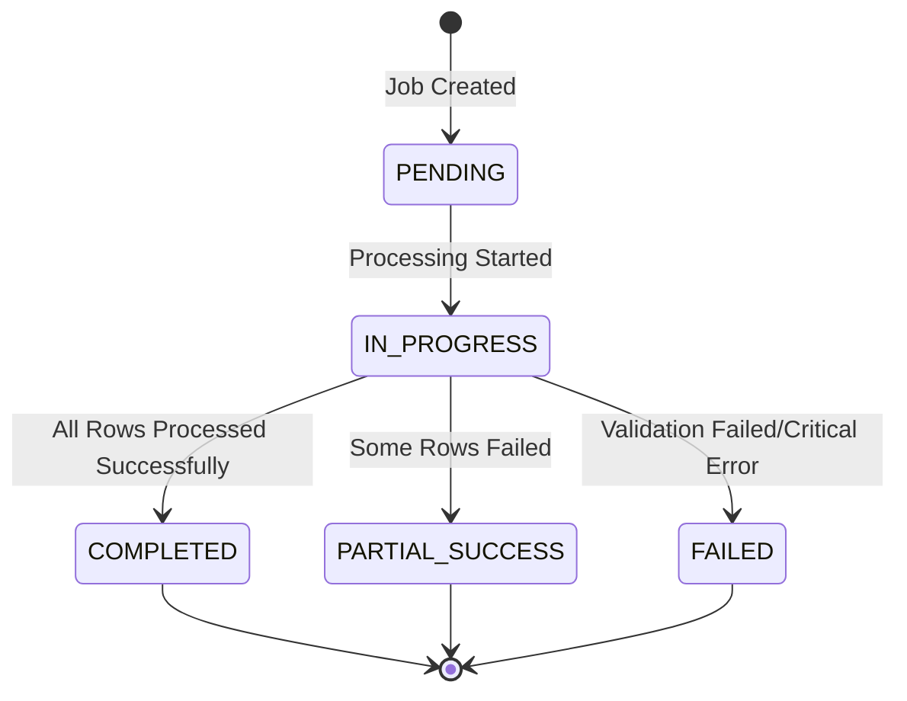

# Employee Module

## Overview

The Employee module manages workforce data including employee profiles, role assignments, department assignments, and bulk import capabilities. It integrates with AWS Cognito for user authentication and supports comprehensive employee lifecycle management.

**Location**: [`modules/employee/`](../../src/main/java/com/horaion/app/modules/employee/)

## Module Structure

```
employee/
├── controllers/
│   ├── EmployeeController.java             # Employee CRUD operations
│   ├── EmployeeImportController.java       # Bulk import via Excel
│   └── EmployeeRoleController.java         # Role management
├── dtos/
│   └── ParsedEmployeeData.java             # Excel row data structure
├── entities/
│   ├── Employee.java                       # Main employee entity
│   ├── EmployeeDepartmentAssignment.java   # Many-to-many with departments
│   ├── EmployeeRole.java                   # Job role definitions
│   ├── EmployeeRoleAssignment.java         # Many-to-many with roles
│   ├── AssignmentType.java                 # Enum: MEMBER, LEAD, TEMPORARY, CONSULTANT
│   ├── Availability.java                   # Enum: AVAILABLE, ON_LEAVE, BUSY, OFFLINE
│   └── EmploymentType.java                 # Enum: FULL_TIME, PART_TIME, CONTRACT, INTERN, TEMPORARY
├── exceptions/
│   ├── DuplicateDepartmentAssignmentException.java
│   ├── InvalidFileException.java
│   └── handlers/ (exception handlers)
├── mappers/
│   ├── EmployeeMapper.java
│   ├── EmployeeDepartmentAssignmentMapper.java
│   └── EmployeeRoleMapper.java
├── processors/
│   └── EmployeeExcelRowProcessor.java      # Excel row parsing
├── repositories/
│   ├── EmployeeRepository.java
│   ├── EmployeeDepartmentAssignmentRepository.java
│   ├── EmployeeRoleRepository.java
│   └── EmployeeRoleAssignmentRepository.java
├── requests/
│   ├── CreateEmployeeRequest.java
│   └── AssignEmployeeToDepartmentRequest.java
├── responses/ (response DTOs)
└── services/
    ├── IEmployeeService.java
    ├── EmployeeService.java
    ├── IEmployeeImportService.java
    ├── EmployeeImportService.java
    ├── IEmployeeRoleService.java
    └── EmployeeRoleService.java
```

## Data Model

### Core Entities



### Enumerations

#### EmploymentType
```java
public enum EmploymentType {
    FULL_TIME,      // Regular full-time employment
    PART_TIME,      // Part-time employment
    CONTRACT,       // Contract-based employment
    INTERN,         // Internship position
    TEMPORARY       // Temporary employment
}
```

#### Availability
```java
public enum Availability {
    AVAILABLE,      // Available for work
    ON_LEAVE,       // Currently on leave
    BUSY,           // Occupied with tasks
    OFFLINE         // Not available
}
```

#### AssignmentType
```java
public enum AssignmentType {
    MEMBER,         // Regular department member
    LEAD,           // Department lead/head
    TEMPORARY,      // Temporary assignment
    CONSULTANT      // External consultant
}
```

#### UserGroup
```java
public enum UserGroup {
    SYSTEM_OWNER("system-owner"),
    PRIVILEGED_SYSTEM_USER("privileged-system-user"),
    USER("user");
}
```

## API Endpoints

### Base URL
```
/api/v1
```

### Employee CRUD Operations

#### 1. Get All Employees (Global)

```http
GET /api/v1/employees?page=0&size=10
Authorization: Bearer {token}
```

**Permission**: `read:employee`

**Access Control**:
- **system-owner**: Returns ALL employees across all companies/branches
- **privileged-system-user**: Returns employees in their primary department ONLY
- **user**: Access denied (403)

**Note**: Excludes employees with `userGroup = SYSTEM_OWNER` from results

#### 2. Get Employees by Branch

```http
GET /api/v1/companies/{companyId}/branches/{branchId}/employees?page=0&size=10
Authorization: Bearer {token}
```

**Permission**: `read:employee`

**Access Control**:
- **system-owner**: All employees in the branch
- **privileged-system-user**: Employees who are BOTH in the branch AND in their department

#### 3. Get Employee by ID

```http
GET /api/v1/companies/{companyId}/branches/{branchId}/employees/{id}
Authorization: Bearer {token}
```

**Permission**: `read:employee`

**Response**:
```json
{
  "success": true,
  "data": {
    "id": "550e8400-e29b-41d4-a716-446655440000",
    "companyId": "550e8400-e29b-41d4-a716-446655440001",
    "branchId": "550e8400-e29b-41d4-a716-446655440002",
    "employeeCode": "EMP001",
    "firstName": "John",
    "lastName": "Doe",
    "fullName": "John Doe",
    "emailAddress": "john.doe@example.com",
    "phoneNumber": "+12025551234",
    "dateOfBirth": "1990-05-15",
    "hireDate": "2023-01-10",
    "employmentType": "FULL_TIME",
    "probationEndDate": "2023-04-10",
    "availability": "AVAILABLE",
    "profilePictureUrl": null,
    "isActive": true,
    "createdAt": "2024-01-15T10:30:00Z",
    "updatedAt": "2024-01-15T10:30:00Z",
    "departmentAssignments": [
      {
        "id": "dept-assignment-uuid",
        "employeeId": "550e8400-e29b-41d4-a716-446655440000",
        "employeeName": "John Doe",
        "department": {
          "id": "dept-uuid",
          "name": "Engineering",
          "code": "ENG"
        },
        "isPrimary": true,
        "assignmentType": "MEMBER",
        "effectiveFrom": "2023-01-10",
        "effectiveUntil": null,
        "isActive": true
      }
    ]
  },
  "error": null
}
```

### Department Assignment Operations

#### 4. Assign Employee to Department

```http
POST /api/v1/companies/{companyId}/branches/{branchId}/employees/{employeeId}/departments
Authorization: Bearer {token}
Content-Type: application/json

{
  "departmentId": "550e8400-e29b-41d4-a716-446655440003",
  "assignmentType": "MEMBER",
  "isPrimary": true,
  "effectiveFrom": "2024-01-01",
  "effectiveUntil": null
}
```

**Permission**: `update:employee`

**Response (201 Created)**:
```json
{
  "success": true,
  "data": {
    "id": "assignment-uuid",
    "employeeId": "employee-uuid",
    "employeeName": "John Doe",
    "department": {
      "id": "dept-uuid",
      "branchId": "branch-uuid",
      "name": "Engineering",
      "code": "ENG",
      "isActive": true
    },
    "isPrimary": true,
    "assignmentType": "MEMBER",
    "effectiveFrom": "2024-01-01",
    "effectiveUntil": null,
    "isActive": true,
    "assignedAt": "2024-01-15T10:30:00Z",
    "createdAt": "2024-01-15T10:30:00Z",
    "updatedAt": "2024-01-15T10:30:00Z"
  },
  "error": null
}
```

#### 5. Get Employee Department Assignments

```http
GET /api/v1/companies/{companyId}/branches/{branchId}/employees/{employeeId}/departments
Authorization: Bearer {token}
```

**Permission**: `read:employee`

#### 6. Remove Employee from Department

```http
DELETE /api/v1/companies/{companyId}/branches/{branchId}/employees/{employeeId}/departments/{departmentId}
Authorization: Bearer {token}
```

**Permission**: `update:employee`

**Response**: 204 No Content

### Employee Role Operations

#### 7. Get All Roles by Company

```http
GET /api/v1/companies/{companyId}/roles
Authorization: Bearer {token}
```

**Permission**: `read:employee-role`

**Response**: List of all role definitions for the company, sorted by level (ascending)

#### 8. Get Roles by Department

```http
GET /api/v1/companies/{companyId}/departments/{departmentId}/roles
Authorization: Bearer {token}
```

**Permission**: `read:employee-role`

**Response**: Distinct roles actively assigned to employees within the department

## Bulk Import Feature

### Excel Import Workflow



### Import Endpoints

#### 1. Upload Excel File

```http
POST /api/v1/employees/upload-excel
Authorization: Bearer {token}
Content-Type: multipart/form-data

file: Employee_Import_Template.xlsx
companyId: 550e8400-e29b-41d4-a716-446655440000
```

**Permission**: `create:employee`

**Response (202 Accepted)**:
```json
{
  "success": true,
  "data": {
    "jobId": "job-uuid",
    "status": "IN_PROGRESS",
    "totalRows": 50,
    "validRows": 48,
    "invalidRows": 2,
    "validationErrors": [
      {
        "rowNumber": 3,
        "field": "EMAIL_ADDRESS",
        "message": "Invalid email format"
      }
    ],
    "message": "Import started successfully. 48 records queued for processing."
  },
  "error": null
}
```

#### 2. Get Import Job Status

```http
GET /api/v1/employees/import/jobs/{jobId}?companyId={companyId}
Authorization: Bearer {token}
```

**Response**:
```json
{
  "success": true,
  "data": {
    "id": "job-uuid",
    "jobType": "EMPLOYEE",
    "status": "COMPLETED",
    "fileName": "employees.xlsx",
    "totalRecords": 50,
    "processedRecords": 50,
    "successfulRecords": 48,
    "failedRecords": 2,
    "skippedRecords": 0,
    "createdAt": "2024-01-15T10:30:00Z",
    "completedAt": "2024-01-15T10:35:00Z"
  },
  "error": null
}
```

#### 3. Get Import History

```http
GET /api/v1/employees/import/history?companyId={companyId}&page=0&size=10
Authorization: Bearer {token}
```

#### 4. Download Import Template

```http
GET /api/v1/employees/excel/download-template
Authorization: Bearer {token}
```

**Response**: Excel file download

### Excel Template Structure

**File**: [`src/main/resources/templates/Employee_Import_Template.xlsx`](../../src/main/resources/templates/Employee_Import_Template.xlsx)

**Required Columns**:
| Column Name | Type | Validation | Description |
|-------------|------|------------|-------------|
| FIRST_NAME | String | Required, max 100 chars | Employee's first name |
| LAST_NAME | String | Required, max 100 chars | Employee's last name |
| PHONE_NUMBER | String | Required, E.164 format | Contact phone number |
| EMAIL_ADDRESS | String | Required, valid email, unique | Work email (becomes Cognito username) |
| BRANCH | String | Required | Branch name (auto-created if not exists) |
| DEPARTMENT | String | Required | Department name (auto-created if not exists) |
| ROLE | String | Required | Job role name (auto-created if not exists) |
| ROLE_PROFICIENCY | Boolean | Required (Yes/No, True/False, 1/0) | Role proficiency status |
| IS_PART_TIME | Boolean | Required (Yes/No, True/False, 1/0) | Part-time employment flag |
| IS_HEAD_DEPARTMENT | Boolean | Required (Yes/No, True/False, 1/0) | Department head designation |

**Optional Columns**:
| Column Name | Type | Description |
|-------------|------|-------------|
| EMPLOYEE_CODE | String | Custom employee identifier (auto-generated if not provided) |
| HIRE_DATE | Date (YYYY-MM-DD) | Employment start date (defaults to current date) |
| DATE_OF_BIRTH | Date (YYYY-MM-DD) | Employee's birth date |

### Import Features

#### Auto-Provisioning

The import service automatically creates missing entities:

1. **Branches**: If branch name doesn't exist
   - Type: SATELLITE
   - Code: Generated from name (uppercase, alphanumeric, max 10 chars)

2. **Departments**: If department doesn't exist in branch
   - Code: Generated from name (uppercase, alphanumeric, max 10 chars)

3. **Roles**: If role doesn't exist in company
   - Active status: true
   - Level: Optional (can be set later)

#### Cognito Integration

For each imported employee:

1. **Create Cognito User** with attributes:
   - email (verified: true)
   - phone_number (verified: true)
   - given_name, family_name, name
   - custom:employee_code

2. **Generate Temporary Password**:
   - Length: 16 characters
   - Character sets: uppercase, lowercase, digits, special (!@#$%^&*)
   - Meets Cognito password policy

3. **Add to Groups**:
   - Default group: "user"
   - Additional: "privileged-system-user" if IS_HEAD_DEPARTMENT = true

4. **Send Welcome Email** with temporary password

#### Validation Rules

```java
// Required field validation
if (firstName.isBlank() || lastName.isBlank()) {
    errors.add("Missing required fields: First Name, Last Name");
}

// Email uniqueness check (within file)
if (seenEmails.contains(email)) {
    errors.add("Duplicate email address: " + email);
}

// Phone number format validation
if (!isValidPhoneNumber(phoneNumber)) {
    errors.add("Invalid phone number format. Use E.164 format (e.g., +12025551234)");
}

// Boolean parsing (flexible)
// Accepts: Yes/No, yes/no, True/False, true/false, 1/0
```

## Business Logic

### Employee Code Generation

When not provided in registration or import:

```java
private String generateEmployeeCode() {
    return "EMP-" + UUID.randomUUID().toString().substring(0, 8).toUpperCase();
}
// Example: EMP-A1B2C3D4
```

### Department Assignment Rules

```sql
-- Database trigger ensures employees can only be assigned
-- to departments within their branch
CREATE OR REPLACE FUNCTION check_department_branch_consistency()
RETURNS TRIGGER AS $$
BEGIN
    IF (SELECT branch_id FROM departments WHERE id = NEW.department_id) !=
       (SELECT branch_id FROM employees WHERE id = NEW.employee_id) THEN
        RAISE EXCEPTION 'Department branch does not match employee branch';
    END IF;
    RETURN NEW;
END;
$$ LANGUAGE plpgsql;
```

### Role Level Hierarchy

Roles are organized by seniority levels (1-20):
- **Level 1-3**: Executive Leadership
- **Level 4-7**: Management
- **Level 8-12**: Senior Individual Contributors
- **Level 13-16**: Individual Contributors
- **Level 17-20**: Entry-Level/Junior

Lower numbers = Higher seniority

## Access Control

### Role-Based Data Filtering

The employee service implements sophisticated access control:

```java
@Override
public Page<EmployeeResponse> getAll(Pageable pageable) {
    if (AuthorizationHelper.isSystemOwner()) {
        // System owners see all employees
        return employeeRepository.findAllActiveExcludingSystemOwners(pageable)
            .map(employeeMapper::toResponse);
    }
    
    if (AuthorizationHelper.isPrivilegedSystemUser()) {
        // HODs see only employees in their department
        UUID departmentId = securityContextService.getRequiredCurrentDepartmentId();
        return employeeRepository.findAllByDepartmentId(departmentId, pageable)
            .map(employeeMapper::toResponse);
    }
    
    throw new IllegalStateException("User does not have permission to list employees");
}
```

### Repository Queries

#### Exclude System Owners from Regular Listings

```java
@Query("SELECT e FROM Employee e " +
       "WHERE e.branch.id = :branchId " +
       "AND e.softDelete = false " +
       "AND (e.intendedUserGroup IS NULL OR e.intendedUserGroup <> :excludedGroup)")
Page<Employee> findAllByBranchId(
    @Param("branchId") UUID branchId,
    @Param("excludedGroup") UserGroup excludedGroup,
    Pageable pageable
);
```

#### Find Employees by User Group

```java
// For notification recipients
@Query("SELECT e FROM Employee e " +
       "WHERE e.intendedUserGroup = :userGroup " +
       "AND (e.company.id = :companyId OR (:companyId IS NULL AND e.branch IS NULL))")
List<Employee> findByIntendedUserGroupAndOptionalCompanyId(
    @Param("userGroup") UserGroup userGroup,
    @Param("companyId") UUID companyId
);
```

## Import Job Management

### Import Job Entity

```java
@Entity
@Table(name = "import_jobs")
public class ImportJob {
    private UUID id;
    private String jobType;              // "EMPLOYEE"
    private ImportJobStatus status;      // PENDING, IN_PROGRESS, COMPLETED, FAILED
    private UUID companyId;
    private UUID branchId;               // Nullable (branch info in Excel)
    private String fileName;
    private Integer totalRecords;
    private Integer processedRecords;
    private Integer successfulRecords;
    private Integer failedRecords;
    private Integer skippedRecords;
    private JsonNode errorDetails;       // JSONB with row-level errors
    private Instant startedAt;
    private Instant completedAt;
}
```

### Job Status Flow



## Error Handling

### Import Validation Errors

```json
{
  "success": false,
  "data": {
    "jobId": null,
    "status": "FAILED",
    "totalRows": 10,
    "validRows": 0,
    "invalidRows": 10,
    "validationErrors": [
      {
        "rowNumber": 2,
        "field": "validation",
        "message": "Missing required fields: First Name, Last Name"
      },
      {
        "rowNumber": 3,
        "field": "EMAIL_ADDRESS",
        "message": "Invalid email format"
      },
      {
        "rowNumber": 5,
        "field": "EMAIL_ADDRESS",
        "message": "Duplicate email address found in file"
      }
    ],
    "message": "No valid records found. All 10 rows have validation errors."
  },
  "error": null
}
```

### Common Import Errors

| Error | Cause | Resolution |
|-------|-------|------------|
| Missing headers | Excel template modified | Use official template |
| Invalid email format | Email validation failed | Fix email format (user@domain.com) |
| Duplicate email | Email appears multiple times | Remove duplicates |
| Invalid phone format | Wrong phone number format | Use E.164 format (+12025551234) |
| Branch creation failed | Invalid branch name | Use alphanumeric characters |

## Testing

### Unit Tests

**Key Test Classes**:
- `EmployeeControllerTest` - Controller endpoint tests
- `EmployeeServiceTest` - Business logic and access control
- `EmployeeImportServiceTest` - Import workflow and validation
- `EmployeeExcelRowProcessorTest` - Excel parsing logic
- `EmployeeMapperTest` - Entity-DTO mapping

### Test Coverage Areas

1. **CRUD Operations**: Create, read, update, delete employees
2. **Access Control**: Role-based data filtering
3. **Import Validation**: Excel file validation
4. **Auto-Provisioning**: Branch/department/role creation
5. **Cognito Integration**: User creation and group assignment
6. **Error Handling**: Rollback scenarios

## Performance Considerations

### Async Processing

Employee import uses `@Async` for non-blocking processing:

```java
@Async
public CompletableFuture<Void> processEmployeeRecords(
    UUID jobId,
    List<ParsedEmployeeData> records,
    Company company
) {
    // Process records asynchronously
    // Update job status periodically
}
```

### Progress Logging

```java
// Log progress every 100 records
if ((index + 1) % 100 == 0) {
    LOGGER.info("Processed {} of {} records", index + 1, totalRecords);
}
```

### Database Optimization

- Batch inserts for role/department assignments
- Indexed queries on branchId, departmentId, emailAddress
- Pagination for all listing operations

## Security

### Employee Data Privacy

- Email addresses masked in logs
- Phone numbers validated and normalized
- Personal data (DOB) handled per privacy regulations

### Access Validation

```java
private void validateEmployeeAccess(UUID employeeId) {
    if (AuthorizationHelper.isSystemOwner()) {
        return; // Full access
    }
    
    if (AuthorizationHelper.isPrivilegedSystemUser()) {
        UUID departmentId = securityContextService.getRequiredCurrentDepartmentId();
        boolean hasAccess = assignmentRepository
            .existsActiveAssignmentByEmployeeIdAndDepartmentId(employeeId, departmentId);
        
        if (hasAccess) {
            return;
        }
    }
    
    throw new IllegalStateException("User does not have permission to access employee");
}
```

## Related Documentation

- [Auth Module](./01-auth-module.md) - Employee-user creation during registration
- [Branch Module](./03-branch-module.md) - Employee branch assignments
- [Department Module](./04-department-module.md) - Employee department assignments
- [Leave Availability Module](./10-leave-availability-module.md) - Employee leave requests
- [Me Module](./11-me-module.md) - Current employee profile

## Migration History

- **V6**: Create employees table
- **V8**: Create employee_role_assignments table
- **V9**: Create employee_department_assignments table
- **V18**: Make branch_id nullable, add intended_user_group
- **V22**: Add company_id for system owners
