# Schedule Module

## Overview

The Schedule module manages workforce schedule generation by integrating with an external optimization engine. It handles schedule creation, validation, engine communication, approval workflows, and result tracking.

**Location**: [`modules/schedule/`](../../src/main/java/com/horaion/app/modules/schedule/)

## Architecture

### Module Structure

```
schedule/
├── controllers/
│   └── ScheduleController.java                # REST API endpoints
├── entities/
│   ├── Schedule.java                          # Main schedule entity
│   ├── ScheduleShift.java                     # Schedule-shift association
│   ├── ScheduleRequest.java                   # Engine request audit
│   ├── ScheduleResult.java                    # Engine response storage
│   └── ScheduleEvent.java                     # Transactional outbox events
├── enums/
│   ├── ScheduleStatus.java                    # Schedule lifecycle status
│   ├── ApprovalStatus.java                    # Approval workflow status
│   ├── ResultStatus.java                      # Result approval status
│   ├── ScheduleEventType.java                 # Event types for publishing
│   └── ScheduleEventStatus.java               # Event processing status
├── exceptions/
│   ├── ScheduleNotFoundException.java
│   ├── InvalidScheduleStatusException.java
│   ├── ScheduleValidationException.java
│   └── ScheduleExceptionHandler.java
├── mappers/
│   └── ScheduleMapper.java                    # Entity-DTO conversion
├── repositories/
│   ├── ScheduleRepository.java
│   ├── ScheduleShiftRepository.java
│   ├── ScheduleRequestRepository.java
│   ├── ScheduleResultRepository.java
│   └── ScheduleEventRepository.java
├── requests/
│   ├── CreateScheduleRequest.java
│   ├── UpdateScheduleRequest.java
│   ├── ApproveScheduleRequest.java
│   ├── RejectScheduleRequest.java
│   └── UpdateScheduleStatusRequest.java
├── responses/
│   ├── ScheduleResponse.java
│   ├── ScheduleListResponse.java
│   └── ScheduleShiftResponse.java
└── services/
    ├── IScheduleService.java
    ├── ScheduleService.java                   # Core business logic
    ├── EngineRequestBuilder.java              # Transforms data for engine
    ├── ScheduleGenerationValidator.java       # Pre-generation validation
    └── ScheduleServiceDependencies.java       # Dependency injection container
```

## Schedule Generation Flow


## Data Model

### Core Entities

```mermaid
erDiagram
    Schedule ||--o{ ScheduleShift : "includes"
    Schedule ||--|| ScheduleRequest : "sent to engine"
    Schedule ||--|| ScheduleResult : "generated by engine"
    Schedule ||--o{ ScheduleEvent : "publishes"
    Schedule }o--|| Company : "belongs to"
    Schedule }o--|| Department : "scheduled for"
    Schedule }o--|| Employee : "approved by"
    Schedule }o--|| Employee : "rejected by"
    Shift ||--o{ ScheduleShift : "used in"
    
    Schedule {
        UUID id PK
        UUID companyId FK
        UUID departmentId FK
        string label
        string description
        date startDate
        date endDate
        time startTime
        time endTime
        integer blockSizeMinutes
        integer totalTimeBlocks
        enum status
        enum approvalStatus
        UUID approvedBy FK
        timestamp approvedAt
        UUID rejectedBy FK
        timestamp rejectedAt
        string rejectionReason
        string callbackUrl
        timestamp callbackDeliveredAt
    }
    
    ScheduleRequest {
        UUID id PK
        UUID scheduleId FK
        jsonb engineRequestData
        timestamp requestSentAt
        integer retryCount
        timestamp nextRetryAt
        timestamp completedAt
        timestamp failedAt
        string errorMessage
    }
    
    ScheduleResult {
        UUID id PK
        UUID scheduleId FK
        jsonb engineResponseData
        timestamp generatedAt
        string scheduleStatus
        integer totalAssignments
        integer unassignedShifts
        decimal coveragePercentage
        decimal optimizationScore
        long executionTimeMs
        jsonb metrics
        integer constraintViolations
        enum status
    }
    
    ScheduleEvent {
        UUID id PK
        UUID scheduleId FK
        enum eventType
        jsonb eventPayload
        enum status
        timestamp publishedAt
        string snsMessageId
        integer retryCount
        timestamp lastRetryAt
        string errorMessage
    }
```



### Status Enumerations

#### ScheduleStatus
```java
public enum ScheduleStatus {
    DRAFT,              // Initial creation, editable
    PENDING,            // Queued for generation
    PROCESSING,         // Engine is processing
    GENERATED,          // Successfully generated, awaiting approval
    COMPLETED,          // Fully completed
    APPROVED,           // Approved by manager
    REJECTED,           // Rejected by manager
    CANCELLED,          // Cancelled by user
    FAILED,             // Generation failed
    FAILED_RETRIABLE,   // Failed but can retry
    PUBLISHED,          // Published to employees
    ARCHIVED            // Archived for historical record
}
```

#### ApprovalStatus
```java
public enum ApprovalStatus {
    PENDING,    // Awaiting approval
    APPROVED,   // Approved by authorized user
    REJECTED    // Rejected with reason
}
```

#### ScheduleEventType
```java
public enum ScheduleEventType {
    SCHEDULE_CREATED,           // Schedule created
    GENERATION_STARTED,         // Engine generation started
    GENERATION_COMPLETED,       // Engine completed successfully
    GENERATION_FAILED,          // Engine failed
    ENGINE_REQUESTED,           // Request sent to engine
    ENGINE_COMPLETED,           // Engine response received
    ENGINE_FAILED,              // Engine returned error
    APPROVED,                   // Schedule approved
    REJECTED,                   // Schedule rejected
    SCHEDULE_APPROVED,          // Alias for APPROVED
    SCHEDULE_REJECTED           // Alias for REJECTED
}
```

## API Endpoints

### Base URL
```
/api/v1/companies/{companyId}/departments/{departmentId}/schedules
```

### Schedule Operations

#### 1. Create Schedule

```http
POST /api/v1/companies/{companyId}/departments/{departmentId}/schedules
Authorization: Bearer {token}
Content-Type: application/json

{
  "label": "Weekly Schedule - Jan 2024",
  "description": "First week of January schedule",
  "startDate": "2024-01-01",
  "endDate": "2024-01-07",
  "startTime": "06:00:00",
  "endTime": "22:00:00",
  "blockSizeMinutes": 30,
  "shiftIds": [
    "550e8400-e29b-41d4-a716-446655440001",
    "550e8400-e29b-41d4-a716-446655440002"
  ]
}
```

**Permission**: `create:schedule`

**Behavior**: 
- Creates schedule in DRAFT status
- Automatically triggers generation with external engine
- Returns schedule with PROCESSING or GENERATED status

**Response (201 Created)**:
```json
{
  "id": "schedule-uuid",
  "companyId": "company-uuid",
  "departmentId": "dept-uuid",
  "departmentName": "Engineering",
  "label": "Weekly Schedule - Jan 2024",
  "description": "First week of January schedule",
  "startDate": "2024-01-01",
  "endDate": "2024-01-07",
  "startTime": "06:00:00",
  "endTime": "22:00:00",
  "blockSizeMinutes": 30,
  "totalTimeBlocks": 960,
  "status": "GENERATED",
  "approvalStatus": "PENDING",
  "approvedById": null,
  "approvedByName": null,
  "approvedAt": null,
  "rejectedById": null,
  "rejectedByName": null,
  "rejectedAt": null,
  "rejectionReason": null,
  "shifts": [
    {
      "id": "shift-uuid-1",
      "label": "Morning Shift",
      "shiftType": "MORNING"
    }
  ],
  "createdAt": "2024-01-15T10:30:00Z",
  "updatedAt": "2024-01-15T10:30:00Z"
}
```

#### 2. Get Schedule by ID

```http
GET /api/v1/companies/{companyId}/departments/{departmentId}/schedules/{id}
Authorization: Bearer {token}
```

**Permission**: `read:schedule`

#### 3. Get All Schedules (with filters)

```http
GET /api/v1/companies/{companyId}/departments/{departmentId}/schedules?status=GENERATED&page=0&size=10
Authorization: Bearer {token}
```

**Query Parameters**:
- `status` (optional): Filter by ScheduleStatus
- `page` (default: 0): Page number
- `size` (default: 10): Page size

#### 4. Approve Schedule

```http
POST /api/v1/companies/{companyId}/departments/{departmentId}/schedules/{id}/approve
Authorization: Bearer {token}
Content-Type: application/json

{
  "approverId": "employee-uuid"  // Optional, uses current user if not provided
}
```

**Permission**: `schedule:approve` (custom permission)

**Response**: Schedule with `approvalStatus = APPROVED`, `status = APPROVED`

#### 5. Reject Schedule

```http
POST /api/v1/companies/{companyId}/departments/{departmentId}/schedules/{id}/reject
Authorization: Bearer {token}
Content-Type: application/json

{
  "rejectedById": "employee-uuid",  // Optional
  "reason": "Insufficient coverage during peak hours"  // Required
}
```

**Permission**: `schedule:reject` (custom permission)

**Response**: Schedule with `approvalStatus = REJECTED`, `status = REJECTED`

#### 6. Update Schedule Status

```http
PUT /api/v1/companies/{companyId}/departments/{departmentId}/schedules/{id}/status
Authorization: Bearer {token}
Content-Type: application/json

{
  "approvalStatus": "APPROVED",
  "approverId": "employee-uuid",
  "reason": null  // Required if status is REJECTED
}
```

**Permission**: `update:schedule`

## Engine Integration

### External Schedule Engine

The module integrates with an external optimization engine via Feign client:

**Configuration**:
```yaml
schedule:
  engine:
    base-url: ${SCHEDULE_ENGINE_BASE_URL:http://localhost:8081}
    connection-timeout-ms: 10000
    read-timeout-ms: 300000  # 5 minutes for long-running operations
    max-retries: 3
    retry-delay-ms: 1000
```

### Engine Request Format

```java
public record EngineScheduleRequestDTO(
    Long id,                                    // Sequential ID for engine
    List<ShiftDTO> shifts,                      // Shift definitions with timeblocks
    List<Map<String, Object>> rules,            // Business rules as field-value pairs
    List<EmployeeDTO> employees,                // Employees with leave/availability
    List<Map<String, Integer>> timeblocks,      // Timeblock mappings
    List<DemandDTO> demands,                    // Role-based demand forecasts
    List<Object> problemDefinition,             // Engine-specific problem def
    List<Object> constraints,                   // Additional constraints
    ApprovalStatus status,                      // Current approval status
    Boolean isNurseSchedulingProblem            // Problem type flag
)
```

### ID Mapping Strategy

The engine requires sequential numeric IDs, while Horaion uses UUIDs. The `EngineRequestBuilder` maintains mappings:

```java
public class EngineRequestBuilder {
    // UUID → Long mappings
    private final Map<UUID, Long> shiftIdMap = new HashMap<>();
    private final Map<UUID, Long> employeeIdMap = new HashMap<>();
    private final Map<UUID, Long> roleIdMap = new HashMap<>();
    
    private Long getOrCreateShiftId(UUID uuid) {
        return shiftIdMap.computeIfAbsent(uuid, k -> (long) (shiftIdMap.size() + 1));
    }
}
```

### Timeblock Calculation

Timeblocks represent discrete time intervals within the schedule:

```java
// Calculate timeblock ID for a specific date/time
public int calculateTimeBlockForDate(TimeBlockParams params) {
    LocalTime effectiveTime = params.time() != null 
        ? params.time() 
        : params.scheduleStartTime();
    
    // Days since schedule start
    long dayOffset = ChronoUnit.DAYS.between(
        params.scheduleStartDate(), 
        params.targetDate()
    );
    
    // Timeblocks per day
    int timeblocksPerDay = calculateTimeblocksPerDay(params.blockSizeMinutes());
    
    // Timeblock within the day
    int timeBlockWithinDay = calculateTimeBlock(
        params.scheduleStartTime(), 
        effectiveTime, 
        params.blockSizeMinutes()
    );
    
    return Math.toIntExact(dayOffset * timeblocksPerDay) + timeBlockWithinDay;
}
```

**Example**:
- Schedule: Jan 1-7, 2024, 06:00-22:00, 30-minute blocks
- Timeblocks per day: 32 (16 hours × 2 blocks/hour)
- Jan 1 at 08:00: Timeblock 4 (day 0, 2 hours after start)
- Jan 2 at 08:00: Timeblock 36 (day 1 × 32 + 4)

### Engine Response Format

```java
public record EngineScheduleResponseDTO(
    String scheduleStatus,          // "SUCCESS", "FAILED", "COMPLETED"
    List<EmployeeAssignmentDTO> data, // Employee shift assignments
    ZonedDateTime generatedAt,      // Generation timestamp
    Map<String, Object> metadata    // Additional metrics
)
```

## Validation Logic

### Pre-Generation Validation

The `ScheduleGenerationValidator` checks prerequisites before calling the engine:

```java
public void validateScheduleForGeneration(Schedule schedule) {
    List<String> errors = new ArrayList<>();
    
    // 1. Validate shifts
    List<Shift> shifts = getActiveShifts(schedule);
    if (shifts.isEmpty()) {
        errors.add("Schedule must have at least one active shift");
    }
    
    for (Shift shift : shifts) {
        if (shift.getStartTime() == null || shift.getEndTime() == null) {
            errors.add("Shift '" + shift.getLabel() + "' missing start/end time");
        }
        if (shift.getDaysAppliedTo() == null || shift.getDaysAppliedTo().isEmpty()) {
            errors.add("Shift '" + shift.getLabel() + "' has no days applied");
        }
        // Check shift has at least one active role
    }
    
    // 2. Validate employees
    List<Employee> employees = getActiveEmployeesInDepartment(schedule);
    if (employees.isEmpty()) {
        errors.add("Department has no active employees");
    }
    
    // Check employees have role assignments
    // Check at least one employee role matches shift roles
    
    // 3. Validate demand forecast (optional but recommended)
    DemandForecast forecast = findDemandForecast(schedule);
    if (forecast != null) {
        // Validate forecast covers schedule date range
        // Validate shift roles have matching demand entries
    }
    
    if (!errors.isEmpty()) {
        throw new ScheduleValidationException(schedule.getId(), errors);
    }
}
```

### Validation Error Example

```json
{
  "type": "about:blank",
  "title": "Schedule Validation Failed",
  "status": 400,
  "detail": "Schedule cannot be generated due to validation errors",
  "instance": "/api/v1/schedules/generate",
  "validationErrors": [
    "Schedule must have at least one active shift",
    "Department has no active employees",
    "No demand forecast found for date range"
  ]
}
```

## Status Transitions

### Schedule Lifecycle


### Approval Workflow


## Audit Trail

### Schedule Request Tracking

Every engine request is stored for audit and debugging:

```java
ScheduleRequest scheduleRequest = ScheduleRequest.builder()
    .schedule(schedule)
    .engineRequestData(objectMapper.valueToTree(engineRequest))
    .requestSentAt(Instant.now())
    .build();

scheduleRequestRepository.save(scheduleRequest);
```

### Schedule Result Tracking

Engine responses are stored with metrics:

```java
ScheduleResult result = ScheduleResult.builder()
    .schedule(schedule)
    .engineResponseData(objectMapper.valueToTree(engineResponse))
    .generatedAt(engineResponse.generatedAt().toInstant())
    .scheduleStatus(engineResponse.scheduleStatus())
    .totalAssignments(calculateTotalAssignments(engineResponse))
    .status(ResultStatus.PENDING)
    .build();

scheduleResultRepository.save(result);
```

### Event Sourcing

The transactional outbox pattern ensures reliable event publishing:

```java
ScheduleEvent event = ScheduleEvent.builder()
    .schedule(schedule)
    .eventType(ScheduleEventType.GENERATION_COMPLETED)
    .eventPayload(objectMapper.valueToTree(eventData))
    .status(ScheduleEventStatus.PENDING)
    .build();

// Background worker publishes events to SNS/SQS
```

## Error Handling

### Engine API Errors

```java
private void handleEngineApiError(
        UUID id,
        Schedule schedule,
        ScheduleRequest scheduleRequest,
        EngineApiException e) {
    
    LOGGER.error("Engine API error while generating schedule: {}", id, e);
    
    scheduleRequest.setFailedAt(Instant.now());
    scheduleRequest.setErrorMessage(e.getMessage() + " - " + e.getResponseBody());
    scheduleRequestRepository.save(scheduleRequest);
    
    schedule.setStatus(ScheduleStatus.FAILED);
    scheduleRepository.save(schedule);
}
```

### Rollback Strategy

If engine generation fails:
1. Schedule status set to `FAILED`
2. ScheduleRequest marked with failure timestamp and error
3. Original schedule data preserved
4. Can retry by calling generate again

### Common Errors

| Error | HTTP Status | Cause | Resolution |
|-------|-------------|-------|------------|
| Schedule not found | 404 | Invalid schedule ID | Verify schedule exists |
| Invalid status transition | 400 | Trying to approve already approved | Check current status first |
| Validation failed | 400 | Missing shifts, employees, or roles | Complete schedule setup |
| Engine timeout | 504 | Engine took too long | Retry or contact support |
| Engine error | 500 | Engine internal error | Check engine logs |

## Business Logic

### Total Time Blocks Calculation

```java
// Calculate total time blocks based on schedule duration and block size
long totalMinutes = Duration.between(request.startTime(), request.endTime()).toMinutes();
int totalTimeBlocks = Math.toIntExact(totalMinutes / request.blockSizeMinutes());
schedule.setTotalTimeBlocks(totalTimeBlocks);
```

**Example**:
- Start: 06:00, End: 22:00 → 16 hours = 960 minutes
- Block size: 30 minutes
- Total blocks: 960 / 30 = 32 blocks per day

### Approval Logic

```java
@Override
public Schedule approve(UUID id, ApproveScheduleRequest request) {
    Schedule schedule = scheduleRepository.findByIdAndSoftDeleteFalse(id)
        .orElseThrow(() -> new ScheduleNotFoundException(id));
    
    // Validate not already approved
    if (schedule.getApprovalStatus() == ApprovalStatus.APPROVED) {
        throw new InvalidScheduleStatusException("Schedule is already approved");
    }
    
    // Resolve approver (provided or current user)
    Employee approver = resolveApprover(request.approverId());
    
    // Update schedule
    schedule.setApprovalStatus(ApprovalStatus.APPROVED);
    schedule.setApprovedBy(approver);
    schedule.setApprovedAt(Instant.now());
    schedule.setStatus(ScheduleStatus.APPROVED);
    
    return scheduleRepository.save(schedule);
}
```

## External Engine Communication

### ScheduleEngineClient (Feign)

```java
@FeignClient(
    name = "schedule-engine",
    url = "${schedule.engine.base-url}",
    configuration = EngineFeignConfiguration.class
)
public interface ScheduleEngineClient {
    
    @PostMapping("/v2/run_engine/schedule")
    EngineScheduleResponseDTO generateSchedule(EngineScheduleRequestDTO request);
}
```

### Configuration

```java
@Configuration
public class EngineFeignConfiguration {
    
    @Bean
    public Request.Options requestOptions() {
        return new Request.Options(
            10000,   // Connect timeout: 10s
            300000,  // Read timeout: 5 minutes
            true     // Follow redirects
        );
    }
    
    @Bean
    public Retryer retryer() {
        return Retryer.NEVER_RETRY;  // Disable retries for long operations
    }
}
```

### Error Decoder

```java
public class EngineErrorDecoder implements ErrorDecoder {
    
    @Override
    public Exception decode(String methodKey, Response response) {
        String responseBody = extractResponseBody(response);
        
        return new EngineApiException(
            "Engine API error",
            response.status(),
            responseBody
        );
    }
}
```

## Testing

### Unit Tests

**Key Test Classes**:
- `ScheduleControllerTest` - API endpoint tests
- `ScheduleServiceTest` - Business logic and validation
- `ScheduleGenerationValidatorTest` - Validation rules
- `EngineRequestBuilderTest` - Data transformation
- `ScheduleMapperTest` - Entity-DTO mapping

### Integration Tests

**Postman Collection**: [`postman/Schedule.postman_collection.json`](../../postman/Schedule.postman_collection.json)

**Test Scenarios**:
- Create schedule with automatic generation
- Query schedules with filters
- Approve/reject workflows
- Error handling for invalid states
- Engine timeout simulation

### Mock Engine Testing

For testing without external engine:

```java
@MockBean
private ScheduleEngineClient scheduleEngineClient;

@Test
void testScheduleGeneration() {
    EngineScheduleResponseDTO mockResponse = new EngineScheduleResponseDTO(
        "SUCCESS",
        List.of(/* assignments */),
        ZonedDateTime.now(),
        Map.of()
    );
    
    when(scheduleEngineClient.generateSchedule(any()))
        .thenReturn(mockResponse);
    
    // Test schedule creation and generation
}
```

## Performance Considerations

### Async Engine Communication

Engine calls are synchronous but use long timeouts (5 minutes):

```java
@Transactional
public Schedule generate(UUID id) {
    // Update status to PROCESSING
    schedule.setStatus(ScheduleStatus.PROCESSING);
    scheduleRepository.save(schedule);
    
    // Call engine (blocks until complete)
    EngineScheduleResponseDTO response = engineClient.generateSchedule(request);
    
    // Save result and update status
    saveScheduleResult(schedule, response);
    return schedule;
}
```

**Considerations**:
- HTTP request remains open during engine processing
- Consider implementing async pattern for very long operations
- Monitor request timeouts in production

### Database Optimization

- **JSONB columns** for flexible engine data storage
- **Indexes** on companyId, departmentId, status, approvalStatus
- **Pagination** for all list operations
- **Lazy loading** for schedule shifts and results

## Security

### Access Control

Schedule operations validate company access:

```java
deps.securityContextService().validateCompanyAccessUnlessAdmin(
    schedule.getCompany().getId(), 
    RESOURCE_TYPE, 
    id
);
```

### Approval Authorization

Only authorized users can approve/reject:
- System administrators
- System owners
- Department heads (privileged-system-user with head_of_dept_id match)

## Use Cases

### Use Case 1: Create and Approve Schedule

```bash
# 1. Create schedule (automatically generates)
POST /api/v1/companies/{companyId}/departments/{departmentId}/schedules
{
  "label": "Week 1 - January",
  "startDate": "2024-01-01",
  "endDate": "2024-01-07",
  "startTime": "06:00:00",
  "endTime": "22:00:00",
  "blockSizeMinutes": 30,
  "shiftIds": ["shift-uuid-1", "shift-uuid-2"]
}
# Response: schedule with status PROCESSING or GENERATED

# 2. Check generation result
GET /api/v1/companies/{companyId}/departments/{departmentId}/schedules/{id}
# Response: schedule with results

# 3. Approve schedule
POST /api/v1/companies/{companyId}/departments/{departmentId}/schedules/{id}/approve
# Response: schedule with approvalStatus APPROVED
```

### Use Case 2: Handle Generation Failure

```bash
# If generation fails
GET /api/v1/companies/{companyId}/departments/{departmentId}/schedules/{id}
# Response: schedule with status FAILED

# Check audit trail
# Review ScheduleRequest.errorMessage for details
# Fix underlying issue (add employees, update rules, etc.)

# Retry generation
POST /api/v1/companies/{companyId}/departments/{departmentId}/schedules/{id}/generate
```

## Database Schema

### schedules Table

```sql
CREATE TABLE schedules (
    id UUID PRIMARY KEY DEFAULT gen_random_uuid(),
    company_id UUID NOT NULL REFERENCES companies(id),
    department_id UUID NOT NULL REFERENCES departments(id),
    label VARCHAR(255) NOT NULL,
    description TEXT,
    start_date DATE NOT NULL,
    end_date DATE NOT NULL,
    start_time TIME NOT NULL,
    end_time TIME NOT NULL,
    block_size_minutes INTEGER NOT NULL,
    total_time_blocks INTEGER NOT NULL,
    status VARCHAR(50) NOT NULL,
    approval_status VARCHAR(50) NOT NULL DEFAULT 'PENDING',
    approved_by UUID REFERENCES employees(id),
    approved_at TIMESTAMPTZ,
    rejected_by UUID REFERENCES employees(id),
    rejected_at TIMESTAMPTZ,
    rejection_reason TEXT,
    callback_url VARCHAR(500),
    callback_delivered_at TIMESTAMPTZ,
    is_active BOOLEAN NOT NULL DEFAULT TRUE,
    soft_delete BOOLEAN NOT NULL DEFAULT FALSE,
    deleted_at TIMESTAMPTZ,
    created_at TIMESTAMPTZ NOT NULL DEFAULT CURRENT_TIMESTAMP,
    updated_at TIMESTAMPTZ NOT NULL DEFAULT CURRENT_TIMESTAMP
);

-- Indexes
CREATE INDEX idx_schedules_company_id ON schedules(company_id);
CREATE INDEX idx_schedules_department_id ON schedules(department_id);
CREATE INDEX idx_schedules_status ON schedules(status);
CREATE INDEX idx_schedules_approval_status ON schedules(approval_status);
CREATE INDEX idx_schedules_date_range ON schedules(start_date, end_date);
```

## Configuration

### Environment Variables

```bash
# Schedule Engine Configuration
SCHEDULE_ENGINE_BASE_URL=http://schedule-engine:8081
SCHEDULE_ENGINE_CONNECTION_TIMEOUT_MS=10000
SCHEDULE_ENGINE_READ_TIMEOUT_MS=300000
SCHEDULE_ENGINE_MAX_RETRIES=3
SCHEDULE_ENGINE_RETRY_DELAY_MS=1000

# Optional: Engine features
SCHEDULE_ENGINE_MAX_ITERATIONS=1000
SCHEDULE_ENGINE_ENABLE_OPTIMIZATION=true
SCHEDULE_ENGINE_OPTIMIZATION_STRATEGY=BALANCED
```

### Application Properties

```yaml
schedule:
  engine:
    base-url: ${SCHEDULE_ENGINE_BASE_URL}
    connection-timeout-ms: ${SCHEDULE_ENGINE_CONNECTION_TIMEOUT_MS:10000}
    read-timeout-ms: ${SCHEDULE_ENGINE_READ_TIMEOUT_MS:300000}
    max-retries: ${SCHEDULE_ENGINE_MAX_RETRIES:3}
```

## Troubleshooting

### Engine Connection Issues

**Symptom**: 503 Service Unavailable  
**Cause**: Engine service not reachable  
**Solution**: 
- Verify `SCHEDULE_ENGINE_BASE_URL` is correct
- Check engine service is running
- Verify network connectivity

### Validation Failures

**Symptom**: 400 Bad Request with validation errors  
**Cause**: Missing shifts, employees, or configuration  
**Solution**:
- Ensure department has active employees
- Verify shifts are configured with roles
- Check employees have role assignments matching shift roles
- Optionally create demand forecast

### Generation Timeout

**Symptom**: 504 Gateway Timeout  
**Cause**: Engine processing exceeds timeout  
**Solution**:
- Increase `read-timeout-ms` in configuration
- Reduce schedule complexity (fewer days, simpler rules)
- Check engine logs for performance issues

## Related Documentation

- [Shift Module](./06-shift-module.md) - Shift definitions used in schedules
- [Rule Module](./07-rule-module.md) - Business rules applied during generation
- [Demand Forecast Module](./08-demand-forecast-module.md) - Demand forecasts for optimization
- [Department Module](./04-department-module.md) - Department context for schedules
- [Employee Module](./05-employee-module.md) - Employee assignments in schedules

## Migration History

- **V14**: Create schedules table
- **V20**: Add status to schedule_results
- **V21+**: Enhanced approval workflow fields
