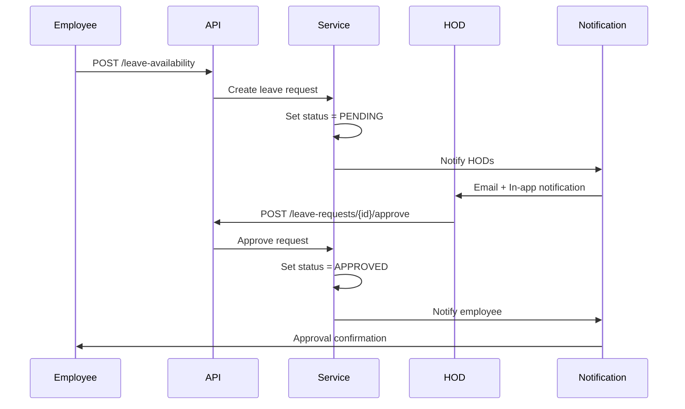

# Leave Availability Module

## Overview

The Leave Availability module manages employee leave requests with approval workflows, notifications, and department-level oversight. It supports leave requests, availability changes, and comprehensive approval management.

**Location**: [`modules/employeeleaveavailability/`](../../src/main/java/com/horaion/app/modules/employeeleaveavailability/)

## Key Features

- **Leave Requests**: Employee-initiated leave requests
- **Approval Workflow**: Multi-level approval with notifications
- **Department HOD Access**: Department heads can view and approve team leaves
- **Admin Access**: System owners can view all leaves
- **Event-Driven Notifications**: Email and in-app notifications
- **Status Tracking**: PENDING, APPROVED, REJECTED, CANCELLED

## Data Model

### EmployeeLeaveAvailability Entity

```java
@Entity
@Table(name = "employee_leave_availability")
public class EmployeeLeaveAvailability {
    private UUID id;
    private Employee employee;
    private RequestType type;               // LEAVE, AVAILABILITY
    private LocalDate startDate;
    private LocalDate endDate;
    private LocalTime startTime;
    private LocalTime endTime;
    private RequestStatus status;           // PENDING, APPROVED, REJECTED
    private Employee approvedBy;
    private Instant approvedAt;
    private String rejectionReason;
    private String notes;
    private Boolean isActive;
}
```

### Request Status

```java
public enum RequestStatus {
    PENDING,    // Awaiting approval
    APPROVED,   // Approved by manager
    REJECTED,   // Rejected with reason
    CANCELLED   // Cancelled by employee
}
```

## API Endpoints

### Employee Leave Requests
**Base**: `/api/v1/employees/{employeeId}/leave-availability`

| Method | Endpoint | Permission | Access |
|--------|----------|------------|--------|
| GET | `/leave-availability` | read:leave-availability | Self + HOD + Admin |
| GET | `/leave-availability/{id}` | read:leave-availability | Self + HOD + Admin |
| POST | `/leave-availability` | create:leave-availability | Self |
| PUT | `/leave-availability/{id}` | update:leave-availability | Self |
| DELETE | `/leave-availability/{id}` | delete:leave-availability | Self |

### Department Leave Requests (HOD)
**Base**: `/api/v1/departments/{deptId}/leave-availability`

| Method | Endpoint | Permission | Access |
|--------|----------|------------|--------|
| GET | `/leave-availability` | read:leave-availability | HOD + Admin |
| GET | `/leave-availability/pending` | read:leave-availability | HOD + Admin |

### Admin Leave Requests (System Owners)
**Base**: `/api/v1/admin/leave-availability`

| Method | Endpoint | Permission | Access |
|--------|----------|------------|--------|
| GET | `/leave-availability` | read:leave-availability | Admin only |
| GET | `/leave-availability/pending` | read:leave-availability | Admin only |

### Approval Operations
**Base**: `/api/v1/leave-requests`

| Method | Endpoint | Permission | Access |
|--------|----------|------------|--------|
| POST | `/leave-requests/{id}/approve` | approve:leave-availability | HOD + Admin |
| POST | `/leave-requests/{id}/reject` | approve:leave-availability | HOD + Admin |

## Access Control Matrix

| Role | View Own | View Team | View All | Approve |
|------|----------|-----------|----------|---------|
| **system-owner** | ✓ | ✓ | ✓ | ✓ |
| **system-administrator** | ✓ | ✓ | ✓ | ✓ |
| **privileged-system-user** (HOD) | ✓ | ✓ (dept only) | ✗ | ✓ (dept only) |
| **user** | ✓ | ✗ | ✗ | ✗ |

## Approval Workflow



## Notification Events

### Leave Request Created
- **Recipients**: System owners, privileged system users, department head
- **Type**: LEAVE_APPROVAL_REQUEST
- **Content**: Employee name, date range, reason

### Leave Request Approved
- **Recipients**: Requesting employee
- **Type**: LEAVE_APPROVED
- **Content**: Approver name, approval date

### Leave Request Rejected
- **Recipients**: Requesting employee
- **Type**: LEAVE_REJECTED
- **Content**: Rejector name, rejection reason

## Related Documentation

- [Employee Module](./05-employee-module.md) - Employee leave submitters
- [Department Module](./04-department-module.md) - Department context
- [Me Module](./11-me-module.md) - View own leave requests
- See [`docs_suggestion.md`](../docs_suggestion.md) segments for comprehensive details
