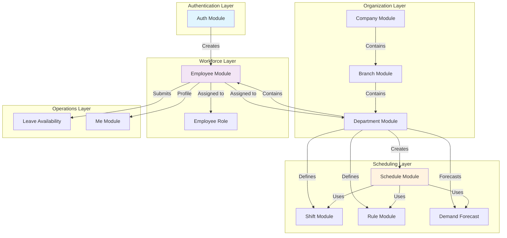

# Horaion Module Documentation

## Quick Start

This directory contains comprehensive documentation for all Horaion modules following the Vertical Slice Architecture pattern.

## Documentation Index

### Getting Started
1. **[Modules Overview](./00-modules-overview.md)** - Start here for system architecture and module catalog
2. **[API Reference Index](#api-quick-reference)** - Quick reference for all endpoints

### Module Documentation

#### Core Business Modules (Documented)
- **[Auth Module](./01-auth-module.md)** - AWS Cognito authentication, registration, JWT tokens
- **[Company Module](./02-company-module.md)** - Organization management and multi-tenancy
- **[Employee Module](./05-employee-module.md)** - Employee management, bulk import, role/department assignments
- **[Schedule Module](./09-schedule-module.md)** - Schedule generation with external engine, approval workflow

#### Additional Modules (See docs_suggestion.md for details)
- **Branch Module** - Location and branch management
- **Department Module** - Organizational units and hierarchy  
- **Shift Module** - Shift patterns and role requirements
- **Rule Module** - See [`rule-module.md`](../rule-module.md) for dynamic business rules engine
- **Leave Availability Module** - Leave request workflow and approvals
- **Me Module** - Current user profile and notifications
- **Demand Forecast Module** - Workforce demand planning

## API Quick Reference

### Authentication (Public Endpoints)

| Method | Endpoint | Purpose |
|--------|----------|---------|
| POST | `/api/v1/auth/register` | Register new user with employee data |
| POST | `/api/v1/auth/confirm` | Confirm account with verification code |
| POST | `/api/v1/auth/login` | Authenticate and get JWT tokens |
| POST | `/api/v1/auth/resend-code` | Resend verification code |
| POST | `/api/v1/auth/refresh` | Refresh access token |

### Company Management

| Method | Endpoint | Purpose | Permission |
|--------|----------|---------|------------|
| GET | `/api/v1/companies` | List companies (paginated) | read:company |
| GET | `/api/v1/companies/{id}` | Get company by ID | read:company |
| GET | `/api/v1/companies/registration/{number}` | Get by registration number | read:company |
| GET | `/api/v1/companies/search?name={name}` | Search by name | read:company |
| POST | `/api/v1/companies` | Create company | create:company |
| PUT | `/api/v1/companies/{id}` | Update company | update:company |
| DELETE | `/api/v1/companies/{id}` | Delete company | delete:company |
| POST | `/api/v1/companies/{id}/complete-onboarding` | Mark onboarding complete | update:company |

### Employee Management

| Method | Endpoint | Purpose | Permission |
|--------|----------|---------|------------|
| GET | `/api/v1/employees` | List all employees (role-based filtering) | read:employee |
| GET | `/api/v1/companies/{companyId}/branches/{branchId}/employees` | List employees by branch | read:employee |
| GET | `/api/v1/companies/{companyId}/branches/{branchId}/employees/{id}` | Get employee by ID | read:employee |
| POST | `/api/v1/companies/{companyId}/branches/{branchId}/employees/{employeeId}/departments` | Assign to department | update:employee |
| GET | `/api/v1/companies/{companyId}/branches/{branchId}/employees/{employeeId}/departments` | Get assignments | read:employee |
| DELETE | `/api/v1/companies/{companyId}/branches/{branchId}/employees/{employeeId}/departments/{deptId}` | Remove from department | update:employee |

### Employee Bulk Import

| Method | Endpoint | Purpose | Permission |
|--------|----------|---------|------------|
| POST | `/api/v1/employees/upload-excel` | Upload Excel file for import | create:employee |
| GET | `/api/v1/employees/import/jobs/{jobId}` | Get import job status | read:employee |
| GET | `/api/v1/employees/import/history` | Get import history | read:employee |
| GET | `/api/v1/employees/excel/download-template` | Download import template | read:employee |

### Employee Roles

| Method | Endpoint | Purpose | Permission |
|--------|----------|---------|------------|
| GET | `/api/v1/companies/{companyId}/roles` | Get all company roles | read:employee-role |
| GET | `/api/v1/companies/{companyId}/departments/{deptId}/roles` | Get department roles | read:employee-role |

### Schedule Management

| Method | Endpoint | Purpose | Permission |
|--------|----------|---------|------------|
| POST | `/api/v1/companies/{companyId}/departments/{deptId}/schedules` | Create & auto-generate | create:schedule |
| GET | `/api/v1/companies/{companyId}/departments/{deptId}/schedules` | List schedules (with filters) | read:schedule |
| GET | `/api/v1/companies/{companyId}/departments/{deptId}/schedules/{id}` | Get schedule by ID | read:schedule |
| PUT | `/api/v1/companies/{companyId}/departments/{deptId}/schedules/{id}` | Update schedule | update:schedule |
| POST | `/api/v1/companies/{companyId}/departments/{deptId}/schedules/{id}/approve` | Approve schedule | schedule:approve |
| POST | `/api/v1/companies/{companyId}/departments/{deptId}/schedules/{id}/reject` | Reject schedule | schedule:reject |
| DELETE | `/api/v1/companies/{companyId}/departments/{deptId}/schedules/{id}` | Delete schedule | delete:schedule |

### Current User (Me)

| Method | Endpoint | Purpose | Permission |
|--------|----------|---------|------------|
| GET | `/api/v1/me` | Get current user profile | Authenticated |
| GET | `/api/v1/me/departments` | Get departments where user is HOD | read:department |
| GET | `/api/v1/me/notifications` | Get user notifications | Authenticated |
| GET | `/api/v1/me/notifications/unread` | Get unread notifications | Authenticated |
| PUT | `/api/v1/me/notifications/{id}/read` | Mark notification as read | Authenticated |

### Health & Info (Public)

| Method | Endpoint | Purpose |
|--------|----------|---------|
| GET | `/actuator/health` | Application health status |
| GET | `/actuator/info` | Build and Git information |

## Common Patterns

### Pagination Parameters

All list endpoints support:
- `page` - Page number (0-indexed, default: 0)
- `size` - Items per page (default: 10-20)
- `sort` - Sort criteria (e.g., "name,asc")

### Standard Response Format

```json
{
  "success": true,
  "data": { /* response data or Page<T> */ },
  "error": null
}
```

### Error Response Format (RFC 7807)

```json
{
  "type": "about:blank",
  "title": "Error Title",
  "status": 400,
  "detail": "Detailed error message",
  "instance": "/api/v1/endpoint",
  "errors": [
    {
      "field": "fieldName",
      "message": "Field-specific error"
    }
  ]
}
```

### Authentication Header

```http
Authorization: Bearer {accessToken}
```

## Module Dependencies



## Technology Stack

- **Framework**: Spring Boot 3.4.0, Java 21
- **Database**: PostgreSQL with Flyway migrations
- **Authentication**: AWS Cognito
- **Authorization**: Permit.io (RBAC/ABAC)
- **API Documentation**: OpenAPI/Swagger
- **HTTP Client**: Spring Cloud OpenFeign
- **Messaging**: AWS SNS/SQS
- **Email**: AWS SES

## Development Workflow

### 1. Setup Phase
```bash
# Create company
POST /api/v1/companies

# Create branches
POST /api/v1/companies/{companyId}/branches

# Create departments  
POST /api/v1/companies/{companyId}/branches/{branchId}/departments
```

### 2. Workforce Setup
```bash
# Import employees via Excel
POST /api/v1/employees/upload-excel

# OR register employees via auth
POST /api/v1/auth/register
```

### 3. Configuration Phase
```bash
# Define shifts
POST /api/v1/companies/{companyId}/branches/{branchId}/departments/{deptId}/shifts

# Configure business rules
POST /api/v1/departments/{deptId}/rules

# Create demand forecasts
POST /api/v1/companies/{companyId}/departments/{deptId}/demand-forecasts
```

### 4. Scheduling Phase
```bash
# Generate schedule
POST /api/v1/companies/{companyId}/departments/{deptId}/schedules

# Review and approve
POST /api/v1/companies/{companyId}/departments/{deptId}/schedules/{id}/approve
```

## Additional Resources

- **Postman Collections**: [`postman/`](../../postman/) - Complete API testing collections
- **Database Migrations**: [`src/main/resources/db/migrations/`](../../src/main/resources/db/migrations/)
- **Configuration Examples**: [`deployments/`](../../deployments/)
- **Setup Scripts**: [`scripts/`](../../scripts/) - AWS and Permit.io setup automation

## Support

For detailed implementation guidance, refer to individual module documentation files. For questions about:
- **Authentication**: See [Auth Module](./01-auth-module.md)
- **Data Import**: See [Employee Module](./05-employee-module.md#bulk-import-feature)
- **Scheduling**: See [Schedule Module](./09-schedule-module.md)
- **Business Rules**: See [`rule-module.md`](../rule-module.md)
