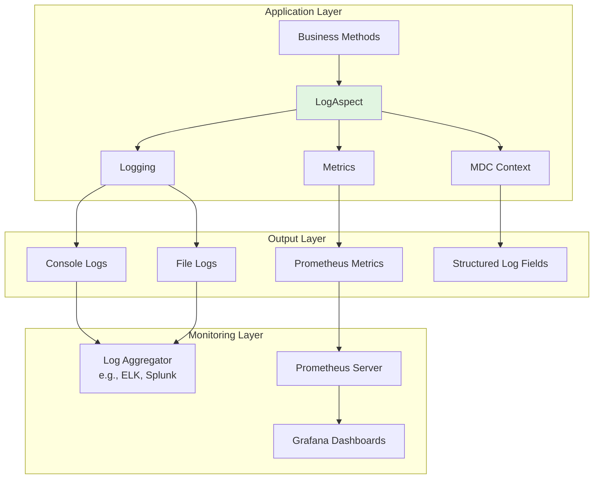

# Observability Setup Guide

## Overview
Horaion implements a comprehensive observability stack including logging, metrics, and distributed tracing (via request IDs). This guide covers the setup and configuration.

## Architecture



## Prerequisites

### 1. Required Dependencies
Ensure these are in your `pom.xml`:
```xml
<!-- AspectJ for AOP -->
<dependency>
    <groupId>org.springframework.boot</groupId>
    <artifactId>spring-boot-starter-aspectj</artifactId>
</dependency>

<!-- Logging -->
<dependency>
    <groupId>org.springframework.boot</groupId>
    <artifactId>spring-boot-starter-logging</artifactId>
</dependency>

<!-- Metrics -->
<dependency>
    <groupId>org.springframework.boot</groupId>
    <artifactId>spring-boot-starter-actuator</artifactId>
</dependency>
<dependency>
    <groupId>io.micrometer</groupId>
    <artifactId>micrometer-registry-prometheus</artifactId>
</dependency>

<!-- Security (for user context) -->
<dependency>
    <groupId>org.springframework.boot</groupId>
    <artifactId>spring-boot-starter-security</artifactId>
</dependency>
```

### 2. Build Configuration
```xml
<!-- Enable AspectJ compile-time weaving -->
<