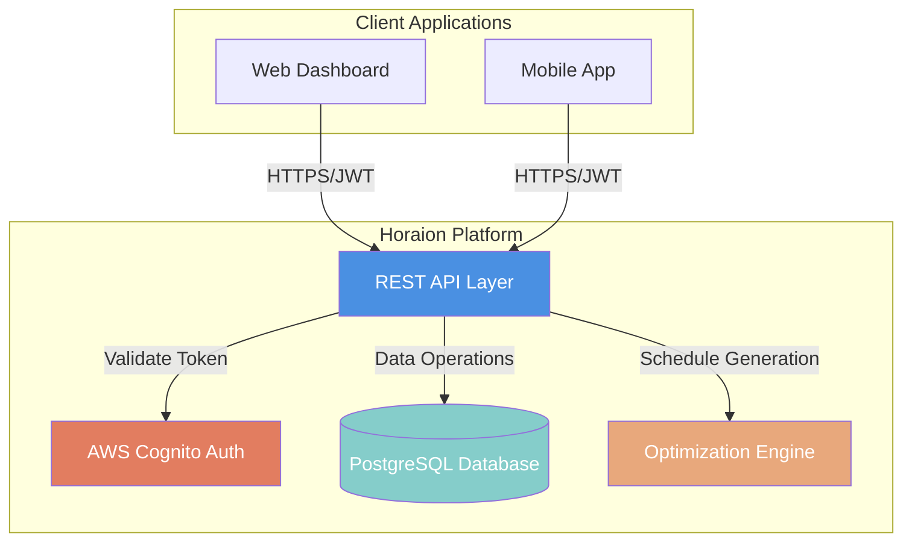
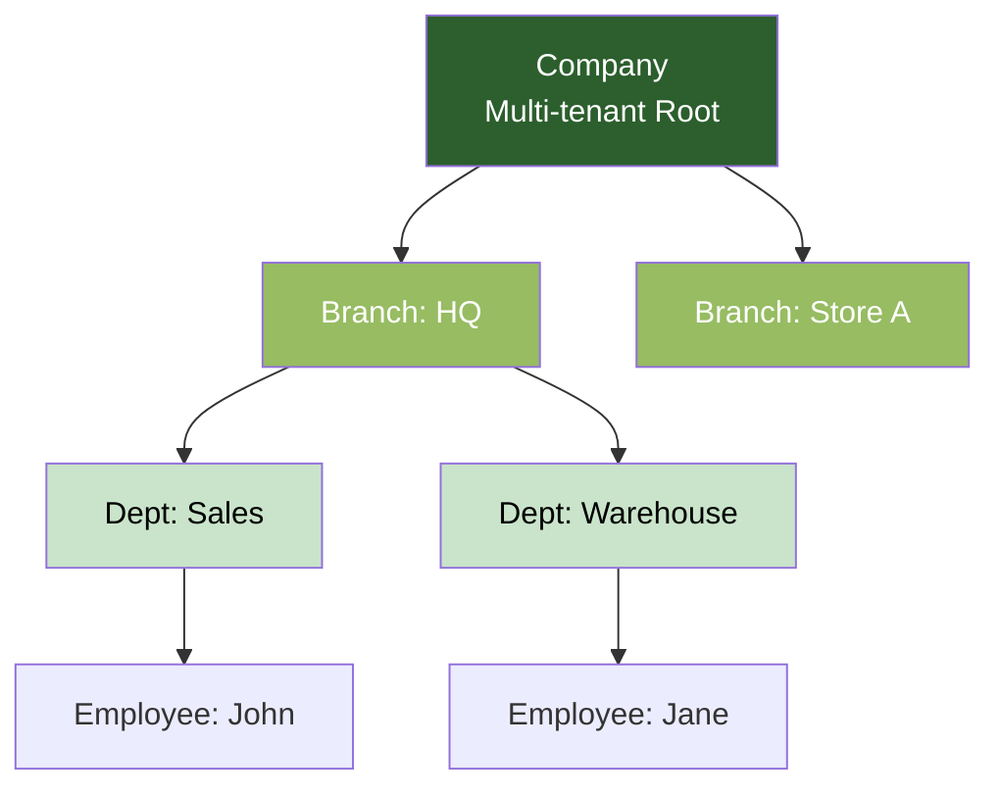
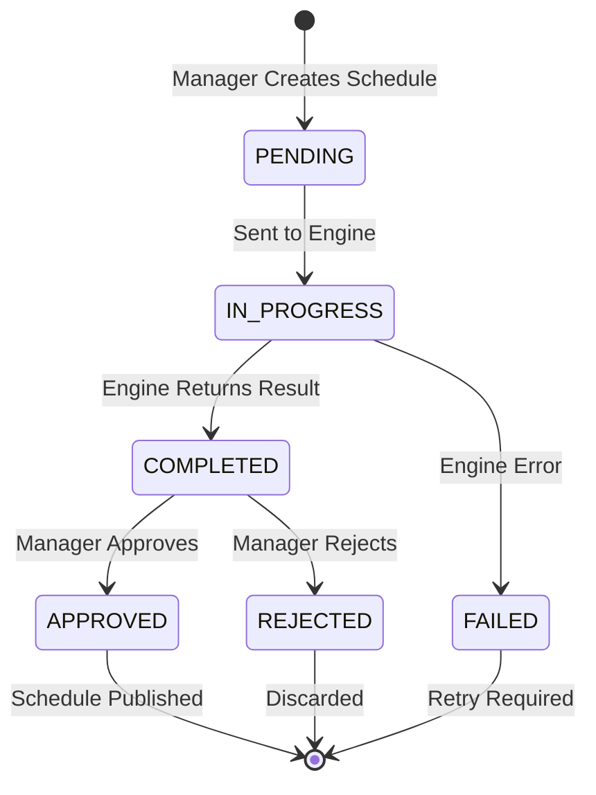
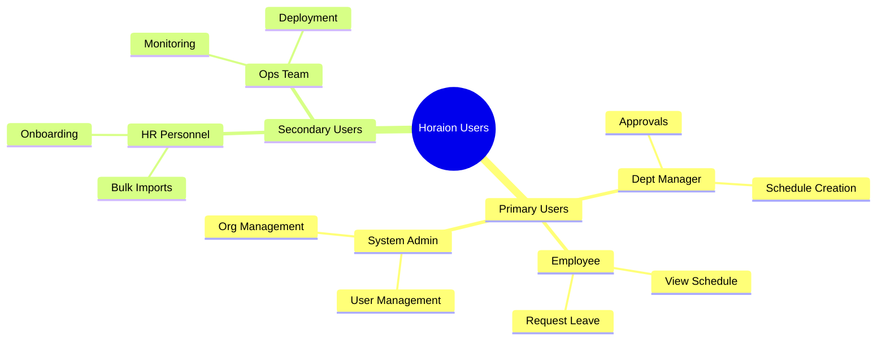
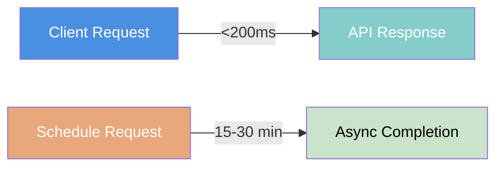

# 01 - Executive Summary

> **Horaion Workforce Management Platform - Executive Summary**

---

## 1.1 System Overview

**Horaion** is a comprehensive workforce management platform designed to optimize employee scheduling, manage organizational hierarchies, and streamline workforce operations for multi-location businesses.


**Note:** Horaion is built specifically for businesses with complex scheduling needs across multiple locations, where manual scheduling becomes impractical and error-prone.


### Core Purpose
Automate complex scheduling operations while maintaining compliance with labor regulations, employee preferences, and business constraints through integration with an external optimization engine.

### System Type
- **Category**: Enterprise Workforce Management System
- **Deployment**: Cloud-based REST API
- **Architecture**: Vertical Slice Architecture with microservice-ready design
- **Integration**: External optimization engine via Feign HTTP client

**Diagram Explanation**: This architecture diagram illustrates the core components of the Horaion platform and their interactions:

1. **Client Applications** (Web/Mobile): Users access the system through browser-based dashboards or mobile applications
2. **REST API Layer**: The central hub that processes all requests, enforces business logic, and coordinates between services
3. **AWS Cognito Auth**: Handles user authentication and JWT token validation for secure access
4. **PostgreSQL Database**: Stores all application data with JSONB support for flexible schemas
5. **Optimization Engine**: External service that solves complex scheduling problems using advanced algorithms

---

## 1.2 Key Features

### Organizational Management
- **Multi-tenant Architecture**: Support multiple companies with complete data isolation
- **Hierarchical Structure**: Company → Branch → Department → Employee
- **Role Management**: Flexible employee roles with proficiency tracking

**Diagram Explanation**: The organizational hierarchy follows a strict top-down structure:
- **Company** (Tenant): The root entity representing an entire organization
- **Branch**: Physical or logical locations (stores, offices, warehouses)
- **Department**: Functional units within a branch (Sales, Operations, etc.)
- **Employee**: Individual workers assigned to a specific department


**Important:** All data queries automatically filter by the authenticated user's `companyId` to ensure strict tenant isolation. Cross-tenant data access is prevented at the database level.


### Employee Management
- **CRUD Operations**: Complete employee lifecycle management
- **AWS Cognito Integration**: Automated user account creation and authentication
- **Excel Import**: Bulk employee upload with validation
- **Custom Fields**: JSONB storage for flexible employee attributes


**Tip:** The Excel import feature supports bulk onboarding of hundreds of employees simultaneously, with detailed error reporting for any validation failures.


###Schedule Generation
- **Optimization Engine Integration**: External service for complex schedule generation
- **Async Processing**: Long-running operations (15-30 minutes) handled asynchronously
- **Constraint Management**: Rules, shifts, demand forecasts, leave availability
- **Approval Workflow**: PENDING → IN_PROGRESS → APPROVED/REJECTED states

**Diagram Explanation**: The schedule lifecycle manages the asynchronous generation process:

1. **PENDING**: Initial state when a manager creates a schedule request
2. **IN_PROGRESS**: Schedule request sent to the optimization engine (15-30 min processing)
3. **COMPLETED**: Engine successfully generated a schedule (ready for review)
4. **FAILED**: Engine encountered an error (infeasible constraints, timeout, etc.)
5. **APPROVED**: Manager reviewed and approved the AI-generated schedule
6. **REJECTED**: Manager rejected the schedule (may require manual adjustments)


**Critical:** Schedule generation can take 15-30 minutes. The system uses asynchronous processing to avoid blocking the API. Do not expect immediate results.


### Leave Management
- **Leave Tracking**: Employee leave availability and requests
- **Integration**: Leave data feeds into schedule generation

---

## 1.3 Technology Stack Summary

### Backend
- **Runtime**: Java 21 LTS
- **Framework**: Spring Boot 4.0.0
- **Database**: PostgreSQL 12+ with JSONB support
- **Authentication**: AWS Cognito with JWT validation
- **API**: RESTful API (Level 2 maturity)
- **Build Tool**: Maven 3.9+
- **Connection Pool**: HikariCP


**Note:** The platform uses Spring Boot 4.0.0, which requires Java 21 LTS. Ensure your development environment is configured accordingly.


### Infrastructure
- **Containerization**: Docker
- **Staging**: Digital Ocean (Droplets)
- **Production**: AWS Lightsail
- **Database**: PostgreSQL

### External Integrations
- **Optimization Engine**: Feign HTTP client with 45-minute timeouts
- **Email**: AWS SES (Planned Integration)
- **Messaging**: AWS SQS/SNS (Planned Integration)


**Important:** The Feign client timeout is set to 45 minutes specifically to accommodate the optimization engine's processing time. Do not reduce this value without understanding the implications.


### Frontend
- **Framework**: React 19.1.0
- **Build Tool**: Vite 6.x
- **Styling**: Tailwind CSS 4.x
- **Routing**: TanStack Router

---

## 1.4 Target Audience

### User Role Hierarchy

**Diagram Explanation**: This mindmap illustrates the complete hierarchy of users who interact with the Horaion platform, categorized by their primary function.

**Detailed Breakdown**:
1. **Primary Users (Daily Operations)**:
   - **System Admin**: The super-user responsible for configuring the entire organization (companies, branches, departments) and managing user access
   - **Dept Manager**: The core operational user who creates schedules, manages employees within their department, and approves/rejects AI-generated shifts
   - **Employee**: The end-user who logs in to view their assigned roster, check upcoming shifts, and submit time-off requests
   
2. **Secondary Users (Support & Maintenance)**:
   - **HR Personnel**: Handles administrative tasks like bulk importing employee data via Excel, managing employee onboarding workflows, and maintaining employee records
   - **Ops Team**: Technical staff (DevOps/SRE) who ensure the infrastructure is running smoothly, handle deployments, monitor system health, and manage database backups

#### 1. System Administrators
- **Responsibilities**: Company, branch, department management
- **Access Level**: Full system access across all tenants

#### 2. Department Managers
- **Responsibilities**: Schedule creation, employee management within their department
- **Access Level**: Department-scoped access (can only see their department's data)

#### 3. Employees
- **Responsibilities**: View schedules, submit leave requests
- **Access Level**: Self-service only (can only see their own data)

#### 4. HR Personnel
- **Responsibilities**: Employee onboarding, data management, bulk imports
- ** Access Level**: Company-wide employee access

#### 5. Operations Teams
- **Responsibilities**: System monitoring, deployment, infrastructure maintenance
- **Access Level**: Infrastructure and backend access


**Tip:** Role-based access control (RBAC) is enforced at the API level using JWT claims. Each request is validated against the user's assigned role before processing.


---

## 1.5 Business Value Proposition

### For Businesses

#### Cost Reduction
- **Automated Scheduling**: Reduces manual scheduling time by 80%
- **Optimization**: Minimizes labor costs while meeting demand
- **Compliance**: Reduces risk of labor law violations

#### Operational Efficiency
- **Multi-location Support**: Manage workforce across multiple branches from a single dashboard
- **Real-time Updates**: Instant schedule changes and notifications
- **Data-driven Decisions**: Analytics on workforce utilization and labor costs

#### Scalability
- **Multi-tenant**: Single deployment serves multiple companies
- **Async Processing**: Handles complex operations without blocking other users
- **Cloud-native**: Scales horizontally with business growth

### For Employees

#### Work-Life Balance
- **Preference Management**: Employee availability and preferences considered in AI scheduling
- **Transparency**: Clear visibility into upcoming schedules weeks in advance
- **Leave Management**: Easy leave request submission with approval workflow

#### Accessibility
- **Self-service**: View schedules without requiring manager intervention
- **Mobile-ready**: RESTful API supports dedicated mobile applications

### For Managers

#### Time Savings
- **Automated Generation**: Schedules created in minutes instead of hours
- **Bulk Operations**: Import hundreds of employees via Excel templates
- **Approval Workflow**: Streamlined schedule review and approval process

#### Flexibility
- **Custom Rules**: Define business-specific scheduling rules (max hours, rest periods, etc.)
- **Constraint Management**: Balance employee preferences with business operational needs
- **Real-time Adjustments**: Quick manual schedule modifications when needed


**Success Story:** Pilot deployments show managers save an average of 10 hours per week on scheduling tasks, allowing them to focus on strategic business activities.


---

## 1.6 System Metrics

### Current Capabilities
- **Entities**: 12 core business entities
- **Modules**: 12 vertical slice modules
- **API Endpoints**: 50+ RESTful endpoints
- **Database Tables**: 12 main tables + audit/job tracking tables
- **Async Thread Pools**: 2 dedicated executors (schedule & general tasks)
- **External Integrations**: 3 (Cognito, Optimization Engine, SES)

### Performance Characteristics
- **Schedule Generation**: 15-30 minutes (optimization engine-dependent)
- **API Response**: Target <200ms for standard CRUD operations
- **Concurrent Users**: Designed for 1-5 users (Bespoke Phase) scaling to 100+ (SaaS Phase)
- **Database Connections**: 10 max (HikariCP pool)

**Diagram Explanation**: Performance characteristics vary significantly by operation type:
- **Synchronous Operations** (left): CRUD operations return within 200ms for responsive user experience
- **Asynchronous Operations** (right): Complex schedule generation runs in background for 15-30 minutes


**Note:** The 15-30 minute processing time for schedules is inherent to the optimization problem (NP-hard). The system uses async processing to keep the API responsive.


---

## 1.7 Document Purpose

This technical documentation provides:
1. **System Architecture**: Design patterns, component relationships, and architectural decisions
2. **Technical Specifications**: Backend implementation details, database schemas, and API contracts
3. **Infrastructure Guide**: Deployment strategies, configuration management, and operational procedures
4. **Development Workflows**: How to build, test, and deploy the application
5. **Module Documentation**: Deep dives into each business domain module

### Intended Audience
- **Software Engineers**: New team members onboarding to the codebase
- **System Architects**: Understanding design decisions and patterns
- **DevOps Engineers**: Deployment, configuration, and operational procedures
- **Technical Managers**: High-level system overview and capabilities

---

## 1.8 Next Steps


**Recommended Reading Path:**
1. **System Architecture** → [02_SYSTEM_ARCHITECTURE.md](02_SYSTEM_ARCHITECTURE.md) for architectural patterns and design decisions
2. **Backend Strategy** → [04_BACKEND_SPECIFICATIONS.md](04_BACKEND_SPECIFICATIONS.md) for module structure and implementation details
3. **Security Policy** → [09_SECURITY_REQUIREMENTS.md](09_SECURITY_REQUIREMENTS.md) for authentication and authorization requirements


---

*Last Updated: 2026-02-05 | Version: Spring Boot 4.0.0 | Java 21 LTS*
