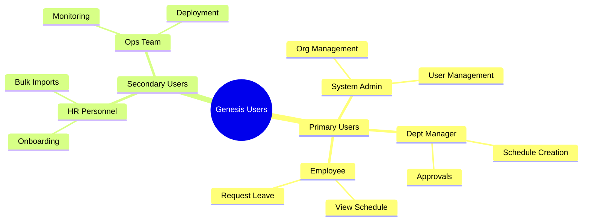

# 01 - Executive Summary

> **Genesis Workforce Management Platform - Executive Summary**

---

## 1.1 System Overview

**Genesis** is a comprehensive workforce management platform designed to optimize employee scheduling, manage organizational hierarchies, and streamline workforce operations for multi-location businesses.

### Core Purpose
Automate complex scheduling operations while maintaining compliance with labor regulations, employee preferences, and business constraints through integration with an external optimization engine.

### System Type
- **Category**: Enterprise Workforce Management System
- **Deployment**: Cloud-based REST API
- **Architecture**: Vertical Slice Architecture with microservice-ready design
- **Integration**: External optimization engine via Feign HTTP client

---

## 1.2 Key Features

### Organizational Management
- **Multi-tenant Architecture**: Support multiple companies with complete data isolation
- **Hierarchical Structure**: Company → Branch → Department → Employee
- **Role Management**: Flexible employee roles with proficiency tracking

### Employee Management
- **CRUD Operations**: Complete employee lifecycle management
- **AWS Cognito Integration**: Automated user account creation and authentication
- **Excel Import**: Bulk employee upload with validation
- **Custom Fields**: JSONB storage for flexible employee attributes

### Schedule Generation
- **Optimization Engine Integration**: External service for complex schedule generation
- **Async Processing**: Long-running operations (15-30 minutes) handled asynchronously
- **Constraint Management**: Rules, shifts, demand forecasts, leave availability
- **Approval Workflow**: PENDING → IN_PROGRESS → APPROVED/REJECTED states

### Leave Management
- **Leave Tracking**: Employee leave availability and requests
- **Integration**: Leave data feeds into schedule generation

---

## 1.3 Technology Stack Summary

### Backend
- **Runtime**: Java 21 with Spring Boot 3.4.0
- **Database**: PostgreSQL 12+ with JSONB support
- **Authentication**: AWS Cognito with JWT validation
- **API**: RESTful API (Level 2 maturity)
- **Build Tool**: Maven
- **Connection Pool**: HikariCP with PostgreSQL optimizations

### Infrastructure
- **Containerization**: Docker
- **Staging**: Digital Ocean (Droplets)
- **Production**: AWS Lightsail
- **Database**: PostgreSQL

### External Integrations
- **Optimization Engine**: Feign HTTP client with 45-minute timeouts
- **Email**: AWS SES (Planned Integration)
- **Messaging**: AWS SQS/SNS (Planned Integration)

### Frontend
- **Framework**: React 19.1.0
- **Build Tool**: Vite 6.x
- **Styling**: Tailwind CSS 4.x
- **Routing**: TanStack Router

---

## 1.4 Target Audience

### User Role Hierarchy

> **Diagram Explanation**: This mindmap illustrates the complete hierarchy of users who interact with the Genesis platform, categorized by their primary function.

**Detailed Breakdown**:
1.  **Primary Users (Daily Operations)**:
    *   **System Admin**: The super-user responsible for configuring the entire organization and managing other users.
    *   **Dept Manager**: The core operational user who creates schedules and approves shifts.
    *   **Employee**: The end-user who logs in to view their roster and request time off.
2.  **Secondary Users (Support & Maintanence)**:
    *   **HR Personnel**: Handles data entry (like bulk importing employees) and onboarding.
    *   **Ops Team**: Technical staff who ensure the server is running and deployed correctly.

#### 1. System Administrators
- **Responsibilities**: Company, branch, department management
- **Access Level**: Full system access

#### 2. Department Managers
- **Responsibilities**: Schedule creation, employee management
- **Access Level**: Department-scoped access

#### 3. Employees
- **Responsibilities**: View schedules, submit leave requests
- **Access Level**: Self-service only

#### 4. HR Personnel
- **Responsibilities**: Employee onboarding, data management
- **Access Level**: Company-wide employee access

#### 5. Operations Teams
- **Responsibilities**: System monitoring, deployment
- **Access Level**: Infrastructure access

---

## 1.5 Business Value Proposition

### For Businesses

#### Cost Reduction
- **Automated Scheduling**: Reduces manual scheduling time by 80%
- **Optimization**: Minimizes labor costs while meeting demand
- **Compliance**: Reduces risk of labor law violations

#### Operational Efficiency
- **Multi-location Support**: Manage workforce across multiple branches
- **Real-time Updates**: Instant schedule changes and notifications
- **Data-driven Decisions**: Analytics on workforce utilization

#### Scalability
- **Multi-tenant**: Single deployment serves multiple companies
- **Async Processing**: Handles complex operations without blocking
- **Cloud-native**: Scales with business growth

### For Employees

#### Work-Life Balance
- **Preference Management**: Employee availability and preferences considered
- **Transparency**: Clear visibility into schedules
- **Leave Management**: Easy leave request submission

#### Accessibility
- **Self-service**: View schedules without manager intervention
- **Mobile-ready**: RESTful API supports mobile applications

### For Managers

#### Time Savings
- **Automated Generation**: Schedules created in minutes, not hours
- **Bulk Operations**: Import employees via Excel
- **Approval Workflow**: Streamlined schedule approval process

#### Flexibility
- **Custom Rules**: Define business-specific scheduling rules
- **Constraint Management**: Balance employee preferences with business needs
- **Real-time Adjustments**: Quick schedule modifications

---

## System Metrics

### Current Capabilities
- **Entities**: 12 core business entities
- **Modules**: 12 vertical slice modules
- **API Endpoints**: 50+ RESTful endpoints
- **Database Tables**: 12 main tables + audit/job tables
- **Async Thread Pools**: 2 dedicated executors
- **External Integrations**: 3 (Cognito, Engine, SES)

### Performance Characteristics
### Performance Characteristics
- **Schedule Generation**: 15-30 minutes (engine-dependent)
- **API Response**: Target <200ms for CRUD operations
- **Concurrent Users**: Designed for 1-5 users (Bespoke) up to 100+ (SaaS)
- **Database Connections**: 10 max (HikariCP)

---

## Document Purpose

This technical documentation provides:
1. **System Architecture**: Design patterns and structure
2. **Technical Specifications**: Backend, database, API details
3. **Infrastructure Guide**: Deployment and operations
4. **Development Workflows**: How to build and deploy
5. **Configuration Reference**: All system configurations

### Intended Audience
- Software Engineers (new team members)
- System Architects (design decisions)
- DevOps Engineers (deployment and operations)
- Technical Managers (system overview)

---

## Next Steps

2. **Read** [02_SYSTEM_ARCHITECTURE.md](02_SYSTEM_ARCHITECTURE.md) for architectural details
3. **Explore** [04_BACKEND_SPECIFICATIONS.md](04_BACKEND_SPECIFICATIONS.md) for implementation details

