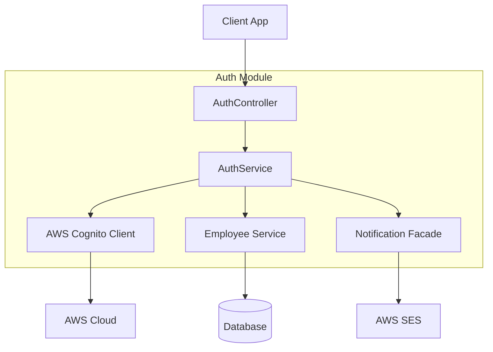

# Auth Module

| Attribute | Details |
| :--- | :--- |
| **Namespace** | `com.horaion.app.modules.auth` |
| **Status** | 🟢 Stable |
| **Criticality** | High (System Entry Point) |
| **Dependencies** | AWS Cognito, Employee Module |

## Executive Summary
The **Auth Module** orchestrates user identity, authentication, and registration within the Horaion platform. It acts as the secure gateway ("The Bouncer") between the client application and our identity provider, **AWS Cognito**.


**Important / Warning:**
**For New Developers**: We leverage **AWS Cognito** for identity management to ensure industry-standard security for password storage and token generation. This module's primary responsibility is to bridge the gap between AWS's identity records and Horaion's local business data.


### Core Capabilities
1.  **Identity Federation**: Proxies registration requests to AWS.
2.  **Data Synchronization**: Maintains strict consistency between the AWS User Pool and the local `Employee` database.
3.  **Session Management**: Issues and validates **JSON Web Tokens (JWT)** for API access.

## Responsibilities
*   **Registration**: Creating new user accounts in AWS Cognito and syncing them to the local `Employee` database.
*   **Authentication**: Handling Login (Username/Password) and returning JWTs.
*   **Token Management**: Refreshing access tokens.
*   **Account Verification**: Confirming email addresses via OTP (One-Time Password).
*   **Security**: Validating complex password policies and cryptographic signatures (Secret Hash).

## Module Architecture

> **Diagram Explanation**: The Auth Module acts as a high-level orchestrator. The **AuthController** provides a unified interface for the client, while the **AuthService** manages the multi-step transaction between **AWS Cognito** for identity, the **EmployeeService** for local profile persistence, and the **NotificationFacade** for welcome emails.


**Note:** This module follows the "Bouncer" pattern—every external identity must be successfully validated and synced to a local `Employee` record before any business operations can take place.


## Key Interactions
1.  **Employee Module**:
    *   **Dependency**: Strongly dependent on `IEmployeeService`.
    *   **Reason**: When a user registers in Cognito, a corresponding `Employee` record must be created locally to link the identity (Subject ID) to business data.
    *   **Rollback**: If local employee creation fails, the Cognito user is deleted to maintain consistency.

2.  **Notification System**:
    *   **Dependency**: Uses `INotificationFacade`.
    *   **Reason**: Sends "Welcome" emails upon successful registration.

## Configuration
This module relies on the following configurations (see `CONFIG.md`):
*   `horaion.cognito.*` (Client ID, User Pool ID, Secret)
*   `horaion.permit.*` (RBAC policies)

## Events
*   **Emits**: None currently (Direct service calls).
*   **Listens**: None.
