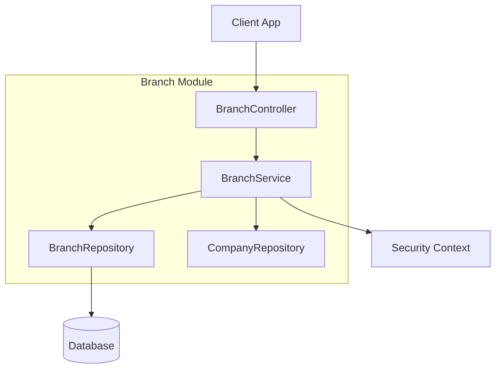

# Branch Module

| Attribute     | Details                                  |
| :------------ | :--------------------------------------- |
| **Namespace** | `com.horaion.app.modules.branch`         |
| **Status**    | 🟢 Stable                                |
| **Criticality** | Medium (Organizational Structure)       |
| **Dependencies** | Company Module, Employee Module (Manager) |

## Executive Summary

The **Branch Module** manages the physical locations (branches) of a company. It acts as the "Map" of the organization, defining where business operations actually happen.


**Tip / Success:**
Think of a **Branch** as a physical store, office, or site. Every employee is assigned to a specific branch, and every shift happens at a specific branch.



**Important / Warning:**
**For New Developers**: Branches are usually tied to a specific **Timezone** and **Location**. This is critical for scheduling compliance (e.g., overtime rules based on local time).


### Core Capabilities

1.  **Location Management**: Stores addresses, coordinates (lat/long), and contact info.
2.  **Hierarchy**: Links branches to a parent **Company** and an assigned **Manager**.
3.  **Operational Metadata**: Tracks opening hours and available services.

## Responsibilities

*   **CRUD Operations**: Create, Read, Update, and Delete branches.
*   **Validation**: Ensuring Branch Codes are unique within a Company.
*   **Search**: Finding branches by name or code.

## Module Architecture

## Key Interactions

1.  **Company Module**:
    *   **Dependency**: Strongly dependent on `CompanyRepository`.
    *   **Reason**: A branch *cannot* exist without a parent Company.

2.  **Security Module**:
    *   **Dependency**: Uses `SecurityContextService`.
    *   **Reason**: To ensure users only access branches belonging to their own company (Multi-tenancy isolation).

## Configuration

This module relies on standard database configurations. See `04_CONFIG.md`.

## Events

*   **Emits**: None currently.
*   **Listens**: None.
