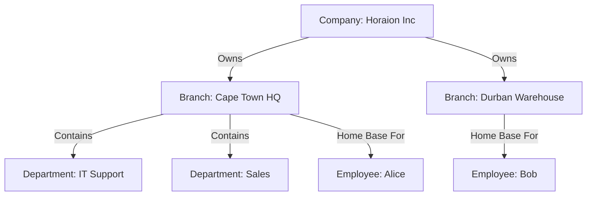
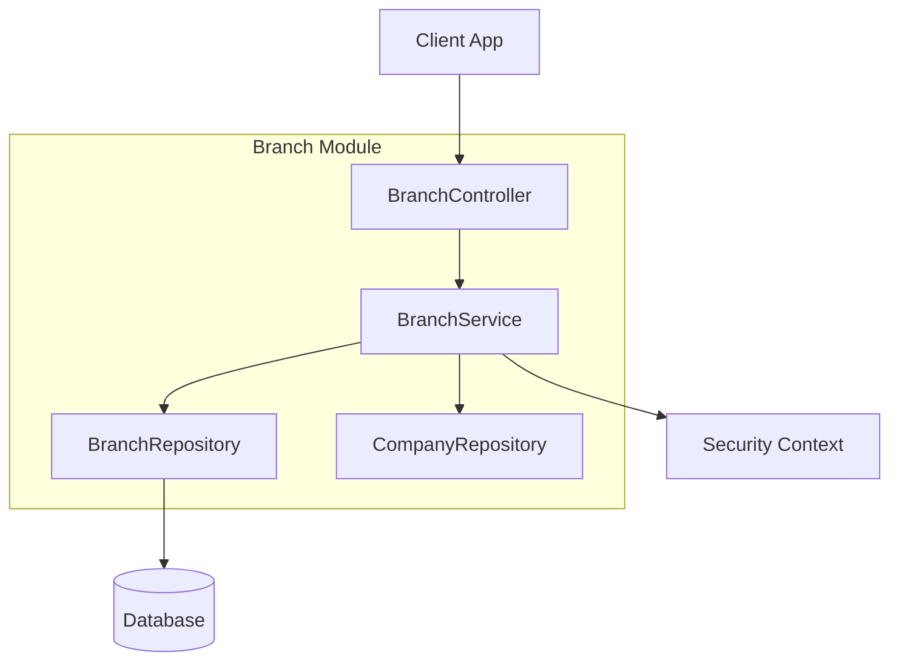

# Branch Module

| Attribute     | Details                                  |
| :------------ | :--------------------------------------- |
| **Namespace** | `com.horaion.app.modules.branch`         |
| **Status**    | 🟢 Stable                                |
| **Criticality** | High (Operational Compliance)            |
| **Dependencies** | Company Module, Employee Module (Manager) |

## Executive Summary

The **Branch Module** serves as the **operational backbone** of the Horaion platform. While the *Company* represents the legal entity, the *Branch* represents the physical or logical locations where work actually occurs.


**Tip / Success:**
**Analogy**: Think of the **Company** as the "Head Office" and the **Branches** as the individual "Franchise Stores". Even a fully remote company has a "Virtual" branch to house its employees.



**Important / Warning:**
**Compliance Criticality**: Branches definition determines the **Timezone** and **Labor Laws** applicable to shifts.
*   A shift at a "Cape Town" branch starts at 08:00 SAST (GMT+2).
*   A shift at a "New York" branch starts at 08:00 EST (GMT-5).
*   **Impact**: Scheduling engines read the Branch configuration to correctly calculate overtime, night-shift allowances, and public holiday pay.


## Hierarchy & Relationships

The Branch sits in the middle of our organizational hierarchy:

1.  **Company** (Root)
2.  **Branch** (Location/Site)
3.  **Department** (Functional Unit within a Branch)
4.  **Employee** (Assigned to a Branch)

> **Diagram Explanation**: This hierarchy shows the **Multi-Tenant Data Partitioning**. A **Company** acts as the root container, while **Branches** serve as the physical or logical silos for resource allocation. **Departments** then subdivide the branch into functional units, allowing for granular scheduling and reporting.

## Core Capabilities

1.  **Geolocation Management**:
    *   Stores `latitude` and `longitude` for geofencing (ensuring employees clock in only when physically on-site).
    *   Manages address data for logistics and compliance.
2.  **Operational Metadata**:
    *   **Opening Hours**: Defines when the site is open (used to validate shift times).
    *   **Services**: Lists capabilities of the branch (e.g., "Drive-thru", "24/7 Support").
3.  **Lifecycle Management**:
    *   Handles the opening, renovation (updates), and closing (soft delete) of locations.

## Responsibilities

*   **Single Source of Truth**: For all location-based data.
*   **Validation**: Enforcing that every branch code (e.g., `CPT-001`) is unique within a company.
*   **Search Optimization**: Providing indexed lookups by City and Country.

## Module Architecture

> **Diagram Explanation**: The Branch Module integrates with the **Security Context** to ensure that all operations are scoped to the user's authorized company. The **BranchService** acts as the primary orchestrator, validating business rules before persisting data to the PostgreSQL database.
