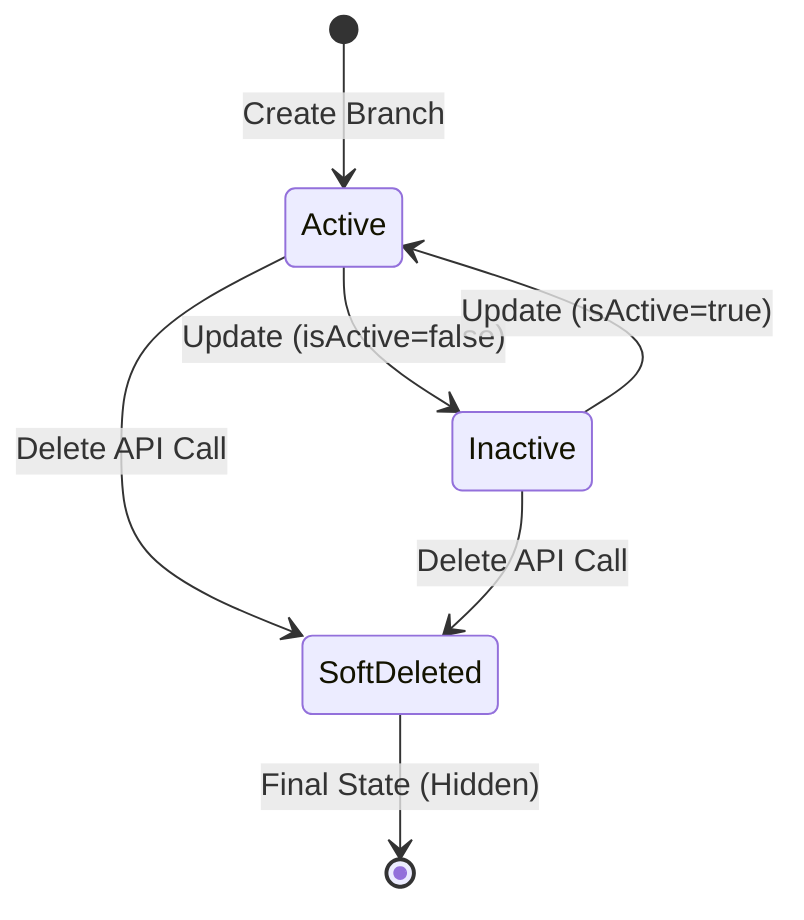

# Branch Module Domain Logic

## Service: `BranchService`

This service encapsulates the business rules for managing branches, ensuring data integrity across the organizational hierarchy.

### Branch Lifecycle State Machine

A Branch is more than just a database row; it has a lifecycle.



> **Diagram Explanation**: The Branch lifecycle manages operational availability. **Active** branches are visible for scheduling. **Inactive** status preserves historical data while preventing new operations. **SoftDeleted** ensures data integrity by hiding records without breaking foreign key relationships in historical shifts.


**Operational Note**: Switching a branch to `Inactive` does not cancel existing shifts, but it prevents the "Auto-Schedule" engine from assigning new staff to that location until it is reactivated.


*   **Active**: Fully operational. Shows up in dropdowns, can have shifts scheduled.
*   **Inactive**: Temporarily closed (e.g., Renovations, off-season). Cannot schedule new shifts, but historical data is visible.
*   **SoftDeleted**: Permanently closed. Hidden from UI. retained for DB referential integrity.

### Data Structures

#### 1. Branch Types (`BranchType` Enum)
We categorize branches to help with reporting and logic application.

| Type | Description |
| :--- | :--- |
| `HEADQUARTERS` | The main office. Usually implies Corporate staff. |
| `REGIONAL` | A regional hub overseeing multiple other branches. |
| `SATELLITE` | A small office attached to a larger one. |
| `WAREHOUSE` | Logistics only. Different overtime rules might apply here. |
| `RETAIL` | A standard shop or storefront. |
| `VIRTUAL` | **Crucial**: Used for remote employees who work from home. |

#### 2. Opening Hours (`JSONB`)
We store opening hours as a flexible JSON object to accommodate varied schedules.

**Schema Example:**
```json
{
  "mon": "08:00-17:00",
  "tue": "08:00-17:00",
  "wed": "08:00-13:00,14:00-17:00", 
  "thu": "08:00-17:00",
  "fri": "08:00-16:00",
  "sat": "closed",
  "sun": "closed"
}
```
*   **Note**: "Wed" shows a split shift (Lunch break closed).
*   **Validation**: Handled at the application layer to ensure format is `HH:mm-HH:mm`.

### Validators & Constraints

#### `CreateBranchRequest` validations
*   **Branch Code**: Must be **Unique** per Company.
    *   *Allowed*: Company A (`HQ-01`) and Company B (`HQ-01`).
    *   *Blocked*: Company A (`HQ-01`) and Company A (`HQ-01`).
*   **Coordinates**: `latitude` and `longitude` are optional but highly recommended for Geofencing features.

#### `Branch` Entity Fields

*   **Keys**:
    *   `id` (UUID, PK)
    *   `company_id` (FK): The tenant owner.
*   **Location**:
    *   `timezone`: Defaults to `Africa/Johannesburg`. This is **vital** for the Scheduling Engine.
    *   `country`: Defaults to `South Africa`.
