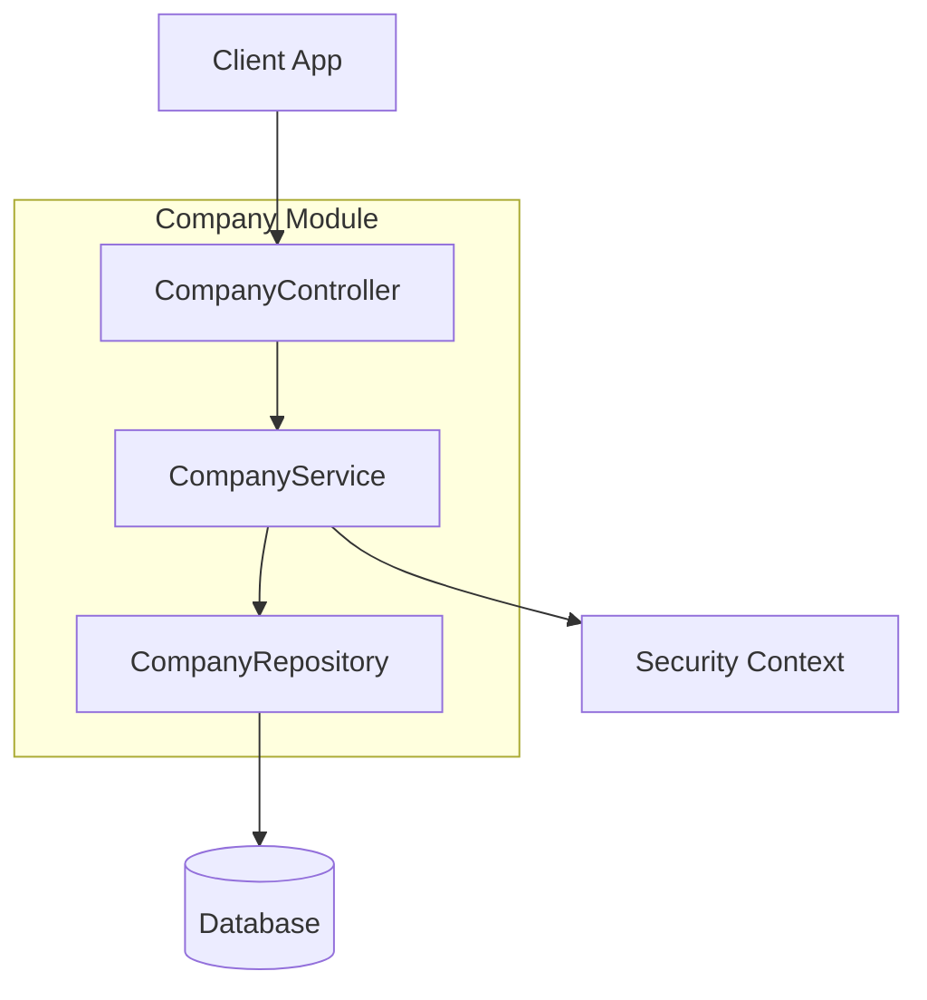

# Company Module

| Attribute     | Details                                       |
| :------------ | :-------------------------------------------- |
| **Namespace** | `com.horaion.app.modules.company`             |
| **Status**    | 🟢 Stable                                     |
| **Criticality** | Critical (Root of Multi-tenancy)             |
| **Dependencies** | None (Top-level entity)                      |

## Executive Summary

The **Company Module** is the foundation of Horaion's multi-tenant architecture. Every user, branch, shift, and schedule belongs to a **Company**. It manages the unique business entities that subscribe to our platform.


**Tip / Success:**
Think of the **Company** as the "Tenant" or the "Account Owner". It is the strict boundary for data isolation. User A from Company X should **never** see data from Company Y.



**Important / Warning:**
**Unique Identity**: Every company is uniquely identified by its **Registration Number** (e.g., CIPC Number, Tax ID). This prevents duplicate accounts for the same real-world business.


### Core Capabilities

1.  **Tenant Management**: Onboarding new companies and managing their profiles.
2.  **Onboarding Status**: Tracking whether a company has completed the initial setup (`hasCompletedOnboarding`).
3.  **Discovery**: Finding companies by name or registration number (for admin/support).

## Responsibilities

*   **Identity**: Maintaining the "Single Source of Truth" for business entities.
*   **Compliance**: Enforcing unique registration numbers.
*   **Lifecycle**: Managing the creation, update, and decommissioning of company accounts.

## Module Architecture

## Key Interactions

1.  **Security Module**:
    *   **Dependency**: Heavy integration with `SecurityContextService`.
    *   **Reason**: Every single meaningful operation in the system requires a `companyId`. This module provides the validity check for that ID.

2.  **All Other Modules**:
    *   **Relationship**: Parent.
    *   **Reason**: `Employee`, `Branch`, `Department` all have a `company_id` Foreign Key.

## Configuration

This module utilizes standard application configuration. See `04_CONFIG.md`.

## Events

*   **Emits**: None currently.
*   **Listens**: None.
