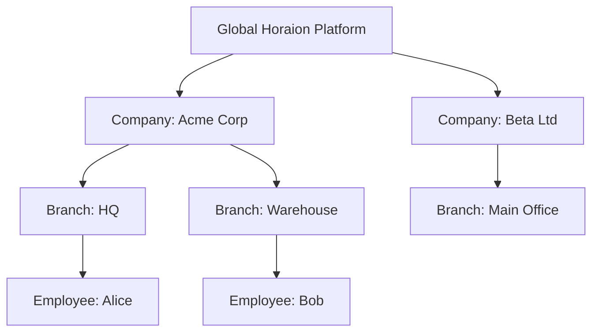
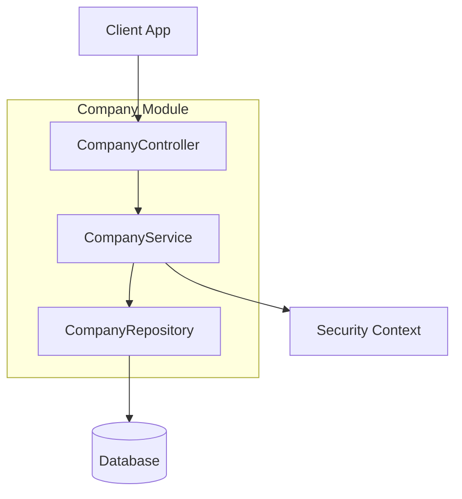

# Company Module

| Attribute     | Details                                       |
| :------------ | :-------------------------------------------- |
| **Namespace** | `com.horaion.app.modules.company`             |
| **Status**    | 🟢 Stable                                     |
| **Criticality** | Critical (Root of Multi-tenancy)             |
| **Dependencies** | None (Top-level entity)                      |

## Executive Summary

The **Company Module** is the foundation of Horaion's multi-tenant architecture. Every user, branch, shift, and schedule belongs to a **Company**. It manages the unique business entities that subscribe to our platform.


**Tip / Success:**
Think of the **Company** as the "Tenant" or the "Account Owner". It is the strict boundary for data isolation. User A from Company X should **never** see data from Company Y.



**Important / Warning:**
**Unique Identity**: Every company is uniquely identified by its **Registration Number** (e.g., CIPC Number, Tax ID). This prevents duplicate accounts for the same real-world business.


## Hierarchy & Relationships

The Company is the root node of the entire Horaion data structure.

## Core Capabilities

1.  **Tenant Management**:
    *   **Onboarding**: Managing the transition from a "New Sign-up" to a "Fully Configured" active tenant.
    *   **Lifecycle**: Creation, Suspension, and Deletion of company accounts.
2.  **Identity Verification**:
    *   Enforcing legal uniqueness via `registrationNumber`.
3.  **Discovery**:
    *   Providing admin-level search tools to find companies by name or ID.

## Responsibilities

*   **Single Source of Truth**: For the legal entity's profile.
*   **Data Isolation Root**: All other modules (Auth, Branch, Employee) reference `company_id` to enforce security barriers.
*   **Compliance**: Storing the legal registration number for audit trails.

## Module Architecture

