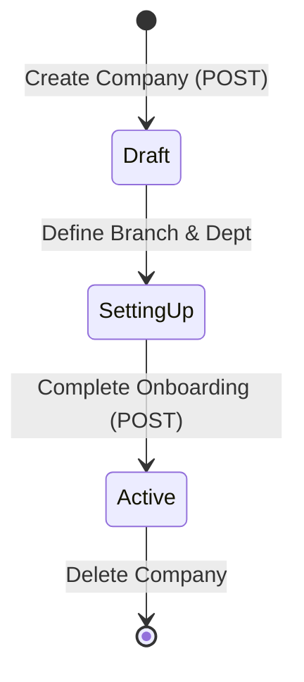

# Company Module Domain Logic

## Service: `CompanyService`

The guardian of tenant isolation and business identity.

### Onboarding Lifecycle

A Company goes through a distinct lifecycle from creation to active usage.



> **Diagram Explanation**: The Company Onboarding Lifecycle ensures that tenants are adequately configured before being allowed to use the core scheduling features. **Active** status is only granted once essential organizational data (Branches, Departments) is present.

1.  **Draft**: The company entity exists, but has no branches or employees (other than the creator).
2.  **SettingUp**: The user is currently in the wizard flow.
3.  **Active**: The `hasCompletedOnboarding` flag is `true`. The company is fully operational.

### Core Flows

#### 1. Duplicate Prevention (The "Business Key")
**Goal**: Ensure every company is a unique legal entity.

**Logic**:
*   The `registrationNumber` column has a database-level **Unique Constraint**.
*   The Service `create()` method also creates a "Java-level" check:
    ```java
    if (repository.existsByRegistrationNumber(req.number)) {
        throw new DuplicateRegistrationNumberException(req.number);
    }
    ```
    
    **Important / Warning:**
    **Race Conditions**: Even with the Java check, two concurrent requests could try to create the same company. The database constraint is the final safety net that will throw a `DataIntegrityViolationException`.
    

#### 2. Multi-Tenancy Enforcement
**Goal**: Users see *only* what they own.

**The "View" Logic**:
*   **System Admin**: Access Level = `GLOBAL`. Can query `findAll()`.
*   **Company Admin**: Access Level = `TENANT`.
    *   The Service intercepts the `findAll()` call.
    *   It extracts the `currentCompanyId` from the JWT.
    *   It ignores the user's request to "find all" and instead returns `findById(currentCompanyId)`.
    *   This ensures a leaked API call cannot expose competitor data.

### Entities

#### `Company` (Database Table: `companies`)

*   **Primary Key**: `id` (UUID).
*   **Business Key**: `registration_number` (String, Unique).

| Field | Type | Description |
| :--- | :--- | :--- |
| `name` | Varchar(255) | Display name (e.g., "Acme Inc"). |
| `registration_number` | Varchar(50) | **Unique**. Official Tax/CIPC ID. |
| `has_completed_onboarding` | Boolean | UI Flag. `false` = Show Wizard. |


**Success: Why UUIDs?**
We use UUIDs (GUIDs) instead of Auto-Increment Integers (`1, 2, 3`) to prevent "ID Enumeration Attacks". You cannot guess that "Company B" exists just because you are "Company A", ensuring a high baseline for tenant privacy.


**Note:**
The `companies` table is the root of the entire data hierarchy. Most other tables in the database (Branches, Employees, Departments) will have a `company_id` column that Foreign Keys back to this table.

