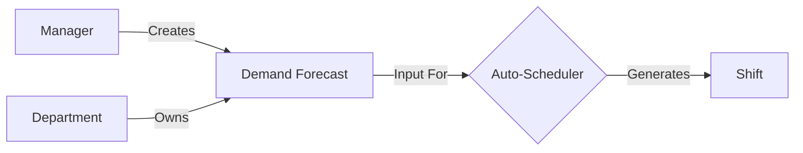
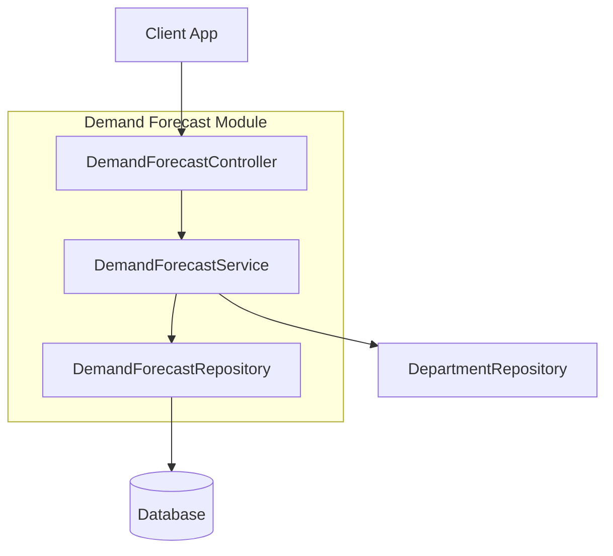

# Demand Forecast Module

| Attribute     | Details                                       |
| :------------ | :-------------------------------------------- |
| **Namespace** | `com.horaion.app.modules.demandforecast`      |
| **Status**    | 🟢 Stable                                     |
| **Criticality** | High (Core Scheduling Logic)                  |
| **Dependencies** | Department Module, Security Module            |

## Executive Summary

The **Demand Forecast Module** is the "Brain" of the scheduling operation. Before you can assign shifts to people, you must first define **what the business needs**.


**Tip / Success:**
**Analogy**: Think of a Demand Forecast as a **"Manpower Budget"**.
*   *Budget*: "We need $100 for snacks."
*   *Demand Forecast*: "We need 5 Cashiers at 09:00 AM."

The **Schedule Module** later reads this "Budget" and tries to "Spend" it by assigning actual employees to shifts.



**Note:**
**Time Granularity**: The system divides the 24-hour day into **48 chunks** of 30 minutes each. This allows for precise staffing levels that can fluctuate during lunch rushes or quiet periods.


## Hierarchy & Data Flow

The Demand Forecast sits right in the middle of the planning phase.

## Core Capabilities

1.  **Granular Staffing Requirements**:
    *   Defining exact headcount needs per **Role** (e.g., "2 Managers, 5 Cashiers") per **30-minute slot**.
2.  **Sparse Storage Optimization**:
    *   Efficiently storing data. If a store is closed from 00:00 to 06:00, we store **nothing** for those slots, keeping the database light.
3.  **Source Tracking**:
    *   Knowing *who* or *what* created the plan. Was it a Manager manually typing numbers? Or was it the `AI-Prediction-Engine-v2`?

## Responsibilities

*   **Validation**: Ensuring forecasts don't contain overlapping or nonsensical time data (e.g., Index 48).
*   **Version History**: Keeping superseded forecasts (via Soft Delete) to train future AI models.
*   **Aggregation**: Providing summaries like "Total labor hours required for this week".

## Module Architecture

