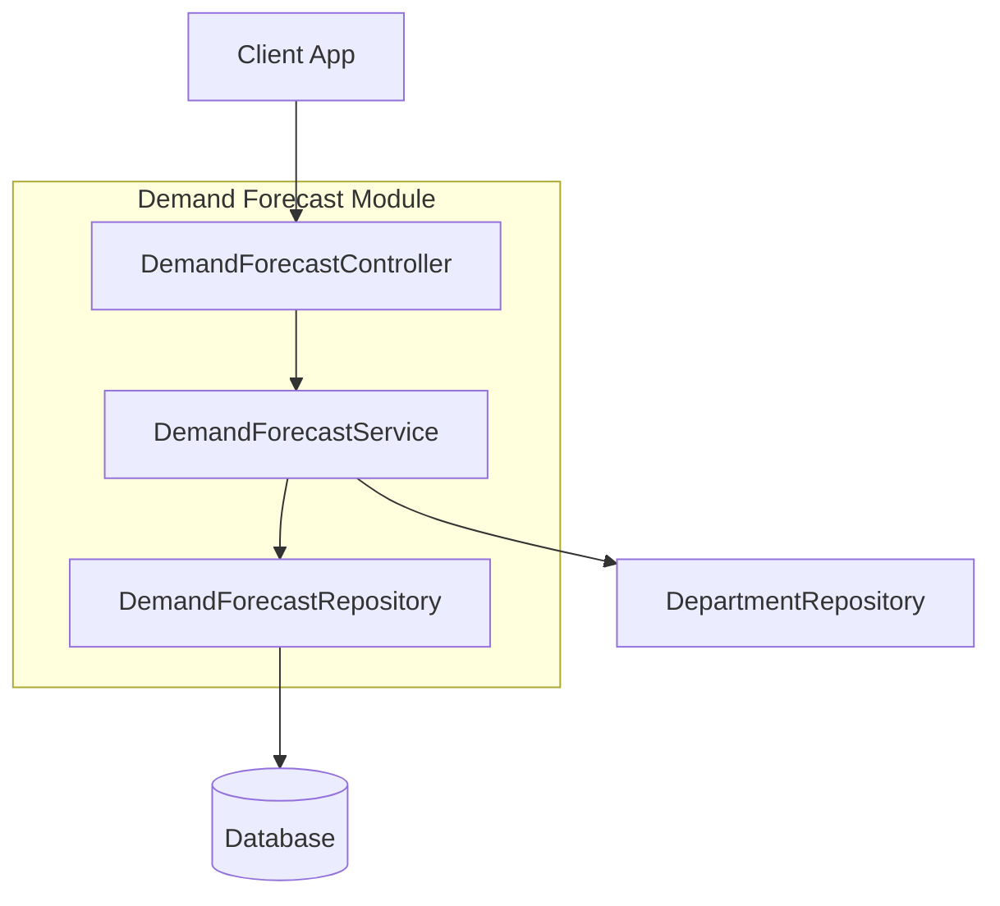

# Demand Forecast Module

| Attribute     | Details                                       |
| :------------ | :-------------------------------------------- |
| **Namespace** | `com.horaion.app.modules.demandforecast`      |
| **Status**    | 🟢 Stable                                     |
| **Criticality** | High (Core Scheduling Logic)                  |
| **Dependencies** | Department Module, Security Module            |

## Executive Summary

The **Demand Forecast Module** is the brain of the scheduling system. It defines **how many employees** are needed at **what times** for a specific **department**.


**Tip / Success:**
Think of a Demand Forecast as a "Manpower Budget". If the forecast says we need 5 Cashiers at 09:00, the Schedule Module will later try to fill those 5 slots with actual people.



**Note:**
**Time Granularity**: We divide the day into **48 chunks** of 30 minutes each.
*   Index `0` = 00:00 - 00:30
*   Index `47` = 23:30 - 00:00


### Core Capabilities

1.  **Staffing Requirements**: Storing the exact number of staff needed per Role per 30-min slot.
2.  **Sparse Storage**: Efficiently saving data only for time slots that have demand.
3.  **Source Tracking**: Tracking whether the forecast came from an AI prediction, a Manager's manual input, or an imported template.

## Responsibilities

*   **Planning**: Providing the target baseline for the Scheduler.
*   **Validation**: Ensuring we don't plan for more than 24 hours in a single day object.
*   **History**: Keeping records of past staffing needs for future AI training.

## Module Architecture

## Key Interactions

1.  **Department Module**:
    *   **Dependency**: Strongly dependent (`department_id`).
    *   **Reason**: You cannot forecast demand for "nothing". It must be for a specific physical or logical department.

2.  **Scheduling Module** (Downstream):
    *   **Consumer**: The Schedule module reads this data to generate shifts.

## Configuration

This module utilizes standard application configuration. See `04_CONFIG.md`.

## Events

*   **Emits**: None currently.
*   **Listens**: None.
