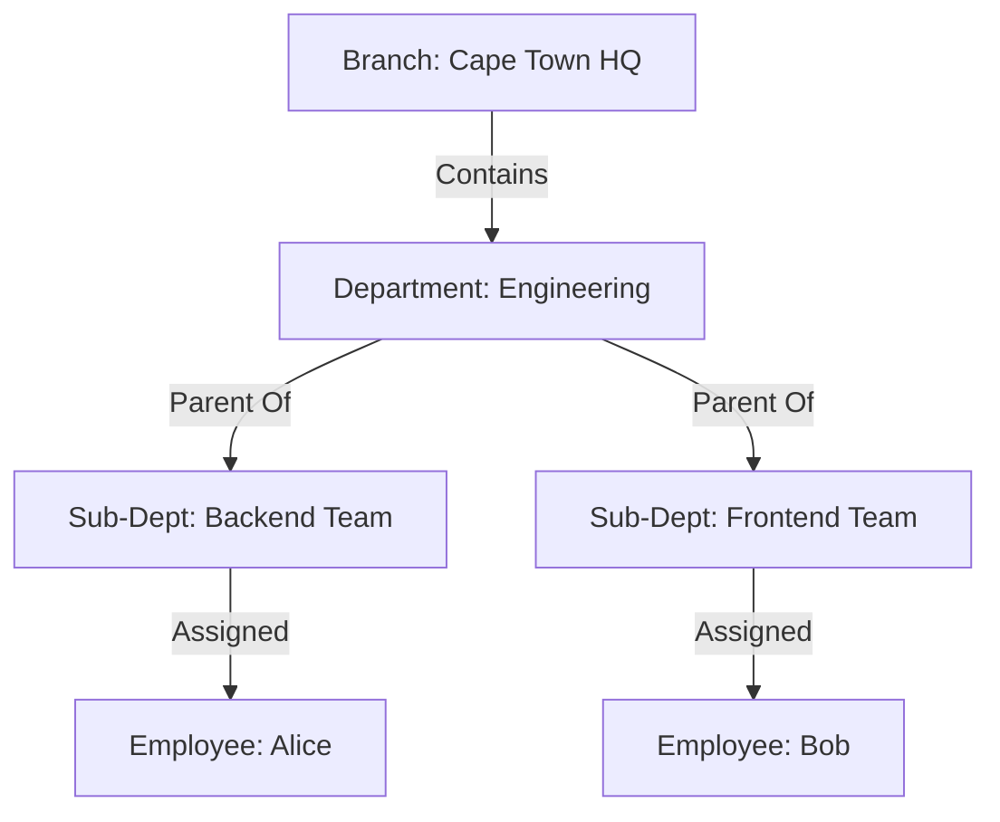
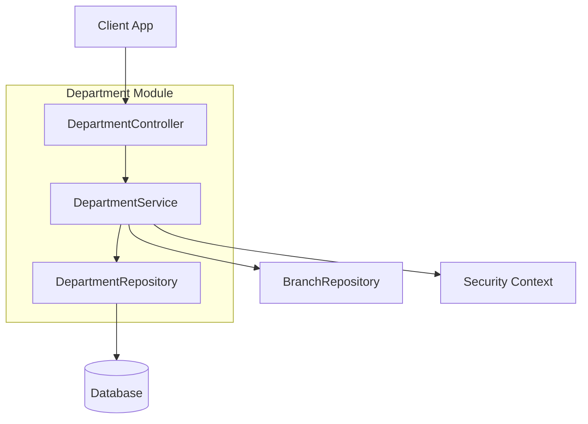

# Department Module

| Attribute     | Details                                       |
| :------------ | :-------------------------------------------- |
| **Namespace** | `com.horaion.app.modules.department`          |
| **Status**    | 🟢 Stable                                     |
| **Criticality** | Medium (Organizational Structure)             |
| **Dependencies** | Branch Module, Employee Module                |

## Executive Summary

The **Department Module** allows companies to organize their workforce into functional units. Unlike a **Branch** (which is a physical location), a **Department** is a logical team (e.g., "Sales", "IT", "Bakery").


**Tip / Success:**
**Hierarchy**: Departments can be nested! You can have a "Sales" department that contains "Direct Sales" and "Online Sales" sub-departments. This allows for complex organizational modeling.



**Note:**
**Context**: A department *must* belong to a specific Branch. A "Sales" department in the Cape Town branch is distinct from the "Sales" department in the Durban branch.


## Hierarchy & Relationships

The Department sits below the Branch in the organizational tree.

## Core Capabilities

1.  **Organizational Modeling**:
    *   Defining the functional structure of a location.
    *   Supporting nested (Parent/Child) relationships.
2.  **Leadership Management**:
    *   Assigning a **Head of Department (HOD)**.
    *   *Side Effect*: assigning an HOD automatically grants them elevated system privileges (Cognito Group update).
3.  **Financial Metadata**:
    *   Tracking `Cost Center` codes and `Budget` allocations for reporting.

## Responsibilities

*   **Validation**: Ensuring Department Codes are unique within a Branch.
*   **Access Control**: Linking Employees to Departments determines what data they can see (e.g., a Manager sees shifts for their own department).

## Module Architecture

