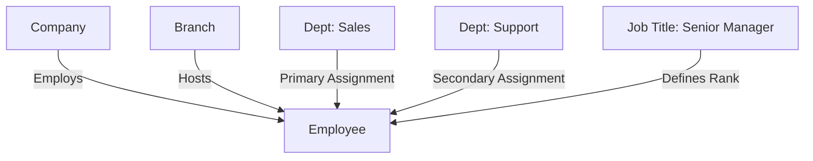
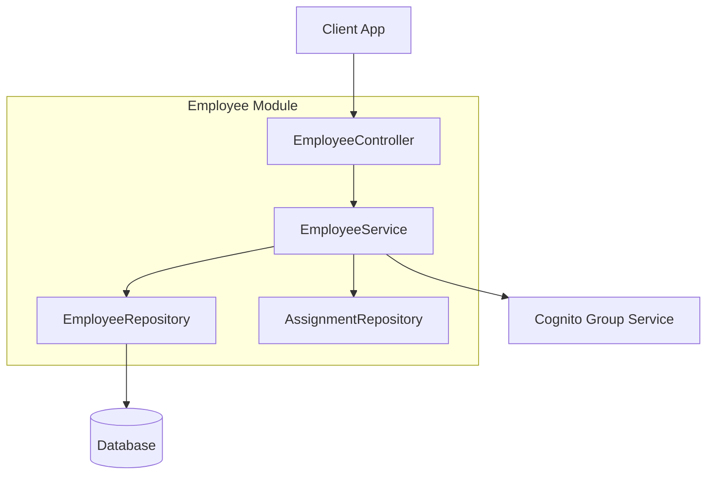

# Employee Module

| Attribute     | Details                                       |
| :------------ | :-------------------------------------------- |
| **Namespace** | `com.horaion.app.modules.employee`            |
| **Status**    | 🟢 Stable                                     |
| **Criticality** | Critical (Identity & Access Link)             |
| **Dependencies** | Auth Module, Department Module, Job Title Module |

## Overview

The **Employee Module** maintains the digital record of every staff member. While the **Auth Module** handles *login credentials* (email/password), the **Employee Module** handles *business context* (Did they sign a contract? Are they currently deployed to the Sales department?).


**Tip / Success:**
**The "Person" vs "User" Distinction**:
*   **Auth User (Cognito)**: "I am `john@domain.com` and I have a valid password."
*   **Employee Record**: "I am John Doe, hired on 2024-01-01, earning a salary, and reporting to Alice."
The `cognito_sub` field in the Employee table links these two worlds together.


## Hierarchy & Relationships

The Employee is the leaf node of the organizational tree but the central node of the operational graph.

> **Diagram Explanation**: This relationship graph places the **Employee** at the center of the ecosystem. They are "owned" by a Company (tenant), "located" at a specific Branch, and "assigned" to one or more Departments. Their rank and permissions are derived from their **Job Title**.

### Core Capabilities

1.  **Profile Management**: Storing PII (Name, Email, Phone, DOB) and business data (Hire Date, Code).
2.  **Flexible Department Assignments**:
    *   Employees can belong to **multiple departments** simultaneously (e.g., a "Float" staff member who works in both `Bakery` and `Deli`).
    *   One assignment is always flagged as **Primary**.
3.  **Role & Title Management**:
    *   Linking an employee to a `Job Title` automatically grants them the corresponding system permissions (Cognito Groups).

## Responsibilities

*   **Identity Mapping**: Mapping a Cognito User ID (`sub`) to a specific Company and Branch context.
*   **Search**: Providing high-performance lookups by Name, Code, or Branch.
*   **Lifecycle**: Managing the "Hire to Retire" flow (Active -> Terminated).

## Module Architecture

> **Diagram Explanation**: This module structure follows the standard Horaion pattern. The **EmployeeController** exposes the API, which delegates to the **EmployeeService**. The service interacts with both the local **EmployeeRepository** (database) and the external **CognitoService** (AWS integration) to ensure data synchronization.


**Important:** The `Employee` record is the "Source of Truth" for business data, but the `Auth` system (AWS Cognito) remains the "Source of Truth" for authentication credentials. Never store passwords or raw Cognito identities in the local database.

