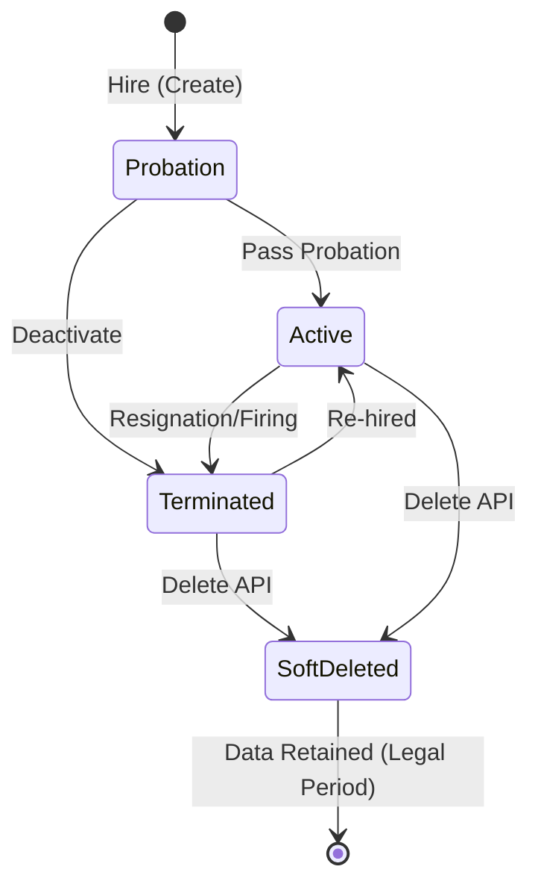
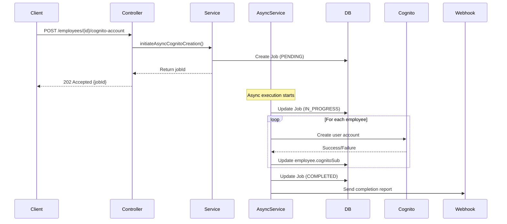

# Employee Module Domain Logic

## Service: `EmployeeService`

The central hub for workforce management.

### Multi-Department Assignment Logic

Startups often have "Generalists" who wear multiple hats. Our system models this via the `EmployeeDepartmentAssignment` entity.

*   **One Primary**: Every employee has exactly one "Home Base" (Primary Department). This is used for payroll cost center allocation.
*   **Many Secondaries**: An employee can "float" into other departments (e.g., a Cashier who also helps stock shelves in Inventory).

**Code Insight**:
```java
// Logic inside assignToDepartment()
if (request.isPrimary()) {
    // Find current primary and downgrade it
    currentPrimary.setPrimary(false);
    save(currentPrimary);
}
// Create new assignment as Primary
newAssignment.setPrimary(true);
save(newAssignment);
```

### Automated Code Generation

When an employee is created, we generate a human-readable ID.
Format: `EMP-{RANDOM_HEX}` (e.g., `EMP-A1B2C3D4`).
*   **Why?**: UUIDs (`a0eebc99...`) are impossible for humans to type or remember. The `code` field gives HR a handle to search for.

### Security Integration (Job Titles)

The `assignJobTitle` method is not just a database update; it is a security provisioner.

1.  **Update DB**: Links the `JobTitle` entity to the `Employee`.
2.  **Update Cognito**:
    *   Finds coverage of the Job Title (e.g., "Store Manager").
    *   Calls `cognitoGroupService.addUserToGroup(...)`.
    *   Grants the actual IAM/JWT permissions needed to perform that job.

### Entities

#### `Employee` (Database Table: `employees`)

*   **Keys**:
    *   `id` (UUID, PK)
    *   `cognito_sub` (String, Unique): Link to Auth system.
    *   `company_id`, `branch_id`: Multi-tenancy scopes.
*   **Indexes**:
    *   `idx_employees_name`: (`last_name`, `first_name`) for fast autocomplete.
    *   `idx_employees_hire_date`: For "Anniversary" or "Probation" reports.
*   **Fields**:
    *   `employment_type`: `FULL_TIME`, `PART_TIME`, `CASUAL`, `CONTRACTOR`.
    *   `profile_picture_url`: pointer to S3 bucket.


**Important / Warning:**
**Privacy**: This table contains **PII** (Personally Identifiable Information) like Email, Phone, and DOB. Access to this entity is strictly audited and restricted via `PermitCheck`.


### Employee Lifecycle

An employee's status changes over time, affecting their access and payroll.



> **Diagram Explanation**: The employee lifecycle governs access and reporting. An employee starts in **Probation** and transitions to **Active**. If they leave, they move to **Terminated**, which revokes their application access. **SoftDeleted** is a terminal state where the record remains in the database for legal/audit purposes but is hidden from all standard views.


**Note:** Transitioning to `Terminated` status automatically invalidates any existing active sessions but does not delete the user from AWS Cognito (preserving the history for possible re-hiring).


---

## Cognito Account Creation Workflow

### Async Job Processing Strategy

When creating multiple employees via import (or even singly), we do not block the HTTP request. Instead, we use a **Job-Based Async Pattern**.

> [!TIP]
> This pattern ensures that if you upload 500 employees, the browser doesn't time out while waiting for AWS Cognito to respond 500 times.

#### Workflow Diagram



> **Diagram Explanation**: This sequence illustrates the **Async Job Pattern**. The client receives an immediate `202 Accepted` response with a `jobId`. A background service then iterates through the employee list, creating accounts in Cognito one by one, and finally reports completion via a webhook.

### Technical Implementation

*   **Thread Pool**: Uses `generalTaskExecutor` (See [Async Config](../../16_SHARED_KERNEL/02_CORE/01_CONFIGURATIONS.md)).
*   **Job Entity**: `CognitoCreationJob` tracks `successful_creations`, `failed_creations`, and status.
*   **Webhooks**: External systems can listen for the job completion event.
