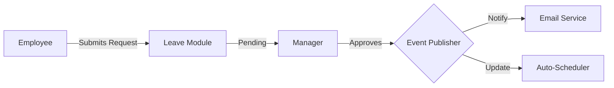
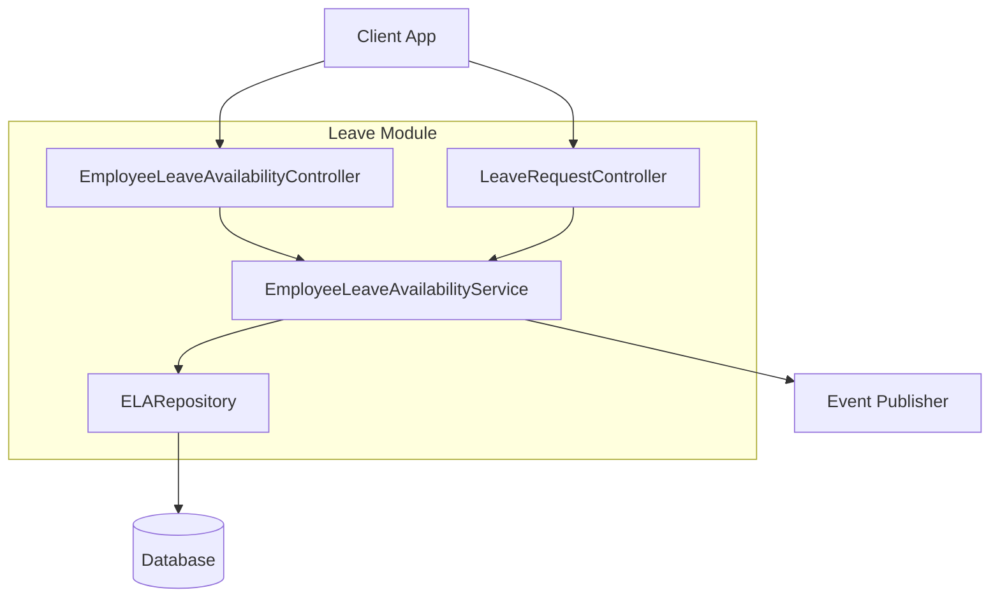

# Leave & Availability Module

| Attribute     | Details                                       |
| :------------ | :-------------------------------------------- |
| **Namespace** | `com.horaion.app.modules.employeeleaveavailability` |
| **Status**    | 🟢 Stable                                     |
| **Criticality** | High (Impacts Schedule Generation)            |
| **Dependencies** | Employee Module, Department Module            |

## Executive Summary

This module is the "Constraint Engine" for the Scheduler. It defines **when an employee can work** and **when they cannot**.


**Tip / Success:**
**Unified Model**: Unlike many systems that separate "Availabilities" and "Leave Requests" into different tables, Horaion uses a **Unified Entity** model (`EmployeeLeaveAvailability`).
*   **Leave**: "I *cannot* work on Tuesday."
*   **Availability**: "I *can* work on Tuesday."
This simplifies the querying logic for the scheduling engine: it just asks "What are the time constraints for John?"


## Hierarchy & Data Flow

The flow moves from Employee -> Approval -> Scheduler.

## Core Capabilities

1.  **Leave Management**:
    *   Annual Leave, Sick Leave, Unpaid Leave.
    *   Supports full days (`StartDate` to `EndDate`) or partial days (`StartTime` to `EndTime`).
2.  **Availability Preferences**:
    *   Employees can indicate preferred working hours (e.g., "Students available only after 17:00").
3.  **Approval Workflow**:
    *   **Auto-Approve**: Requests by Admins or "On Behalf" submissions are instantly approved.
    *   **Manual Approval**: Standard requests enter a `PENDING` state waiting for a Manager.

## Responsibilities

*   **Conflict Detection**: Preventing duplicate requests for the same date range.
*   **Precedence Logic**: Handling complex scenarios where a "Manager Override" request supersedes a standard employee request.
*   **Audit Trail**: Tracking *who* approved the request and *when*.

## Module Architecture

