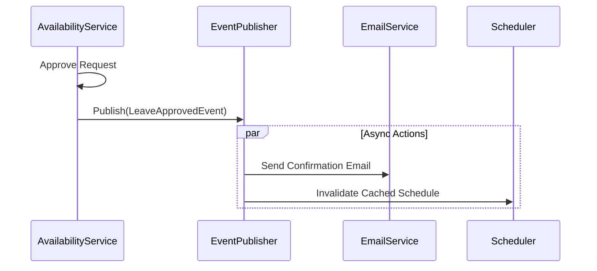
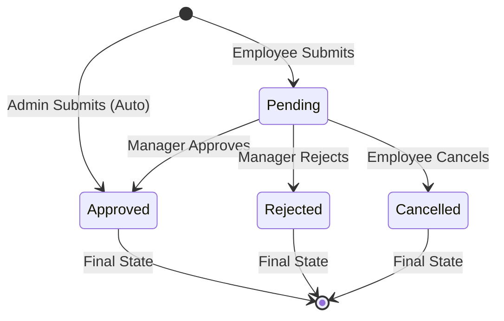

# Leave & Availability Domain Logic

## Service: `EmployeeLeaveAvailabilityService`

This service acts as the gatekeeper for employee time.

### The Unified "Constraint" Model

We treat both **Absence** (Leave) and **Presence** (Availability) as "Constraints" on the schedule.

1.  **Hard Constraint (Leave)**: "The employee is definitely NOT here."
2.  **Soft Constraint (Availability Preference)**: "The employee PREFERS to be here (or not)."

This unification allows the `Auto-Scheduler` to fetch a single list of `TimeConstraints` rather than querying five different tables.

### Approval Logic & Precedence

Not all requests are created equal. The system uses a `requesterPrecedence` integer to decide who wins.

*   **Logic**:
    *   If `User A` submits a request, it has `Precedence: 1`.
    *   If `Admin B` submits a request "On Behalf Of" User A, it has `Precedence: 10`.
*   **Use Case**:
    *   An employee requests Annual Leave (Pending).
    *   A Manager creates a "Mandatory Training" block for the same day (Auto-Approved).
    *   The "Mandatory Training" (High Precedence) effectively overrides or conflicts with the leave request depending on business rules.

### Auto-Approval Logic

The system automatically approves requests based on the `SubmissionType`:

| Submission Type | Status | Use Case |
| :--- | :--- | :--- |
| `SELF_SERVICE` | `PENDING` | Employee applying via Mobile App. Needs Manager review. |
| `ON_BEHALF` | `APPROVED` | HR or Manager logging leave *for* the employee. Assumed pre-approved. |


**Note:** `ON_BEHALF` requires elevated permissions (System Owner or Department Lead).


### Event-Driven Architecture

This module is a "Producer" in event-driven design. It does not send emails directly; it **publishes facts**.



> **Diagram Explanation**: This sequence demonstrates the **Event-Driven Pattern**. When a leave request is approved, the service does *not* wait for emails to send. Instead, it publishes a `LeaveApprovedEvent`. Async listeners then pick this up to handle notifications and cache invalidation in parallel, ensuring the API remains fast and responsive.

### Entities

#### `EmployeeLeaveAvailability`

*   **Keys**:
    *   `id` (UUID, PK)
    *   `employee_id` (FK): Subject of the request.
    *   `approved_by` (FK): Audit trail of the manager.
*   **Fields**:
    *   `request_type`: Enum (`ANNUAL_LEAVE`, `SICK_LEAVE`, `AVAILABILITY`).
    *   `status`: Enum (`PENDING`, `APPROVED`, `REJECTED`, `CANCELLED`).
    *   `start_date` / `end_date`: **Inclusive** range.
    *   `notes`: User-provided context ("Going to dentist").


**Important / Warning:**
**Date Validation**: The system explicitly forbids `end_date < start_date`. However, `start_time` and `end_time` are nullable (implying "All Day").


### Request Lifecycle

The lifecycle of a generic request involves the Employee (Applicant) and the Manager (Approver).



> **Diagram Explanation**: The Request Lifecycle is designed to be fail-safe. The **Pending** state acts as a lock, preventing employees from spamming multiple requests for the same dates. **Approved** is the only state that propagates to the Scheduler, while **Rejected** and **Cancelled** serve as historical records.

1.  **Pending**: Waiting for action. Blocks the employee from submitting overlapping requests.
2.  **Approved**: Confirmed. This is the only state that the **Scheduler** cares about.
3.  **Rejected**: Denied. The constraints are ignored by the Scheduler.

### Frontend Integration Guide

To ensure consistent UI across Mobile, Web, and Email, use these standard mappings.

#### TypeScript Enums & Helpers

```typescript
export enum RequestStatus {
  PENDING = 'PENDING',
  APPROVED = 'APPROVED',
  REJECTED = 'REJECTED',
  CANCELLED = 'CANCELLED'
}

export const StatusConfig: Record<RequestStatus, { label: string; color: string }> = {
  [RequestStatus.PENDING]:   { label: 'Pending Review', color: 'orange' },
  [RequestStatus.APPROVED]:  { label: 'Approved',       color: 'green' },
  [RequestStatus.REJECTED]:  { label: 'Declined',       color: 'red' },
  [RequestStatus.CANCELLED]: { label: 'Cancelled',      color: 'grey' }
};

/**
 * Returns a user-friendly label for the Leave Type.
 * e.g., "ANNUAL_LEAVE" -> "Annual Leave 🌴"
 */
export function getLeaveTypeLabel(type: string): string {
  const labels: Record<string, string> = {
    ANNUAL_LEAVE: 'Annual Leave 🌴',
    SICK_LEAVE: 'Sick Leave 🤒',
    UNPAID_LEAVE: 'Unpaid Leave 💸',
    AVAILABILITY: 'Availability Preference 🕒'
  };
  return labels[type] || type;
}
```
