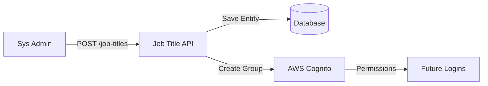

# Job Title Module

| Attribute     | Details                                       |
| :------------ | :-------------------------------------------- |
| **Namespace** | `com.horaion.app.modules.jobtitle`            |
| **Status**    | 🟢 Stable                                     |
| **Criticality** | **Critical (Security Infrastructure)**        |
| **Dependencies** | Company Module, Auth Module (Cognito)         |

## Executive Summary

The **Job Title Module** is more than just a list of labels like "Manager" or "Cashier". It is the **Bridge to Security**. 

When a Job Title is created in Horaion, it **mechanically provisions** the corresponding infrastructure in the Identity Provider (AWS Cognito).


**Critical:**
**Infrastructure as Code**: Creating a Job Title acts as a provisioning command. It creates a **User Group** in Cognito. This means Job Titles are structurally significant and cannot be treated as simple text fields.


## Core Capabilities

1.  **Role Provisioning**: Automatically creating Cognito Groups.
2.  **Standardization**: Ensuring all "Senior Cashiers" across 50 branches have the exact same permissions.

## Hierarchy & Data Flow

## Module Architecture

The module is intentionally simple but rigid.

*   **Immutable Design**: Currently, Job Titles are **Create-Read Only**.
*   **Rationale**: Renaming a Job Title (e.g., "Manager" -> "Lead") would require complex migration of Cognito Groups and re-issuing of tokens for all logged-in users. To maintain stability, modifications are restricted.
