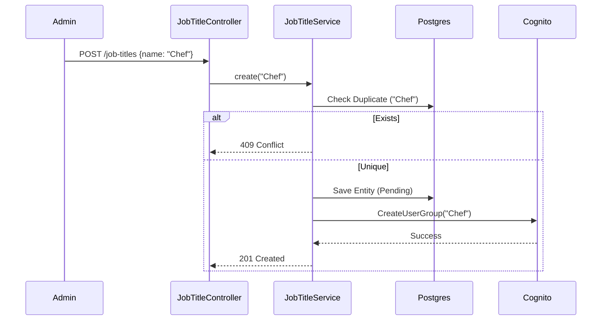

# Job Title Domain Logic

## Service: `JobTitleService`

This service coordinates the database state with the external Identity Provider state.

### The "Role = Group" Equivalence

In many systems, "Job Title" is just a label, and "Permissions" is a separate setting. In Horaion, we couple them to ensure **Least Privilege Access**.

*   **Scenario**:
    1.  Admin creates Job Title: `Bakery Lead`.
    2.  System creates Cognito Group: `Bakery Lead`.
    3.  Admin assigns Permissions to Cognito Group: `[menu:update, shift:approve]`.
    4.  HR hires Alice as `Bakery Lead`.
    5.  Alice logs in -> Cognito sees her group -> Alice gets `menu:update` permission.

This chain ensures that HR does not need to understand "Permissions". They just hire a "Bakery Lead", and the system does the rest.

### Immutable Architecture

The service exposes `create`, `get`, and `getAll`.

**Why no Update?**
Changing a Job Title name (e.g., from `Manager` to `Store Lead`) causes a **Distributed Consistency Problem**:
1.  **Database**: Easy to update string.
2.  **Cognito**: Group names are often immutable IDs. Even if changeable, it disrupts current sessions.
3.  **Active Tokens**: Users with a JWT token containing `groups: ["Manager"]` would instantly lose access if the group became `Store Lead`.

To avoid this "Fragile State", the system currently enforces an append-only model for Job Titles via the API.

### Provisioning Workflow

The creation process is a distributed transaction across Database and Cognito.



### Frontend Integration Guide

Job Titles are primarily used in **Dropdowns** during Employee Onboarding.

#### Data Structure for Dropdowns

When fetching `GET /job-titles`, expect a list optimized for selection:

```typescript
interface JobTitleOption {
  id: string;          // UUID
  name: string;        // Display Label
  description: string; // Tooltip text
  isActive: boolean;
}

// React Component Example
const RoleSelect = ({ roles }) => (
  <select>
    {roles.map(role => (
      <option key={role.id} value={role.id} title={role.description}>
        {role.name}
      </option>
    ))}
  </select>
);
```

### Entities

#### `JobTitle`

*   **Keys**:
    *   `id` (UUID, PK)
    *   `company_id` (FK): Tenant owner.
*   **Fields**:
    *   `name`: **Unique** per company. Used as the Cognito Group Name.
    *   `description`: Descriptive text.


**Note:**
**Soft Deletes**: The entity supports `softDelete` and `isActive` fields, but they are currently internal-only and not exposed via the standard API controller.

