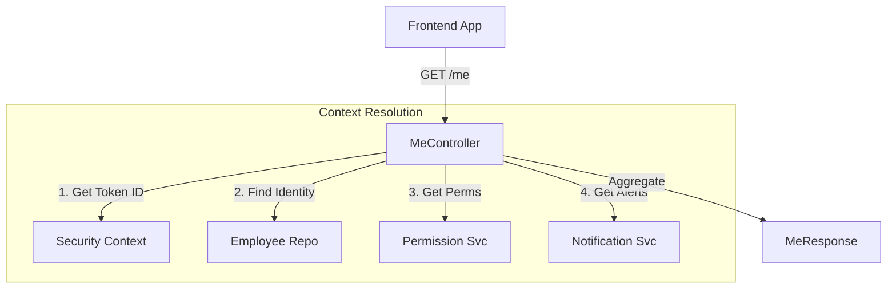

# Me Module

| Attribute     | Details                                       |
| :------------ | :-------------------------------------------- |
| **Namespace** | `com.horaion.app.modules.me`                  |
| **Status**    | 🟢 Stable                                     |
| **Criticality** | **High** (Primary Context for Frontend)       |
| **Dependencies** | Auth, Employee, Department, Notification      |

## Executive Summary

The **Me Module** is the "Personal Context" layer of the application.

Instead of asking "Get details for Employee #123", the frontend simply asks "Who am I?". The Me Module interprets the authentication token, identifies the user, and returns their specific context (Profile, Permissions, Notifications, Assignments).


**Tip / Success:**
**BFF Pattern**: This module acts as a "Backend for Frontend" aggregator. It stitches together data from 4-5 different services into a single, cohesive response optimized for the initial app load.


## Core Capabilities

1.  **Identity Resolution**: Securely mapping `Cognito SUB` -> `Employee ID`.
2.  **Context Aggregation**: Fetching Primary Department, Active Role, and Permissions in one go.
3.  **Self-Service**: Allow users to view their own Leave Requests and Notifications.

## Hierarchy & Data Flow

## Security Design

The primary goal of this module is to prevent **Insecure Direct Object References (IDOR)**.
*   **Bad**: `GET /employees/123` (Attacker could change 123 to 124).
*   **Good**: `GET /me` (Server derives ID from the signed, tamper-proof JWT).
