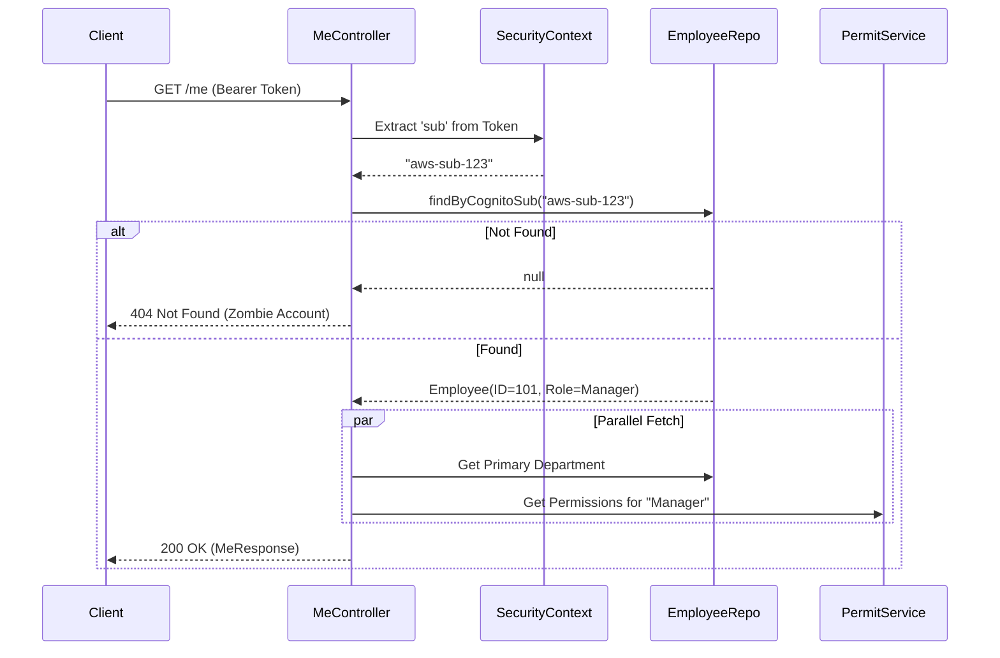

# Me Domain Logic

## Service: `MeService`

This service is unique because it doesn't "own" data. It borrows it.

### Identity Resolution Flow

The core logic is the translation of a technical ID (Cognito SUB) into a business entity (Employee).

1.  **Extract Token**: Intercept the `Authorization: Bearer <token>` header.
2.  **Decode SUB**: Extract the `sub` claim (Subject) from the JWT.
3.  **Lookup**: Query `employees` table where `cognito_sub = ?`.
    *   *Error Handling*: If no employee matches (e.g., account disabled or fresh signup), invoke `EmployeeNotFoundException`.

#### Identity Resolution Sequence



### Context Aggregation

### Context Aggregation

The `MeResponse` is a composite object designed to answer three questions for the frontend:

1.  **Who am I?** (Basic Profile data).
2.  **Where do I fit?** (Primary Department ID).
3.  **What can I do?** (Permissions Map).

#### Permissions Map (`Permit`)
The service asks the `PermitAuthorizationService` to resolve the granular actions allowed.
*   **Input**: `Cognito Group` ("Manager").
*   **Output**: `Map<Resource, List<Action>>`.
    *   e.g., `schedule: [read, update, approve]`.

### Notifications Integration

The module delegates to `UserNotificationService`.

*   **Targeting**: Notifications are targeted to `UserId` OR `UserRole`.
*   **Logic**: `WHERE (user_id = :me) OR (target_group = :myGroup)`.

---

### Entities

The Me Module does not own any database tables. It reads from:
*   `employees` (Profile)
*   `employee_department_assignments` (Context)
*   `user_notifications` (Alerts)

*   `user_notifications` (Alerts)

### Frontend Integration Guide

The `MeResponse` is the seed for the entire frontend session.

#### React Context / Redux Store Structure

We recommend initializing your global user state immediately upon app launch.

```typescript
// types/UserContext.ts
export interface UserContextState {
  isAuthenticated: boolean;
  profile: MeResponse | null;
  permissions: Record<Resource, Action[]>;
  isLoading: boolean;
}

// Hooks Example
export const usePermission = (resource: string, action: string) => {
  const { permissions } = useUserContext();
  return permissions[resource]?.includes(action) ?? false;
};

// Usage
// if (!usePermission('schedule', 'approve')) return null;
```


**Critical:**
**Performance**: Because `GET /me` hits 4+ tables and is called on every app launch, it must be highly optimized. N+1 queries here will degrade the entire user perceived latency.

