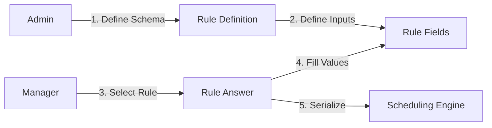
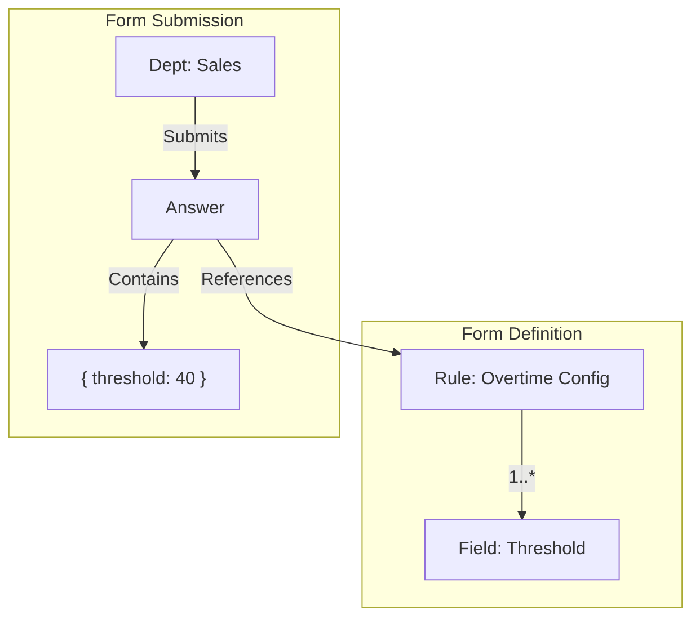

# Rule Module

| Attribute     | Details                                       |
| :------------ | :-------------------------------------------- |
| **Namespace** | `com.horaion.app.modules.rule`                |
| **Status**    | 🟢 Stable                                     |
| **Criticality** | **High** (Defines Legal/Business Constraints) |
| **Dependencies** | Department, Schedule                          |

## Executive Summary

The **Rule Module** is a **Dynamic Configuration Engine**.

Unlike traditional hardcoded parameters, this module allows System Administrators to dynamically define new business constraints (e.g., "Max Hours", "Min Rest Period") and their required parameters (schemas). Users then "Answer" these rules to configure them for their specific department.

### Core Capabilities

1.  **Meta-Definition**: Define rules and their input fields (Text, Number, Select) dynamically.
2.  **Contextual Configuration**: Different departments can have different values for the same rule (e.g., Store A: Max 40h, Store B: Max 45h).
3.  **Solver Integration**: Provides the "Constraints" payload to the Scheduling Engine.

## Hierarchy & Data Flow

It follows a **Class-Instance** pattern.

> **Diagram Explanation**: This flow demonstrates the **Dynamic Configuration Lifecycle**. Instead of hardcoding rules, the Admin defines the *structure* (Schema). The Manager then fills in the *values* (Answer). Finally, the System serializes these answers into a payload that the **Scheduling Engine** can understand to apply constraints.

## Module Architecture

### The "Form Builder" Pattern
The module stores the *structure* of a form in the database.
*   **Rule**: The form container (e.g., "Weekly Overtime").
*   **RuleField**: The inputs (e.g., "Threshold Hours", "Multiplier").
*   **RuleAnswer**: The submitted data (e.g., `{ "threshold": 40, "multiplier": 1.5 }`).

> **Diagram Explanation**: This pattern mirrors a Dynamic Form Builder. The **Rule** acts as the blueprint (Class), defining what fields exist. The **Answer** acts as the submission (Instance), containing the actual data for a specific Department.
