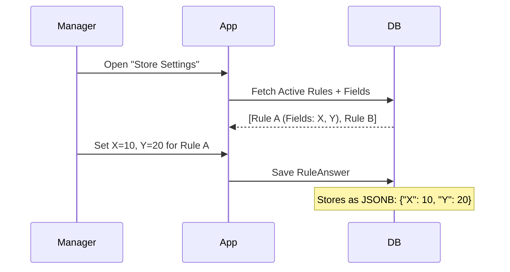

# Rule Domain Logic

## Service: `RuleService`

This service manages the lifecycle of the Rule Definitions.

### Dynamic Schema Logic

The core power of this module is `RuleField`. It turns the database into a NoSQL-like store for configurations.

1.  **Field Types**:
    *   `TEXT`, `NUMBER`, `BOOLEAN`, `SELECT`, `MULTI_SELECT`.
2.  **UI Config**:
    *   Stored as `jsonb`.
    *   Contains rendering hints like `{ "placeholder": "Enter value", "step": 0.5 }`.
    *   Frontend creates inputs based on this config.

### Configuration (`RuleAnswer`)

The `RuleAnswer` entity stores the actual values in a `jsonb` column called `field_values`.

*   **Configuration Storage**: The `field_values` are stored as a flexible JSONB map.
    *   *Advantage*: We can add new parameters (e.g., "Exclude Sundays") to a Rule Definition without running database migrations.
    *   *Trade-off*: The database does not enforce types (e.g., ensuring "max_hours" is a number).

### Validation Responsibility

Because the database storage is schema-less (`jsonb`), validation is shared:

1.  **Frontend (Primary)**: Must enforce the schema defined in `RuleField`.
    *   If `isRequired=true`, the UI must block submission.
    *   If `type=NUMBER`, the UI must parse the string input to an Integer/Float before sending.
2.  **Backend (Secondary)**: The API validates that the `ruleId` exists, but currently trusts the payload structure of `field_values`.

### Rule Scope & Inheritance

Rules are typically defined hierarchically:

1.  **Company Level**: "Global Rules" defined by HQ (e.g., "Sexual Harassment Policy Acknowledgement").
2.  **Department Level**: "Local Rules" configured by the Store Manager (e.g., "Max Overtime Hours").

*   *Note*: Currently, `RuleAnswer` data is attached specifically to a **Department**. Even Company-level rules need to be "Answered" by each Department to take effect locally.

#### Sequence: Application of Rules



### Frontend Integration Guide

#### Rendering Dynamic Forms

You should build a `FormGenerator` component.

```typescript
// Component Map
const FIELD_COMPONENTS = {
  NUMBER: NumberInput,
  TEXT: TextInput,
  BOOLEAN: ToggleSwitch,
  SELECT: Dropdown
};

function RuleForm({ rule }) {
  return (
    <form>
      {rule.fields.map(field => {
        const Component = FIELD_COMPONENTS[field.type];
        return (
          <Component 
            key={field.name}
            label={field.label}
            config={field.uiConfig} 
          />
        );
      })}
    </form>
  );
}
```


**Important / Warning:**
**Type Safety**: Since `field_values` is unstructured JSON in the API, the Frontend must cast types carefully (e.g. ensure numbers are sent as `10`, not `"10"` string).

