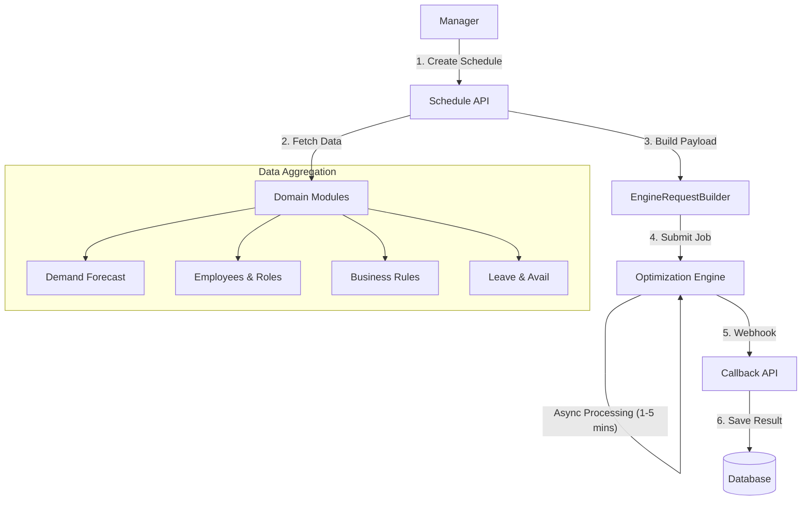

# Schedule Module

| Attribute     | Details                                       |
| :------------ | :-------------------------------------------- |
| **Namespace** | `com.horaion.app.modules.schedule`            |
| **Status**    | 🟢 Stable                                     |
| **Criticality** | **Core (The Brain of the Operation)**         |
| **Dependencies** | Demand, Employee, Leave, Rule, Shift          |

## Executive Summary

The **Schedule Module** is the orchestration engine of Horaion. It does not just "store" shifts; it **generates** them.

It acts as the bridge between the **Horaion Business Domain** (Employees, Contracts, Prefs) and the **Mathematical Solver** (Python/C++ Engine).

## Core Capabilities

1.  **Automated Generation**: converting Demand Forecasts into assigned Shifts.
2.  **Constraint Solving**: Respecting 100+ rules (e.g., "Max 40 hours", "No clopening", "Skill matching").
3.  **Async Architecture**: Handling long-running optimization jobs (1-5 minutes) without blocking the API.

## Hierarchy & Data Flow

The data flow is a classic **Extract-Transform-Load (ETL)** pattern, but for real-time operations.

> **Diagram Explanation**: The Schedule Generation process follows an asynchronous **Scatter-Gather** pattern. The API first gathers all necessary context (Employees, Rules, Forecasts) from their respective modules. This aggregated "Snapshot" is then sent to the external Optimization Engine. Because the math is complex (NP-Hard), the engine processes it asynchronously and calls a webhook when finished.

## Module Architecture

### The "Two-Status" System

A Schedule has **two** distinct status fields to track its lifecycle in two different dimensions:

1.  **Job Status** (`PENDING` -> `PROCESSING` -> `COMPLETED`/`FAILED`):
    *   Tracks the technical generation process.
2.  **Approval Status** (`PENDING` -> `APPROVED` -> `REJECTED`):
    *   Tracks the business review process by the Manager.


**Note:**
A schedule must be **Job Status: COMPLETED** before it can be **Approval Status: APPROVED**. You cannot approve a schedule that hasn't finished generating.

