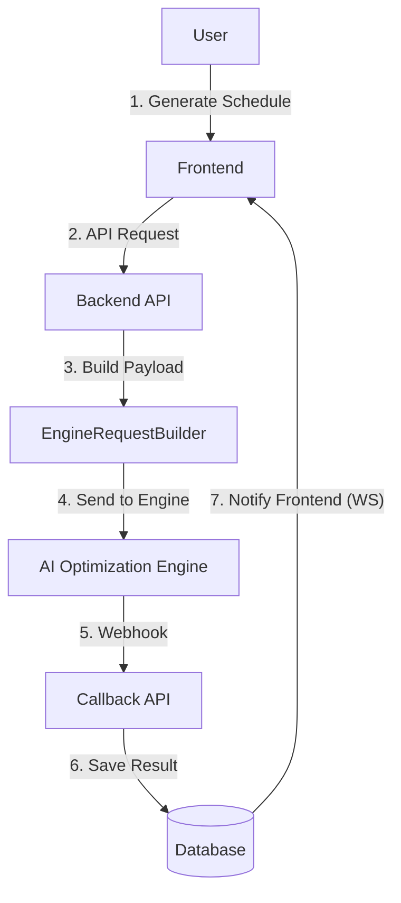

# Schedule Domain Logic

## Service: `ScheduleService`

This service is the sophisticated aggregator of all other modules.

### Engine Optimization Pipeline

Before we can solve the schedule, we must translate the **Business Language** into **Mathematical Language**. This process is managed by the `EngineRequestBuilder`.


**Note:** The optimization engine is stateless. Every request must contain the full context (employees, rules, demand) required to solve that specific scheduling period.

| Validator | Rule | Error Message |
| :--- | :--- | :--- |
| **Active Shifts** | Must have at least one active shift defined. | `Schedule must have at least one active shift` |
| **Shift Roles** | Every shift must have at least one valid role attached. | `Shift 'Morning' must have at least one active role assigned` |
| **Employee Cover** | There must be employees who actually hold the roles required by the shifts. | `No employees have roles matching the shifts' required roles.` |
| **Demand Forecast** | (Warning Only) Checks if forecast exists for the date range. | `Demand forecast is incomplete for schedule...` |

### Data Aggregation Details

The `EngineRequestBuilder` performs the heavy lifting of data transformation:

1.  **Time Normalization**:
    *   Converts human times ("08:00 AM") into **Integer Timeblocks** (e.g., 0-96 for 15-minute intervals).
    *   *Why?* Mathematical solvers process integers significantly faster than complex DateTime objects.
2.  **Rule Serialization**:
    *   Fetches dynamic logic from the `Rule` module.
    *   Converts parameters like `MaxHours=40` or `MinimumRest=11h` into the engine's required JSON format.
3.  **Constraint Flattening**:
    *   Combines `Annual Leave` (hard constraint) and `Preferences` (soft constraint) into a unified "Availability Map".


**Note:** The system uses 15 or 30-minute timeblocks. Smaller blocks (5-min) increase engine precision but exponentiate the processing time. 15-min is the recommended "Sweet Spot".

#### Engine Request Payload (JSON Structure)

This is the actual payload sent to the solver. It is optimized for size and parsing speed.

```json
{
  "scheduleId": "uuid...",
  "timeblocks": {
    "2024-12-25T08:00": 0,
    "2024-12-25T08:15": 1
  },
  "employees": [
    {
      "id": 101, // Integer ID for solver speed
      "roleId": 5,
      "constraints": [
        { "startBlock": 0, "endBlock": 32 } // Unavailable 08:00-16:00
      ]
    }
  ],
  "demands": [
    {
      "timeblockId": 10,
      "requirements": [
        { "roleId": 5, "count": 2 } // Need 2 Cashiers at block 10
      ]
    }
  ]
}
```

### The Callback Loop

The system is designed for **Asynchronous Eventual Consistency**.

1.  **State 1: Pending**
    *   User clicks "Generate".
    *   Data is gathered, validation passes.
2.  **State 2: Processing**
    *   Request sent to Engine (`200 OK`).
    *   The user sees a "Spinner" or "Processing" badge on the UI.
    *   *The transaction commits here.* The HTTP request ends.
3.  **State 3: Completed (The Callback)**
    *   5 minutes later, Engine POSTs to `/callback`.
    *   Server wakes up, accepts the payload, saves results.
    *   Server triggers a WebSocket event (optional) to refresh the UI.



> **Diagram Explanation**: The scheduling lifecycle is a high-speed ETL pipeline:
> 1.  **Extraction**: The system pulls raw data from 5 different domain modules (Demand, Employees, etc.).
> 2.  **Transformation**: The `EngineRequestBuilder` translates these business entities into a mathematical integer-based payload.
> 3.  **Loading (Submission)**: The Feign client securely transmits the payload to the external AI Engine.
> 4.  **Async Loop**: The engine processes the complex NP-hard problem and notifies Horaion via a webhook once complete.


**Success:** Using an external engine decouples the complex mathematical optimization from our core business logic, allowing us to update algorithms without taking the main API offline.


### Entities

#### `Schedule`

*   **Keys**: `id` (UUID), `department_id`, `company_id`.
*   **Config**: `block_size_minutes` (Default: 30, but supports 15 for high-precision retailers).
*   **State**: `job_status` (Technical), `approval_status` (Business).
*   **Callback**: Store `callback_url` to ensure the engine knows where to reply different environments (Dev vs Prod).

#### `ScheduleShift`

The result of the optimization. A specific instance of a `Shift` assigned to the `Schedule`.
*(Note: The actual employee assignments to these shifts are managed here).*

**Audit Trail**: The `ScheduleRequest` table stores the *exact* JSON payload sent to the engine. This is invaluable for debugging "weird" schedules. You can replay this JSON locally against the engine to reproduce issues.

**Tip:** This "Payload Snapshoting" is invaluable for debugging. You can extract the JSON and re-run the optimization locally to reproduce and fix edge-case scheduling issues.


### Frontend Integration Guide

Visualizing a schedule is complex. We recommend using a **Gantt Chart** library.

#### TypeScript Interfaces

```typescript
export interface ScheduleShift {
  id: string;
  employeeId: string;
  shiftId: string;
  startTime: string; // ISO 8601 "10:00:00"
  endTime: string;
}

export interface GanttRow {
  id: string;        // Employee ID
  label: string;     // Employee Name
  bars: GanttBar[];
}

export interface GanttBar {
  id: string;        // ScheduleShift ID
  start: Date;
  end: Date;
  color: string;     // Based on Role color
}
```
