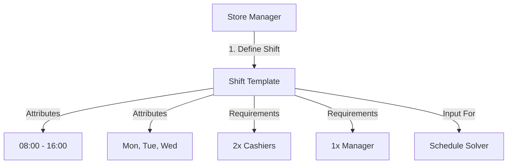

# Shift Module

| Attribute     | Details                                       |
| :------------ | :-------------------------------------------- |
| **Namespace** | `com.horaion.app.modules.shift`               |
| **Status**    | 🟢 Stable                                     |
| **Criticality** | **High** (Core input for Schedule Generation) |
| **Dependencies** | Department, Employee (Role)                   |

## Executive Summary

The **Shift Module** defines the **Templates of Work**.

Crucially, a "Shift" in this module is a **Definition**, not an Assignment. It defines a standard block of time (e.g., "Morning Shift: 08:00 - 16:00") and the staffing requirements for that block (e.g., "Requires 2 Cashiers").

The [Schedule Module](../schedule/01_OVERVIEW.md) later uses these definitions to generate the actual roster.

### Core Capabilities

1.  **Shift Templating**: Define standard operating hours.
2.  **Role Requirements**: Specify exactly *who* is needed for this shift (e.g., "1 Manager, 3 Baristas").
3.  **Day Applicability**: Tag shifts for specific days (e.g., "Weekend Brunch Shift").

## Hierarchy & Data Flow


**Note:**
**Analogy**: Think of the **Shift Module** as the "Menu" in a restaurant. It lists what is *available* (Morning Shift, Night Shift). The **Schedule Module** is the actual "Order" (John is working the Morning Shift on Monday).

