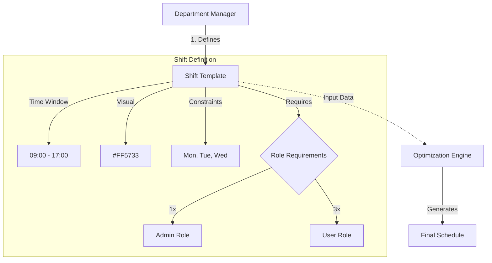

# Shift Module

| Attribute | Details |
| :--- | :--- |
| **Namespace** | `com.horaion.app.modules.shift` |
| **Status** | 🟢 Stable |
| **Criticality** | **High** (Core input for Schedule Generation) |
| **Dependencies** | Department, Employee (Role) |

## Executive Summary

The **Shift Module** is responsible for defining the **Templates of Work** within the organization. 

Crucially, in the Horaion platform, a "Shift" is a **Metadata Definition**, not an assignment. It represents a reusable block of time (e.g., "Standard Morning: 09:00 - 17:00") and the staffing requirements needed for that block.


**Analogy Note:**
Think of the **Shift Module** as the **"Menu"** in a restaurant. It lists what is *available* to be scheduled (Morning Shift, Night Shift).
The **Schedule Module** is the **"Order"** (e.g., "John is working the Morning Shift on Monday").


### Core Capabilities
1.  **Shift Templating**: Define standard operating hours with visual cues (Color Codes).
2.  **Role Requirements**: Specify exactly *which* roles are needed.
    *   *Current Limitation*: The system currently defaults to **1 person per role** specified.
3.  **Day Applicability**: Tag shifts for specific days of the week (e.g., "Weekend Brunch Shift" only applies on Sat/Sun).
4.  **Department Scoping**: Shifts are strictly isolated by Department.

## Module Architecture

The Shift module sits between the organizational structure (Department) and the operational execution (Schedule).

## Key Interactions

### 1. Department Module (Upstream)
*   **Relationship**: **Strict Parent-Child**.
*   **Details**: Every Shift belongs to exactly one `Department`. Operations are always scoped via `/api/v1/departments/{departmentId}/shifts`.
*   **Cascade**: If a Department is deleted, its Shifts are likely cascaded (though usually soft-deleted in practice).

### 2. Employee Module (Lateral)
*   **Relationship**: **Reference**.
*   **Details**: Shifts define requirements based on `EmployeeRole` (via `ShiftRole` entity). It does *not* reference specific Employees, only their Roles.

### 3. Schedule Module (Downstream)
*   **Relationship**: **Dependency**.
*   **Details**: The Schedule module uses the list of Active Shifts to know what slots need to be filled by the optimization engine.

## Domain Model Summary

| Entity | Description |
| :--- | :--- |
| `Shift` | The root aggregate. Contains time, label, and metadata. |
| `ShiftRole` | A child entity defining "How many of Role X are needed". |
| `ShiftType` | Enum categorization (MORNING, NIGHT, etc.) used for reporting. |


**Important Implementation Detail:**
Shifts support **Soft Deletion**. When a user "deletes" a shift, `softDelete` is set to `true` and `isActive` to `false`. This preserves historical data for past schedules that may validly reference this now-deleted shift.

