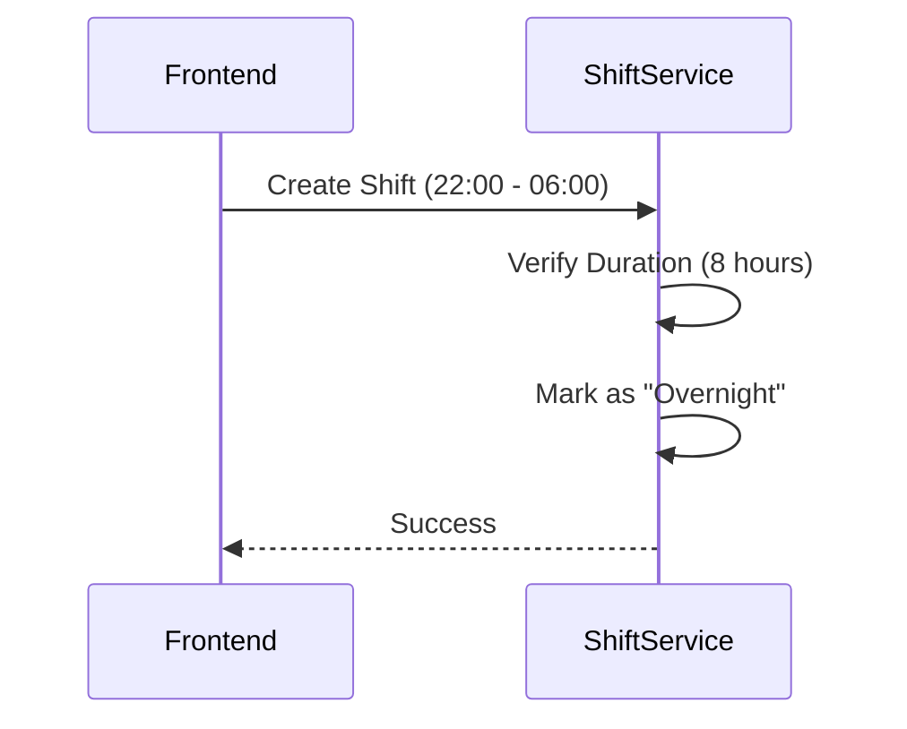

# Shift Domain Logic

## Service: `ShiftService`

This service manages the "Inventory of Time".

### 1. The Multi-Role Pattern

A unique feature of this system is that a single `Shift` entity aggregates multiple `EmployeeRoles`.

*   **Traditional Model**: 1 Shift = 1 Person.
*   **Horaion Model**: 1 Shift = A Team.
    *   Example: "Truck Unloading Shift" (04:00 - 08:00).
    *   Requirement: 4x Movers, 1x Supervisor.

This aggregation simplifies the schedule generation. Instead of the solver trying to place 5 individual shifts, it places 1 "Block" and then fills the 5 slots within it.

### 2. Validation Logic

*   **Label Uniqueness**: Enforced per-department. You can have "Morning" in Kitchen and "Morning" in Bar, but not two "Morning" shifts in Kitchen.
*   **Time Validity**: `startTime` must be defined. `endTime` can be *after* `startTime` (same day) or *before* `startTime` (overnight shift).
    *   *Note*: The system handles overnight shifts (cross-midnight) efficiently.

#### Cross-Midnight Handling



### Frontend Integration Guide

#### Displaying Shifts (Gantt Palette)

When building the Schedule Editor, use the `GET .../shifts/active` endpoint to populate the "Draggable Palette" on the left side of the screen.

```typescript
// Component: ShiftPaletteItem
interface ShiftProps {
  label: string;
  color: string;
  duration: string; // "8h"
}

// Render
<div style={{ backgroundColor: shift.colorCode }}>
  <span className="font-bold">{shift.label}</span>
  <span className="text-xs">{shift.startTime} - {shift.endTime}</span>
</div>
```


**Tip / Success:**
**Color Coding**: Always use the `colorCode` from the API. This ensures that the "Morning Shift" looks the same in the Palette, the Gantt Chart, and the Employee Mobile App.

