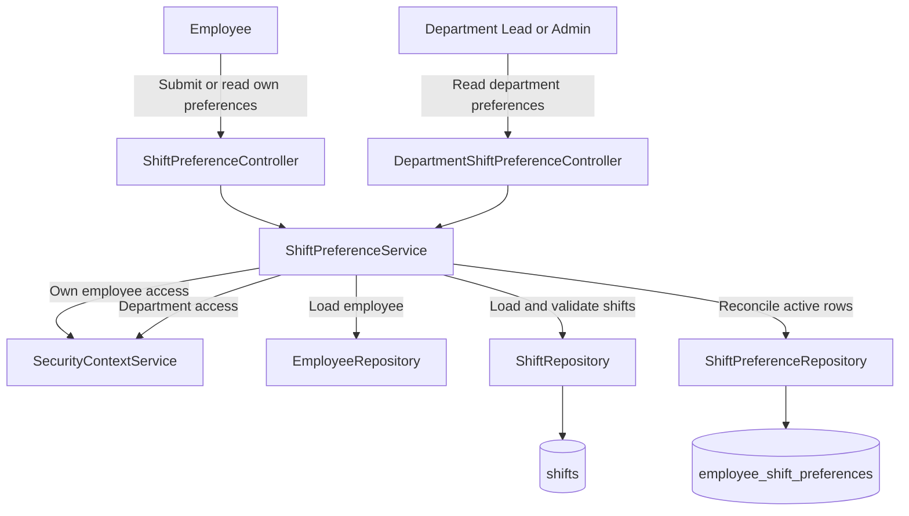

# Shift Preference Module

| Attribute | Details |
| :--- | :--- |
| **Namespace** | `com.horaion.app.modules.shiftpreference` |
| **Status** | Stable |
| **Criticality** | High (Input for employee-aware schedule generation) |
| **Dependencies** | Employee, Department, Shift, Me, Security Context |

## Overview

The **Shift Preference Module** lets employees record the shifts they prefer to work on a specific date inside a department. A preference is **positive-only**: if a row exists, the employee prefers that shift for that date. The module does not model dislikes, ranking scores, approvals, or neutral availability.


**Current Product Shape:**
The active API groups preferences by **employee + date + department**. Each group contains one or more preferred shifts. This supersedes the earlier branch shape that grouped one shift with many preferred dates.


### Core Capabilities

1.  **Self-Service Submission**: Employees submit their preferred shifts for one date and department.
2.  **Set Reconciliation**: Re-submitting the same `(date, department)` replaces the active shift set with the submitted set.
3.  **Self-Service Reads**: Employees can view only their own shift preference groups.
4.  **Department Reads**: Department leads and administrators can view all active preferences in a department.
5.  **Soft Delete History**: Removed preferences are soft-deleted instead of physically removed.
6.  **Department Validation**: Every submitted shift must belong to the submitted department.

## Module Architecture

> **Diagram Explanation**: Employee-facing writes and department-facing reads share the same service. The service enforces identity and department boundaries before it loads or mutates preference rows.

## Key Interactions

### 1. Employee Module

*   **Relationship**: **Owner**.
*   **Details**: Every preference row belongs to one employee. Employee endpoints call `assertOwnEmployeeAccess(...)` so a regular user can manage only their own rows.

### 2. Department Module

*   **Relationship**: **Scope**.
*   **Details**: Preferences are grouped by department through the selected shifts. Department reads call `assertDepartmentAccess(...)`, allowing system administrators and system owners broadly, and department leads only within their scope.

### 3. Shift Module

*   **Relationship**: **Target**.
*   **Details**: Each active preference row references one shift. Submit requests must provide shift IDs that all belong to the submitted `departmentId`.

### 4. Me Module

*   **Relationship**: **UI Support**.
*   **Details**: `GET /api/v1/me/department-assignments` lets the authenticated user fetch their own department assignments without requiring the elevated `GET /me/departments` permission.

## Business Rules

| Rule | Description |
| :--- | :--- |
| Positive-only | A row means "preferred"; no row means no stated preference. |
| Group key | Responses group rows by `(employeeId, date, departmentId)`. |
| Reconciliation | Submit inserts missing shift rows and soft-deletes rows omitted from the submitted set. |
| Department isolation | Reconciliation for one department does not alter preferences for another department on the same date. |
| Shift validation | A shift outside the submitted department returns `400 SHIFT_DEPARTMENT_MISMATCH`. |
| Self-service access | Employee endpoints are limited to the authenticated employee. |

## Related Documentation

*   [API](02_API.md)
*   [Domain](03_DOMAIN.md)
*   [Configuration](04_CONFIGURATION.md)
*   [Shift Module](../shift/01_OVERVIEW.md)
*   [Me Module](../me/01_OVERVIEW.md)
