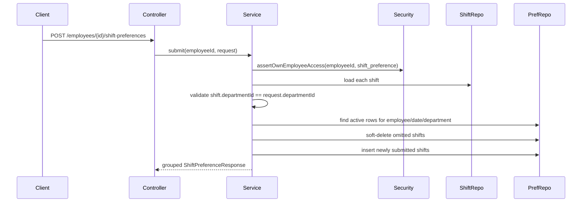

# Domain Model

## Entity: `ShiftPreference`

**Table**: `employee_shift_preferences`

One row records that an employee prefers to work one shift on one date. The public API groups these rows into a higher-level preference group by `(employee, date, department)`.

| Field | Type | Required | Description |
| :--- | :--- | :--- | :--- |
| `id` | UUID | Yes | Primary key. |
| `employee_id` | UUID | Yes | Employee stating the preference. |
| `shift_id` | UUID | Yes | Preferred shift. |
| `preferred_date` | DATE | Yes | Date the employee prefers to work the shift. |
| `soft_delete` | BOOLEAN | Yes | Marks inactive preference rows. |
| `deleted_at` | TIMESTAMPTZ | No | Timestamp when the row was soft-deleted. |
| `created_at` | TIMESTAMPTZ | Yes | Creation timestamp. |
| `updated_at` | TIMESTAMPTZ | Yes | Last update timestamp. |
| `created_by` | UUID | No | Audit user who created the row. |
| `updated_by` | UUID | No | Audit user who last updated the row. |

## Persistence Rules

| Rule | Implementation |
| :--- | :--- |
| One active row per preference | Partial unique index on `(employee_id, shift_id, preferred_date)` where `soft_delete = false`. |
| Historical removals | Deleting or reconciling away a preference sets `soft_delete = true` and `deleted_at`. |
| Date lookup | `preferred_date` is indexed for schedule-window queries. |
| Employee lookup | `employee_id` is indexed for self-service reads. |
| Shift lookup | `shift_id` is indexed for joins and maintenance. |


**Storage vs API Shape:**
The table stays at row-level granularity for simple uniqueness and schedule filtering. The API groups rows into `ShiftPreferenceResponse` objects so the frontend sees one object per date and department.


## Request and Response Types

### `CreateShiftPreferenceRequest`

```java
public record CreateShiftPreferenceRequest(
    LocalDate date,
    UUID departmentId,
    List<UUID> shiftIds
) {}
```

Validation:

| Field | Rule |
| :--- | :--- |
| `date` | Must not be null. |
| `departmentId` | Must not be null. |
| `shiftIds` | Must not be empty. |

### `ShiftPreferenceResponse`

```java
public record ShiftPreferenceResponse(
    UUID employeeId,
    String employeeName,
    LocalDate date,
    UUID departmentId,
    String departmentName,
    List<PreferredShiftResponse> shifts
) {}
```

### `PreferredShiftResponse`

```java
public record PreferredShiftResponse(
    UUID shiftId,
    String shiftLabel
) {}
```

## Service Logic

### Submit Flow



> **Diagram Explanation**: Submit is a reconciliation operation, not an append-only operation. The final active rows for the group match the submitted `shiftIds`.

### Reconciliation Example

Existing active rows:

| Date | Department | Active Shifts |
| :--- | :--- | :--- |
| `2026-07-06` | Front Office | Morning, Evening |

Request body:

```json
{
  "date": "2026-07-06",
  "departmentId": "front-office-id",
  "shiftIds": ["morning-id", "night-id"]
}
```

Result:

| Shift | Result |
| :--- | :--- |
| Morning | Kept active. |
| Evening | Soft-deleted because it was omitted. |
| Night | Inserted because it was newly submitted. |

## Grouping Logic

Reads use `ShiftPreferenceService.groupByDateAndDepartment(...)`.

Group key:

```java
private record GroupKey(UUID employeeId, LocalDate date, UUID departmentId) {}
```

Within each response, `shifts` are sorted by `shiftLabel` for stable display.

## Access Rules

| Operation | Service Check | Effect |
| :--- | :--- | :--- |
| Get employee preferences | `assertOwnEmployeeAccess(employeeId, "shift_preference")` | Caller can read only their own rows. |
| Submit employee preferences | `assertOwnEmployeeAccess(employeeId, "shift_preference")` | Caller can mutate only their own rows. |
| Delete employee preferences | `assertOwnEmployeeAccess(employeeId, "shift_preference")` | Caller can delete only their own rows. |
| Get department preferences | `assertDepartmentAccess(departmentId, "shift_preference")` | System administrators and owners can read broadly; department leads are scoped to their departments. |
| Submit shift IDs | `validateCompanyAccessUnlessAdmin(companyId, "shift_preference")` | Submitted shifts must be in an accessible company unless caller is an administrator. |

## Domain Exceptions

| Exception | HTTP Status | Meaning |
| :--- | :--- | :--- |
| `ShiftPreferenceEmployeeNotFoundException` | `404` | Path employee was not found. |
| `ShiftPreferenceNotFoundException` | `404` | No active group exists for delete by date and department. |
| `ShiftDepartmentMismatchException` | `400` | Submitted shift is not owned by the submitted department. |
